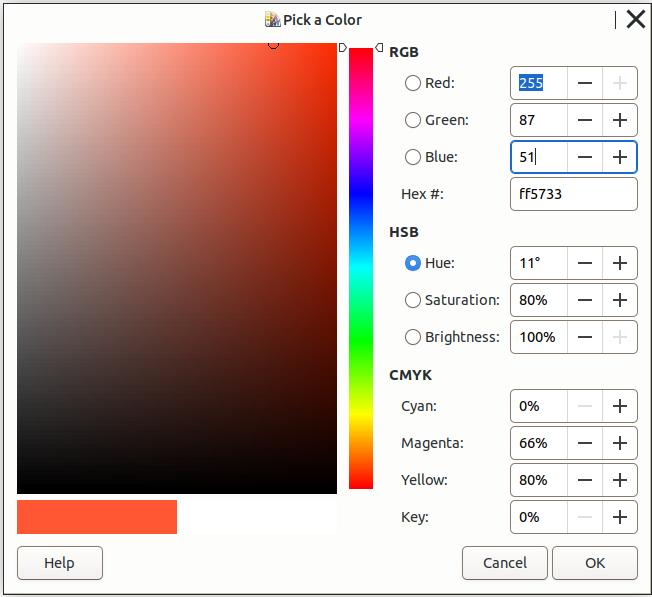
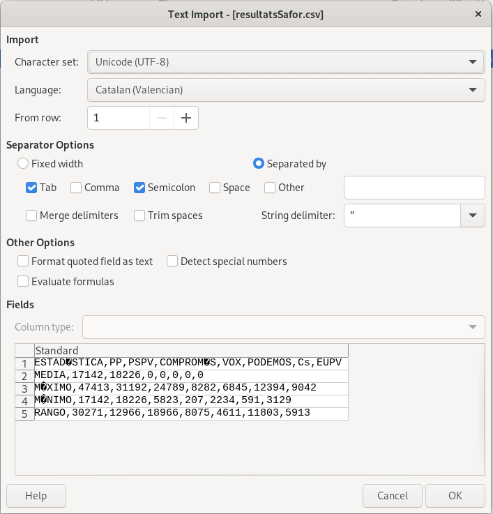

\newpage
\renewcommand\tablename{Tabla}

## 1 Conversió de RGB

En RGB poden donar-nos el color de dos formes:

* Decimal: rgb()
* Hexadecimal: 

Però sabem que es grava en binari.

{width=70%}

**Instruccions per traduir entre sistemes**

De Hexadecimal -> Decimal -> Binari

1. Separar el codi hexadecimal en tres parts: una per al component vermell (R), una per al component verd (G) i una per al component blau (B).
2. Convertir cada part hexadecimal a decimal.
3. Convertir cada valor decimal a binari, assegurant-te que cada component binari sigui de 8 bits.

Exemple de resolució per al cas #FF5733:

**Hexadecimal:** #FF5733  
   - R = FF  
   - G = 57  
   - B = 33  

**Conversió a decimal:**
   - R = 15*16$^{1}$ + 15 = 255  
   - G = 5*16$^{1}$ + 7 = 87  
   - B = 3*16$^{16}$ + 3 =  51

**Conversió a binari (8 bits):** 
   - R = 11111111  
   - G = 01010111  
   - B = 00110011  
   

**Fes els següents exemples:**

1. **#4A90E2**  
3. **#7D3F8C**  
4. **#2ECC71**  

Per comprovar, pots fer el pas contrari:

binari-> decimal -> hexadecimal
## 2 Conversió de IPv4

Una IP4 està composada de 4 bytes (4 * 8 = 32 bits). Però la representem per comoditat en decimal

Vegem l'exemple de conversió:
Per convertir una adreça IP en IPv4 a binari i hexadecimal, segueix aquests passos:

**Conversió a binari:**

   - Separar l’adreça IP en els seus quatre octets: 192, 168, 1, 10.
   - Convertir cada octet a binari:

Exemple: **192.168.1.10**
   
   Decimal: 192  
   Binari: 11000000

   Decimal: 168  
   Binari: 10101000

   Decimal: 1  
   Binari: 00000001

   Decimal: 10  
   Binari: 00001010

Per tant, l’adreça IP en binari és:  
     **11000000.10101000.00000001.00001010**

**Fes la conversió a binari de les IPs:**

1. **10.2.2.2**

2. **172.217.3.110**

3. **151.101.1.67**

4. **13.226.32.32**

## 3 Octal

Representa en octal i binari els caracters especials i les lletres següents d' ASCII ( et deixe al costa el seu valor en decimal )

|Símbol|Codi ASCII|Octal|Binari|
|:--|--:|---|---|
|**<**| 60|||
|**\@**|64|||
|**A**|65|||
|**a**| 97|||

## 4 Investigació

Investiga i documenta molt breument com són les adreces MAC, com estan compostes,  com es guarden, ús...

## 5 Problema real amb taula de codis

Fent la FCT en un Ajuntament, un administratiu que està registrant dades electorals de la comarca ens planteja un problema que té amb el fitxer [resultatsSafor.csv](altres/resultatsSafor.csv) (descarrega-te'l).

El problema és que, en obrir-lo amb Calc de LibreOffice o MS Excel, veu que alguns caràcters no són correctes tal i com mostra la Figura 1 (vocals amb accent gràfic, per exemple)

A partir d'ací...

1. Raona i indica quin creus que és el problema.
2. Com ho solucionaries temporalment?
3  I de forma definitiva?
4. Creus que el fitxer prové d'una Base de Dades actualitzada?

