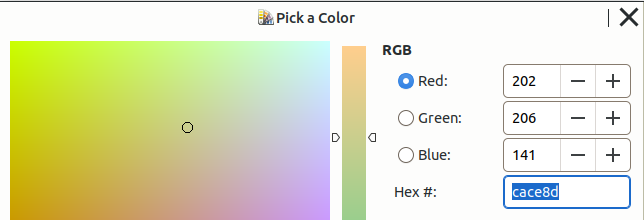
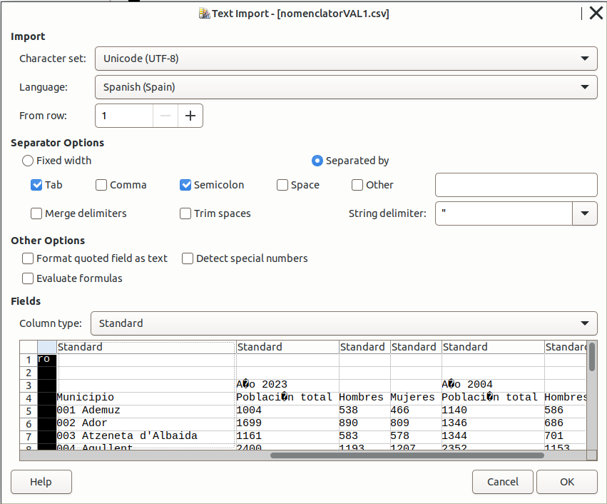
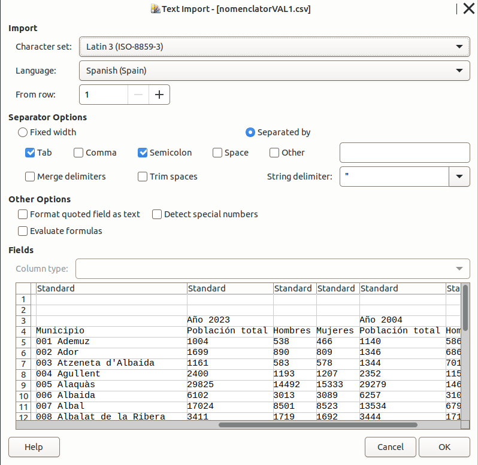
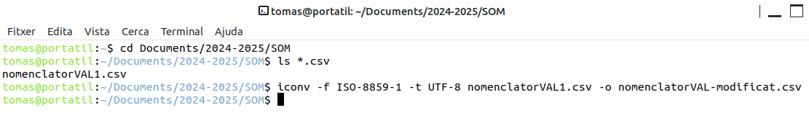
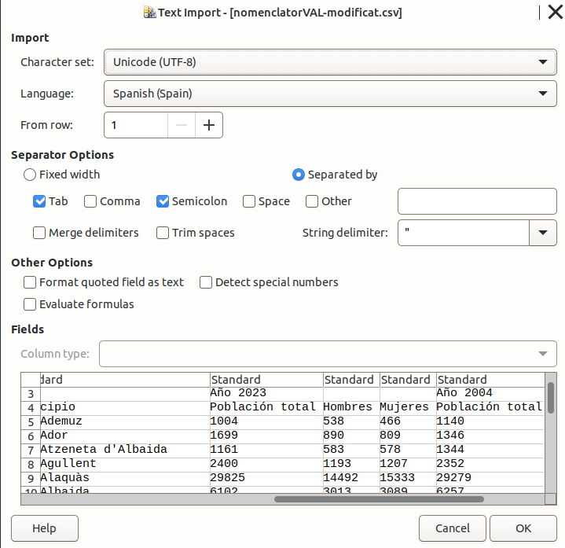
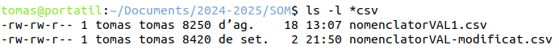
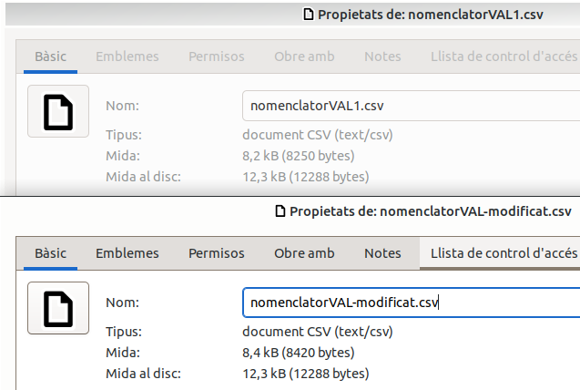
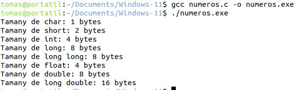

# 1. La informació

## 2.1 Conceptes.

**Definició i importància de la informació en el context de les TIC:**
La informació és un recurs essencial en les Tecnologies de la Informació i la Comunicació (TIC). És el conjunt de dades processades que tenen significat i utilitat per als usuaris. La informació permet prendre decisions, coordinar activitats i desenvolupar tecnologies eficients. La seva correcta gestió i interpretació és fonamental per a la innovació i el desenvolupament tecnològic.

**Relació entre informació, dades i coneixement:**

- **Dades:** Són valors o descripcions bàsiques sense un significat explícit. Per exemple, nombres, paraules, mesures.

- **Informació:** És el resultat de processar, organitzar i estructurar les dades de manera que esdevinguin significatives. Per exemple, una llista de temperatures diàries esdevé informació quan s'analitza per trobar tendències.

- **Coneixement:** És l'ús i interpretació de la informació per a la presa de decisions, basat en l'experiència i el context. Per exemple, saber que certs patrons de temperatura poden indicar un canvi climàtic.

## 2.1 Tipus de dades

Des del punt de vista del processament de les dades tenim 3 tipus de dades

- **Dades d'entrada**. Es subministren des de:
        - els perifèrics d'entrada (teclat, escaner...)
        - la lectura dels perifèrics de magatzematge (disc durs, pen-drive...)
- **Dades internes del procés**. Són les dades que usa el processador, la RAM (coprocessador i memòria de la tarja gràfica...
- **Dades d'eixida**. Són el resultat del processament de les anteriors i es lliuren a l'usuari o altres SI mitjançant:
    - els perifèrics d'eixida
    - escrivint en perifèrics de magatzematge (disc durs, pen-drive...)


# 2. Com mesurar la informació

## 2.1 Unitats de mesura de la informació

- **Bit:** És la unitat mínima d'informació, representant dos valors possibles (0 o 1).

- **Byte (B):** Equival a 8 bits:
    
    Des del "0000 0000"" fins el "1111 1111""

- **Unitats majors**

    En potències de 2

  - **Kibibyte (KiB):** 1024¹ Bytes= 2¹⁰ B = 2¹⁰ * 1,024 Bytes.
  - **Mebibyte (MiB):** 1024² Bytes= 2¹⁰ KiB = 2¹⁰ * 2¹⁰ Bytes = 2 ²⁰ Bytes= 1,024 KiB.
  - **Gibibyte (GiB):** 1024³ Bytes= 2¹⁰ MiB = 2¹⁰ * 2¹⁰ * 2¹⁰ Bytes = 2 ³⁰ Bytes= 1,024 MiB.
  - **Tebibyte (TiB):** 1024⁴ Bytes= 2¹⁰ GiB = 2¹⁰ * 2¹⁰ * 2¹⁰ * 2¹⁰ Bytes = 2 ⁴⁰ Bytes= 1,024 GiB.
  - **Pebibyte (PiB):** 1024⁵ Bytes= 2¹⁰ TiB = 2¹⁰ * 2¹⁰ * 2¹⁰ * 2¹⁰ *2¹⁰ Bytes = 2 ⁴⁰ Bytes= 1,024 TiB.

  En potències de 10
  
  - **Kilobyte (KB)** 	1.000¹ = 1.000
  - **Megabyte (MB)** 	1.000² = 1000* 1000= 1.000.000
  - **Gigabyte (GB)** 	1.000³ = 1.000.000.000
  - **Terabyte (TB)** 	1.000⁴ = 1.000.000.000.000
  - **Petabyte (PB)** 	1.000⁵ = 1.000.000.000.000.000


**Unitats de mesura de la transferència d'informació:**

La velocitat de transmissió es mesura en quantitat d'informació dividida per temps. Bé en:
  * bits per segon
  * bytes per segon
  Donant resultats en base 10: KB/s, MB/s, GB/s
  o en base 8: KiB/s, MiB/s, GiB/s


## 2.2 Sobre l'origen dels KiB i els KB

Inicialment sols s'usaven les potències de 2 amb la teminología actual de les potencies de 10 (KB, MB...). 
A partir de 1990 s'estandaritza que el "K", "M"... deu definir 1000, 1 Milió... Com en la resta de magnituds  (pes en grams, distàncies en metres, litres en volum...) i es creen els "KiB", "MiB" per a les potències de 2.

## 2.3 Activitat proposta

**Llegiu detingudament** aquest article i Fixeu-vos bé en els càlculs que fa.

[GB vs GiB: ¿Cuál es la diferencia entre Gigabytes y Gibibytes?](https://massive.io/es/transferencia-de-archivos/gb-vs-gib/#how-did-gibs-come-to-be)


# 3. Tipus de dades simples

## 3.1 Numèriques
  * Enters.   0,1,2,3 ...
  * Naturals. -34,-4,0, 5, 56 ...
  * Reals.    3.456; 34.003,897
  
## 3.2 Alfanumèriques
  * a-z, A-Z
  * 0-9
  * Caràcters especials: "€",.!&%
  * Caracters de control ( no visibles)
  
  Exemple: una contrassenya robusta que incloga majúscules, minuscules, números i caracters especials:
            "E1M€upassw0rd"

## 3.3 Boolean
  * TRUE/ FALSE
  
  
## 3.4 Què representens els tipus simples

La informàtica es basa en la codificació, magatzematge i tractament de codificacions binàries que identifiquen informació del món humà que pot ser:

* Els caràcters.

  * alfanumèric: 0, 1, 2, 3,4,5,6,7,8,9, a, b, c..., A, B, C ...

  * especial: * / ) [ .

* Els numèrics:
  * Un color
  * Una coordenada X o Y d'un pixel de la pantalla o fotografia
  * El volum d'un so
  * La grossor d'una línia
  * La gravetat d'un so
  * El grau de transparència d'una imatge
  * La velocitat de rotació d’un disc mecànic...
  * Una quantitat de segons

* Els booleans o lògics
  * Si s'ha produït un event extern
  * Si s'ha activat un bit a la CPU o ha arribat una senyal del bus de control
    

# 4 Els tipus numèrics

## 4.1 Els naturals i el Teorema de la numeració

El teorema de la numeració estableix que qualsevol número natural (enter positiu) en un sistema de numeració donat es pot representar de manera única com una suma de múltiples d'una base específica elevada a diferents potències. 

Per exemple, en el sistema decimal (base 10), el nombre 345 es representa com:

\(3 \times 10^2 + 4 \times 10^1 + 5 \times 10^0\).


### 4.1.1 Sistemes de numeració:

- **Binari (base 2):** Ús dels dígits 0 i 1.
- **Octal (base 8):** Ús dels dígits del 0 al 7.
- **Decimal (base 10):** Ús dels dígits del 0 al 9.
- **Hexadecimal (base 16):** Ús dels dígits del 0 al 9 i les lletres A a F.


*Taula d'exemples de codificació en diferents sistemes:*

| Decimal | Binari | Octal | Hexadecimal |
| :------- | :------ | :----- | :----------- |
| 0       | 0000   | 0     | 0           |
| 1       | 0001   | 1     | 1           |
| 2       | 0010   | 2     | 2           |
| 3       | 0011   | 3     | 3           |
| 4       | 0100   | 4     | 4           |
| 5       | 0101   | 5     | 5           |
| 6       | 0110   | 6     | 6           |
| 7       | 0111   | 7     | 7           |
| 8       | 1000   | 10    | 8           |
| 9       | 1001   | 11    | 9           |
| 10      | 1010   | 12    | A           |
| 15      | 1111   | 17    | F           |
| 16      | 10000  | 20    | 10          |
|17|10001|21|11|
| 31      | 11111  | 37    | 1F          |


## 4.2 Exemples de conversió entre sistemes de numeració.  

A continuació es mostren alguns exemples de conversió entre sistemes de numeració:

### 1. Conversió de Binari a Decimal

- **Binari:** `1101`
- **Decimal:** 

  \( 1 \times 2^3 + 1 \times 2^2 + 0 \times 2^1 + 1 \times 2^0 \)
  
  \( = 8 + 4 + 0 + 1 = 13 \)

- **Decimal Resultat:** 13

### 2. Conversió de Decimal a Binari

Exemple: 25,76

#### 2.1 Part entera: 25

- **Decimal:** 25
- **Binari:** 

  Dividim 25 per 2 i anotem els residus:
  - 25 ÷ 2 = 12, residu = 1
  - 12 ÷ 2 = 6, residu = 0
  - 6 ÷ 2 = 3, residu = 0
  - 3 ÷ 2 = 1, residu = 1
  - 1 ÷ 2 = 0, residu = 1

  Llegint els residus de baix a dalt: `11001`

- **Binari Resultat:** 11001

### 2.2 Part fraccionària ( decimal): 0,76
    0,76 × 2 = 1,52 → 1 (enter), 0,52 queda
    0,52 × 2 = 1,04 → 1 (enter), 0,04 queda
    0,04 × 2 = 0,08 → 0 (enter), 0,08 queda
    0,08 × 2 = 0,16 → 0 (enter), 0,16 queda
    0,16 × 2 = 0,32 → 0 (enter), 0,32 queda
    0,32 × 2 = 0,64 → 0 (enter), 0,64 queda
    0,64 × 2 = 1,28 → 1 (enter), 0,28 queda
    0,28 × 2 = 0,56 → 0 (enter), 0,56 queda
    0,56 × 2 = 1,12 → 1 (enter), 0,12 queda

0,76 en binari és aproximadament 0.110000101.

### Total

11001,110000101

( Veurem més avant la representacio en Coma Flotant que és la forma usada)

### 3. Conversió de Hexadecimal a Decimal

- **Hexadecimal:** `1A3`
- **Decimal:**

  Convertim cada dígit a decimal i utilitzem la base 16: (A = 10 en decimal)
  - `1A3` = \( 1 \times 16^2 + A \times 16^1 + 3 \times 16^0 \)
  - \( = 1 \times 256 + 10 \times 16 + 3 \)
  - \( = 256 + 160 + 3 = 419 \)

- **Decimal Resultat:** 419

### 4. Conversió de Decimal a Hexadecimal

- **Decimal:** 255
- **Hexadecimal:**

  Dividim 255 per 16 i anotem els residus:
  - 255 ÷ 16 = 15, residu = 15
  - 15 en hexadecimal és `F`

  Llegint els residus: `FF`

- **Hexadecimal Resultat:** FF


### 5. Conversió entre Hexadecimal i Binari

- **Hexadecimal:** `A7`
- **Binari:**

  Convertim cada dígit hexadecimal a binari (1 dígit H -> 4 digits B)
  - A = 1010
  - 7 = 0111

  Combina els resultats: `10100111`

- **Binari Resultat:** 10100111

### 6. Conversió entre Binari i Hexadecimal

- **Binari:** `10101100`
- **Hexadecimal:**

  Agrupem els bits en blocs de 4 (de dreta a esquerra): `1010 1100`
  - 1010 = A
  - 1100 = C

  Combina els resultats: `AC`

- **Hexadecimal Resultat:** AC

Aquí tens exemples de conversió entre el sistema octal i el sistema binari:

### 7. Conversió de Octal a Binari

- **Octal:** `345`
  
  Convertir cada dígit octal a binari (1 dígit O -> 3 dígits B)
  
  - Octal `3` = Binari `011`
  - Octal `4` = Binari `100`
  - Octal `5` = Binari `101`
  
  Combinar els resultats:

  - `345` en octal es converteix en `011 100 101` en binari.
  
  **Binari Resultat:** `011100101`

### 8. Conversió de Binari a Octal

- **Binari:** `100101011`
  
  Agrupar els dígits binaris en blocs de 3 (de dreta a esquerra):
  
  - `010 010 101 011`
  
  Convertir cada grup de 3 dígits a octal:
  
  - Binari `010` = Octal `2`
  - Binari `010` = Octal `2`
  - Binari `101` = Octal `5`
  - Binari `011` = Octal `3`
  
  **Octal Resultat:** `2253`

Observem, com ja hem comentat que les conversions entre octal i hexadecimal i binari són "automàtiques" perquè 8 i1 6 són potències de 2 (8 = 2³; 16 = 2⁴). 

* En la conversió d'octal a binari, cada dígit octal es converteix en un bloc de 3 bits binaris. 
* En la conversió de binari a octal, agrupeu els dígits binaris en blocs de 3 i converteix-los en dígits octals.

* En la conversió d'hexadecimal a binari, cada dígit hexadecimal es converteix en un bloc de 4 bits binaris. 
* En la conversió de binari a hexadecimal, agrupeu els dígits binaris en blocs de 4 i converteix-los en dígits hexadecimals.

## 4.3 Els enters: positius, zero(s) i negatius.

Hi ha diverses formes de representar els valors negatius. Les tres que anem estudiar es caracteritzen per destinar el MSB ( Bit major, el de la dreta) a indicar el signe:
  1: Negatiu
  0: Positiu
Això implica que "perdem" un bit per representar valors.

### 4.3.1 Bit amb signe
  Es reserva el primer bit per indicar el signe
  * **0**0000011 -> 3
  
  * **1**0000011 -> -3

### 4.3.2 Complement a 1 

Els negatius es codifiquen fent l'inversa de cada bit. No té ús, el veiem per entendre el Complement a 2.

Exemples dels valors de 0, 1, 2, 3, 4 i -1, -2, -3, -4:

| Byte en complement a 1 | Decimal |
|:------------------------|:---------|
| 00000000               | 0 (positiu)  |
| 11111111               | 0 (negatiu)  |
| 00000001               | 1       |
| 00000010               | 2       |
| 00000011               | 3       |
| 00000100               | 4       |
| 11111110               | -1      |
| 11111101               | -2      |
| 11111100               | -3      |
| 11111011               | -4      |


**Rang i combinacions en Ca1:**

En 1 byte pot representar 2⁸=256 combinacions diferents.
Rang de valors representables:
        Nombres positius: 0 a 2⁷−1=127 (el bit més significatiu és 0).
        Nombres negatius: −1 a −2⁷+1=−127 (el bit més significatiu és 1).
En complement a 1, tenim dos zeros (0 positiu: 00000000 i 0 negatiu: 11111111).

Així doncs, el rang de valors és de -127 a 127, incloent els dos zeros. Per tant, encara que tinguem 256 combinacions, representem 255 números diferents (perquè dos d'ells són el mateix nombre 0).

### 4.3.3 Complement a 2 

Per solucionar el problema dels 2 zeros i aprofitar millor totes les representacions, el que fem en els negatius és restar un 1 al Ca1.
Ca1 de -1 -> 0000 0001 -> 1111 1110
Ca1 de -7 -> 0000 0111 -> 1111 1000
Ca1 de 0 -> 0000 0000 -> 1111 

Ca1 de -1 -> 0000 0001 -> 1111 1110 +1 -> 1111 1111
Ca2 de -7 -> 0000 0111 -> 1111 1000 +1 -> 1111 1010
Ca2 de 0 -> 0000 0000 -> 1111 1111 -> 0000 0000 (overflow)

Exemple amb els valors de 0, 1, 2, 3, 4 i -1, -2, -3, -4 representats en complement a 2:

| Byte en complement a 2 | Decimal |
|:------------------------|:---------|
| 00000000               | 0       |
| 00000001               | 1       |
| 00000010               | 2       |
| 00000011               | 3       |
| 00000100               | 4       |
| 11111111               | -1      |
| 11111110               | -2      |
| 11111101               | -3      |
| 11111100               | -4      |

Per obtenir el valor en decimal:

Si MSB ( bit major) = 1; Restem un 1 i després invertim:

1111 1101 -> 1111 1100 -> 0000 0011 -> -3

**Rang i combinacions en Ca2:**

En 1 byte pot representar 2⁸=256 combinacions diferents.
Rang de valors representables:
        Nombres positius: 0 a 2⁷−1=127 (el bit més significatiu és 0).
        Nombres negatius: −1 a −2⁷=−128 (el bit més significatiu és 1).
En complement a 2, sols tenim un 0

Així doncs, el rang de valors és de -128 a 127. Per tant, les 256 combinacions, representem 256 números diferents-


## 4.4 Els números reals

Exemples de números reals:
* 3.141592653589793
* 3
* -3
* 0
* 2334335335345346679755334354656757885334343
* 0,00000000000000000000000000000000000000103

Per tant: els reals inclouen als números enters: 4 = 4,000; -34 = -34,000 que inclouen als naturals.

### 4.4.1 Coma flotant. General.
Els formats en FP ens permeten guardar qualsevol número siga quin siga el seu pes (alt o baix)

**Parts:**

* Mantissa: Conté un valor del tipus 0,1XXXX
* Exponent: Per a fer el valor

**Procés:**

1- Normalització de la mantissa: S'ajusta el valor al primer **bit significatiu**: 0,*1*xxxxx 
2- Bit implícit. Omitim el 1r bit.
3- Es calcula l'exponent i se li suma a l'excés. Amb l'excés fem que els exponents siguen sempre psoitius i no "perdem" el MSB per a indicar el signe.

### 4.4.2 Estàndards
Els dos formats estàndard de coma flotant segons l'estàndard IEEE 754 són:

1. **Simple precisió (32 bits)**:
   - **1 bit** per al signe.
   - **8 bits** per a l'exponent, amb biaix de 127.
   - **23 bits** per a la mantissa (fracció). Un bit addicional, implícit, sempre és 1 i no s'emmagatzema (mantissa normalitzada).
   - **Rang:** Aproximadament de \( -3.4 \times 10^{38} \) a \( 3.4 \times 10^{38} \).

2. **Doble precisió (64 bits)**:
   - **1 bit** per al signe.
   - **11 bits** per a l'exponent, amb biaix de 1023.
   - **52 bits** per a la mantissa. Igual que en simple precisió, té un bit implícit.
   - **Rang:** Aproximadament de \( -1.8 \times 10^{308} \) a \( 1.8 \times 10^{308} \).


Aquests formats permeten representar nombres molt grans o molt petits amb precisió controlada.Independentment de que representen un nombre amb part fraccionària o un enter.


# 5 Sobre els usos habituals de cada sistema de numeració

1. El BINARI és com es codifica la informació al SI internament. El hardware només usa 0/1.

2. Al món humà usem el DECIMAL (0-9) o SEXAGESIMAL (0-59) (minuts, segons o graus dels angles).
    
3. Els perifèrics d'entrada i eixida tradueixen o codifiquen informació del món humà:
        * assignant-li valors numèrics a cada color, X,Y, intensitat de so, dia-hores-minuts-segon... o 
        * llegint directament el valor que introduim d'imports, kilos, metres...
        
De decimal o sexagesimal a binari (entrada) o a la inversa (eixida)

4. L'OCTAL (0-7), HEXAGESIMAL (0-9,A-F) i el DECIMAL és usat pel software de les interfícies per **facilitar-nos** la lectura de dades com,per exemple, adreces IP, adreces MAC, colors, permisos de fitxers en Linux, adreces de memòria... Llegir i recordar valors en binari és complicadíssim i es presta a errors. 


## 5.1 Exemple de la codificació del color RGB.

El codi de color es guarda internament en 3 bytes o siga 24 bits però el software pot mostrar/admetre:

* 3 decimals que val cadascuna del 0 al 255.
* 1 hexadecimal que val cadascun de 000000 a FFFFFF. Ací observem la comodidat del Hexadecimal

Veiem 5 exemples de RGB en hexadecimal, decimals i el binari

  | Color   | Hexadecimal | RGB (Decimal)   | RGB (Binari)                   |
  | :------- | :----------- | :--------------- | :------------------------------ |
  | Negre   | #000000     | (0, 0, 0)       | (00000000, 00000000, 00000000) |
  | Blanc   | #FFFFFF     | (255, 255, 255) | (11111111, 11111111, 11111111) |
  | Roig    | #FF0000     | (255, 0, 0)     | (11111111, 00000000, 00000000) |
  | Verd    | #00FF00     | (0, 255, 0)     | (00000000, 11111111, 00000000) |
  | Blau    | #0000FF     | (0, 0, 255)     | (00000000, 00000000, 11111111) |
  | Taronja | #FF8242     | (255,130,65)    | (11111111, 10000010, 01000001) |

Quan introduim o llegim el valor no fem ús del binari però és com es guarda.




> **Resumint:**
>
> 1- La màquina NOMÉS treballa en BINARI 
>
> 2- El decimal, l’octal i l’hexadecimal, són «traduccions» que ens ofereixen les interfície software per a facilitar la lectura i escriptura d'aquests valors als humans.
>
>És és fácil llegir a la pantalla i introduir pel teclat: CACE8D que el valor que realment es guarda  memòria o CPU: 110010101100111010001101

# 6. Els caràcters. La representació dels alfanumèrics

Tipus:

  * Alfanumèrics: 0-9, a-z, A-Z

  * Amb tilles ö, ü., à

  * Especials: ^ ! "" ?...

  * De control (no visibles): LF, CR...
  
  
## 6.1 Evolució: de l'ASCII al UTF

Inicialment els caràcter es van codificar en ASCII (American Standard Code for Information Interchange). Utilitza 7 o 8 bits. (En origen, 7 en anglés)

- **ASCII** estava limitat a 128 caràcters en l'original anglès. Limitat a 256 en la versió extesa de 8 bits posterior, la qual cosa no era suficient per representar tots els caràcters necessaris per a diferents idiomes com el xinès, japonès o àrab.

- **Pàgines de codi** Donades estes limitacions d'ASCII es van anar creant conjunts (set char) específics de caràcters per a diferents grups d'idiomes o regions. 
Per exemple ISO 8859-1 per a l'Europa Occidental (Latin-1) o la ISO 8859-5 per al ciríl·lic. Però apareixien els problemes de compatibilitat entre pàgines web i fitxers.

- **Unicode** va ser dissenyat per superar aquestes limitacions, permetent la representació de caràcters de pràcticament tots els sistemes d'escriptura coneguts. UTF-8, un dels formats de codificació de Unicode, és compatible amb ASCII però permet la codificació de caràcters addicionals utilitzant múltiples bytes.

## 6.2 Codificacions UTF

Les codificacions UTF (Unicode Transformation Format) més comuns són UTF-8, UTF-16 i UTF-32.

### UTF-8 (Unicode Transformation Format de 8 bits)

- **Mida del Codi**: Variable, de 1 a 4 bytes.
- **Compatibilitat**: Compatible amb ASCII per als primers 128 caràcters.
- **Ús**: És el format de codificació més utilitzat a la web i en molts sistemes moderns. És eficient en espai per a textos que utilitzen principalment caràcters ASCII.

### UTF-16 (Unicode Transformation Format de 16 bits)

- **Mida del Codi**: Variable, de 2 a 4 bytes.
- **Compatibilitat**: Pot utilitzar una seqüència de 2 bytes o 4 bytes.
- **Ús**: Comú en sistemes com Windows i moltes aplicacions de programació. És més eficient per a textos amb molts caràcters no ASCII.

### UTF-32 (Unicode Transformation Format de 32 bits)

- **Mida del Codi**: Fix, 4 bytes per a cada caràcter.
- **Compatibilitat**: Representa directament cada caràcter Unicode en un sol valor de 32 bits.
- **Ús**: Menys eficient en termes d’espai en comparació amb UTF-8 i UTF-16, però simplifica la manipulació de caràcters perquè cada caràcter té una longitud fixa.


Hi ha altres Codificacions UTF

## 6.3 UTF-8 i Latin-1

La diferència principal entre **UTF-8** i **Latin1** (també conegut com a **ISO-8859-1**) rau en com codifiquen els caràcters i la quantitat de caràcters que poden representar.
* UTF-8 és una codificació de longitud variable: un caràcter pot ocupar entre 1 i 4 bytes.
  És la codificació més actual i pot codificar una àmplia gamma de caràcters sent compatible amb els anteriors ASCII.

* Latin1 és una codificació d'un sol byte, té una cobertura limitada en només poder representar fins a 256 caràcters (de 0 a 255): els caràcters bàsics d'anglès i diversos caràcters accentuats de llengües europees occidentals, però no pot representar caràcters d'altres idiomes, com el xinès o l'àrab, ni molts símbols especials.

Els primers 128 caràcters en UTF-8 són idèntics als d'ASCII original de 7 bits (anglés) i la resta de pàgines.

Exemples:

| Caràcter | UTF-8 (Hex)  | UTF-8 (Decimal)   | Latin-1 (Hex) | Latin-1 (Decimal) |
|----------|--------------|------------------|---------------|-------------------|
| **à**    | `C3 A0`      | `195 160`        | `E0`          | `224`             |
| **ñ**    | `C3 B1`      | `195 177`        | `F1`          | `241`             |
| **ç**    | `C3 A7`      | `195 167`        | `E7`          | `231`             |
| *a*    | `61`         | `97`             | `61`          | `97`              |
| *7*    | `37`         | `55`             | `37`          | `55`              |
| *-*    | `2D`         | `45`             | `2D`          | `45`              |
| *'*    | `27`         | `39`             | `27`          | `39`              |

### Resum:
- **UTF-8**: Més flexible i versàtil, amb suport per a quasi tots els caràcters possibles.
- **Latin1**: Més senzill i lleuger, però amb una cobertura de caràcters molt limitada, adequada només per a llengües europees occidentals.

## 6.3 Activitat proposta. Compatibilitat i conversió entre pàgines de codi i UTF-8. 

Descarreguem un fitxer de dades de tipus CSV (Comma Separated Values) del INE (Instituto Nacional de Estadística) i, en intentar obrir-lo, observem que apareixen uns caràcters estranys (com errors).

*Què està passant?*

El Libreoffice està interpretant-lo amb com si haguera estat codificat en **UTF-8**:

{width=75%}


*Com ho solucionem?*

Com intuim que l'idioma deu ser un idioma europeu, provem canviant el conjunt de caràcters a **Latin-1** que deu ser el conjunt usat en la codificació:

{width=75%}

*Seguim investigant* 

Preguntem a ChatGPT per alguna eina per convertir textos (o fitxers de text) d'un conjunt de caràcters a un altre. Ens proposa l'ordre de Linux "iconv".

*Convertim el fitxer de Latin-1 a UTF8*

Usem l'ordre amb l'ajuda de ChatGPT per converti un fitxer (-f) de text pla com són els CSV que venia codificat en Latin-1 a UTF8 

{width=75%}

Comprovem que ara sí es pot obrir com fitxer codificat en UTF8

{width=75%}

*Presta més atenció, sigues curiós...*

Com a detall, si observem el tamany dels fitxers, aquest es un poc diferent.

* El fitxer codificat en Latin-1 mesura 8250 bytes 
* El fitxer recodificat a UTF8 mesura 8420 bytes. 



També ho podem vore des del GUI




**A què creus que pot deure's?**


# 7. Els diferents tipus en els llenguatges

Quan usem un llenguatge de programació (Python, R, C, Java, Javascript, PHP) o també un llenguatge d'scripts, definirem variables on guardarem temporalment valors numèrics, alfanumèrics o booleanes tal com les hem estudiades. 

* El següent codi correspon a un fitxer de C
* Crea variables de diferents tipus,
* Els assigna valors,
* Imprimeix el seu tamanay *(sizeof())*

```c
#include <stdio.h>

int main() {
    // Tipus numèrics en C
    char c = 'A';                    // Enter de 8 bits (1 byte)
    short s = 32767;                 // Enter curt de 16 bits (2 bytes)
    int i = 2147483647;              // Enter de 32 bits (4 bytes)
    long l = 9223372036854775807L;   // Enter llarg de 64 bits (8 bytes)
    long long ll = 9223372036854775807LL; // Enter molt llarg de 64 bits (8 bytes)
    float f = 3.14f;                 // Punt flotant de precisió simple (4 bytes)
    double d = 3.141592653589793;    // Punt flotant de doble precisió (8 bytes)
    long double ld = 3.141592653589793238L; // Punt flotant de precisió estesa (12-16 bytes, depèn del sistema)

    // Mostrar el tamany de cada tipus
    printf("Tamany de char: %zu bytes\n", sizeof(c));
    printf("Tamany de short: %zu bytes\n", sizeof(s));
    printf("Tamany de int: %zu bytes\n", sizeof(i));
    printf("Tamany de long: %zu bytes\n", sizeof(l));
    printf("Tamany de long long: %zu bytes\n", sizeof(ll));
    printf("Tamany de float: %zu bytes\n", sizeof(f));
    printf("Tamany de double: %zu bytes\n", sizeof(d));
    printf("Tamany de long double: %zu bytes\n", sizeof(ld));

    return 0;
}
```
El resultat, després de compilar i executar el programa .exe resultant serà:

{width=50%}

# 8. Dades complexes. La gràfica de la informació

Hem vist la codificació de dades simples (caràcters alfanumèrics, de control, valors numèrics...) i les possibles formes de codificar-les.

Ara hem d'entendre que un import, un descompte, una edat, un color, el sexe, Vacunat contra el COVID?...pot representar-se com a nombre o lletra. El llegirem en decimal, hexadecimal, caràcter... però es gravarà en binari (Ca2, Bit Sense Signe, hexadecimal, M/F, TRUE/FALSE).

Es tracta de dades simples. Les dades complexes que es tracten en altres temes (fitxers, Bases de dades, llenguatges de marques... ) són composicions o combinacions estructurades d'aquestes dades simples:

- **Píxels:** Elements mínims d'una imatge digital. Es defineixen per una coordenada X i un Y (dos números) -**Resolució:** Nombre de píxels en una imatge (ex. 1920x1080).
- **Profunditat de color:** Nombre de bits per píxel (ex. 24 bits per color RGB).
 
# 7. Més sobre la codificació

Fins el moment hem parat de la informació estricta, és a dir, allò que té un significat. El preu, el color, els anys, el % de malalts, el volumen...

Però en guardar la informació -o en enviar-la- els nostres sistemes solen fer dos procesos previs que modifiquen la codificació esperada del binari. Es tracta de dos procesos que afecten al tamany esperat de forma distinta:

* Afegir bits per al tractamet de possibles errors.

* Comprimir: recodificar el binari per reduir l'espai físic (bits totals) que ocupa.

## 7.1 Detecció o correcció d'errors

Es tracta d'uns bits addicionals (no aporten informació) que s'afigen a tot el bloc d'informació (o a cada byte) per a detectar i alguns per corregir si hi s'ha produït un error en l'enviament a través de les xarxes o magatzematge.

- **Bits de paritat:** Afegir un bit addicional per fer que el nombre de 1 (o de 0) siga parell.

- **CRC (Cyclic Redundancy Check):** Genera un valor de verificació que es compara per assegurar la integritat de les dades.
  
- **Checksum:** Similar al CRC, suma tots els bytes d'un conjunt de dades per produir un valor que es compara per detectar errors simples.

- **Hash (Funcions de hash):** Crea un codi únic per a un conjunt de dades. És útil per a la integritat de fitxers, autenticació i emmagatzematge segur de contrasenyes, però no està pensat per a la correcció d'errors. L'usarem més avant quan descarreguem paquets de software grans com la ISO de Windows 11.

- **Hamming Code:** Codi de correcció que pot detectar i corregir errors simples d'un sol bit en la transmissió de dades.

- **ECC (Error-Correcting Code):** Utilitzat en memòries RAM per corregir errors simples o dobles en dades, millorant la fiabilitat del sistema.

## 7.2 Compressió de dades

Es basen en dos tècniques.

- **Huffman:** Mètode de compressió sense pèrdua que utilitza codis de longitud variable. Destina cadenes de bits més curtes per a codificar els valors més freqüents. 
L'usa el JPEG i el MP3.

- **Run-Length Encoding (RLE):** Compressió que representa seqüències repetides d'un valor amb una sola instància i la seua quantitat. Molt potent quan les dades es repeteixen molt.
L'usa el format BMP (algunes versions) i TIFF.

En el cas de les imatges ja existeixen formats de fitxers comprimits:

- **BMP:** Format sense compressió (estàndard tradicional)
- **JPEG:** Format amb compressió amb pèrdua.
- **PNG:** Format amb compressió sense pèrdua.

