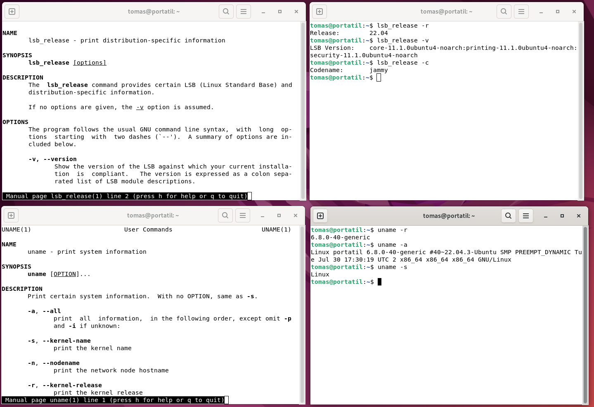
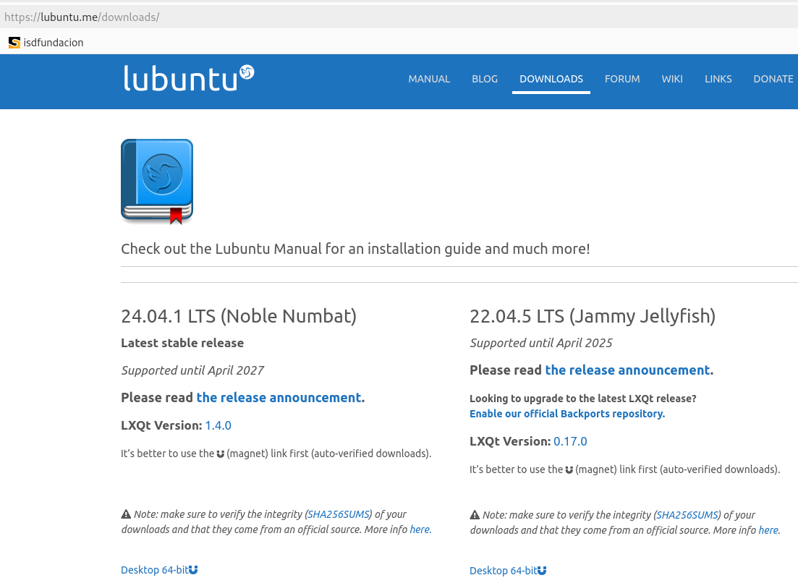
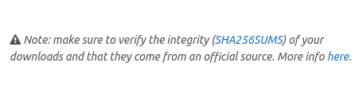
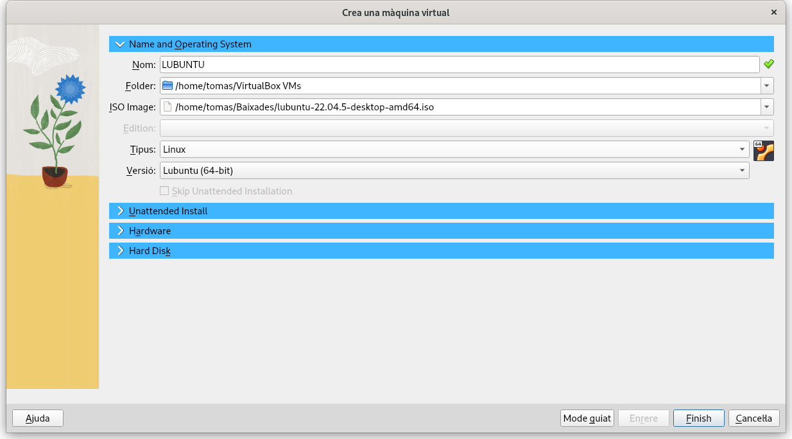
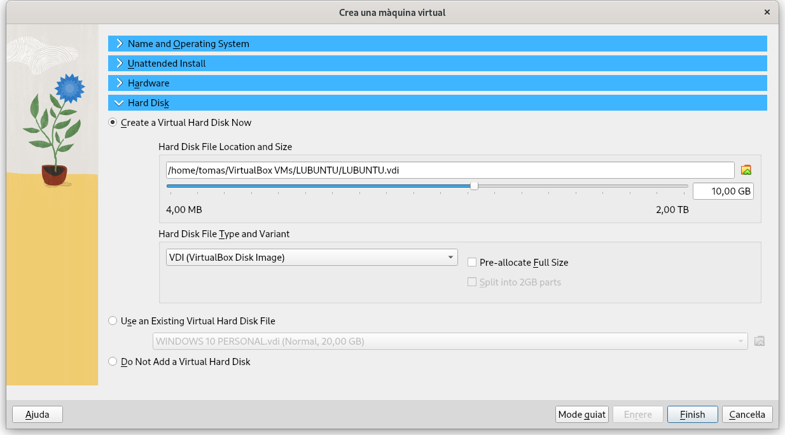

\newpage
\renewcommand\tablename{Tabla}
---


# 1 Introducció

Tot i que més avant estudiarem més detingudament la instal·lació i configuració d'Ubuntu, necessitem fer ara un avanç poder vore entendre, de manera práctica. què és la virtualització i altres conceptes teòrics.

En aquesta activitat vorem conceptes vistos en la **Unitat 1**:

* Software de sistema.

* Codi de detecció i correcció de la integritat de les dades.

Aprendrem els aspectes més importants del..

* VirtualBox

I serà un avanç a la Unitat 5 que tracta la instal·lació del Linux.

# 2 Instruccions per a l'activitat

1.  Estudieu la Unitat 1 i Unitat 2.

2.  Llegiu bé l'**Apartat 1**. Tot i que tornarem a veure-ho més avant.

3.  A l'**Apartat 2** s'especifica què heu de fer. Documenteu amb captures de pantalla el que aneu fent i guardeu en una carpeta amb el nom "Activitat2".

*Els apartats següents: **2.1, 2.2, 2.3** els estudiarem en la**UInitat 5**. Ara només cam que els llegiu per entendre quin SO anem a instal·lar.

## 2.1 Lubuntu/Ubuntu

Ubuntu i Lubuntu són diferents versions del mateix sistema operatiu base (nucli, repositoris i funcionalitats). La principal diferència entre **Ubuntu** i **Lubuntu** es troba en l’entorn d’**escriptori** i, conseqüentment, el rendiment. Aquí és on resideix la diferència:


- **Ubuntu**: Utilitza l’entorn d’escriptori **GNOME**, més complet, modern i visualment atractiu però més exigent pel que fa a l'ús de recursos del sistema (RAM i CPU).
  
- **Lubuntu**: Fa servir **LXQt**, un entorn d'escriptori molt més lleuger. Està dissenyat per consumir menys recursos, fent-lo ideal per a ordinadors antics i, més encara si, sobre aquests virtualitzem com serà el nostra cas a l'aula en el curs 2024-2025.

## 2.2 Versions

Són actualitzacions del sistema operatiu que es publiquen regularment. Hi ha dues categories principals:

1. **Versions LTS (Long Term Support)**: Versions amb suport a llarg termini (5 anys). Estan dissenyades per ser estables i segures durant més temps.
2. **Versions regulars**: Tenen un cicle de vida més curt (9 mesos), amb novetats més freqüents però menys estabilitat.

Els escriptoris també tenen versions.

## 2.3 Consultes per terminal

Comencem a obrir el Terminal ( **Alt + T**) i escriure alguna ordre de Linux...


### Quin entorn d'escriptori tenim ?

Cal consultar una vairable del sistema. Les estudiarem més avant.
```shell
echo $XDG_CURRENT_DESKTOP
```

### Quina versió té l'escriptori?

```shell
gnoms-shell --version
```

### Ditribució i versió del SO?

Fixeu-vos en Description i en Release

```shell
lsb_release -a
```

## Versió del nucli?

```shell
uname -r
```

> Nota:
>
>La majoria d'ordres (comandaments) de Linux tenen un **man**ual per consultar. O una ajuda (help) alternativa.

Exemple de búsqueda d'ajuda:
``` shell
man uname
```




# 3 Activitat

## 3.1 Descàrrega i comprovació de la font

Descàrrega la ISO de Lubuntu més avançada i fes la comprovació de la integritat del fitxer descarrega't tal com indica a la web.

[Web Lubuntu](https://lubuntu.me/downloads/)



## 3.2 Comprovar la integritat del fitxer

Usarem la **funció de hash: *sha256*** de Linux per comprovar que coincidesca amb el codi SHA256 que corresponga; el consultarem en l'enllaç de la Web. 



Estem, per tant fent una comprovació per detectar si hi ha hagut algun error en la baixada o en la gravació en disc; assegurant la integritat de les dades.

> Nota:
>
>Excutar una funció hash, quan ens ho proposa un proveïdor, és una pràctica recomanable que devem acostumar-nos a fer en descarregar o copiar software, sobretot si són fitxers de cert tamany.

Així:

```shell
sha256sum lubuntu-22.04.5-desktop-amd64.iso 
```

>Nota:
> Quan els fitxer sobre passen el **4Gb** no podràs copiar-los a un pen-drive formatejar amb FAT32 com solen vidre per defecte.  Això ens passaria amb la ISO de Windows 1x, per exemple.
Convé que el formateges com a NTFS.

## 3.3 Instal·lació senzilla

Ara intentarem fer la instal·lació. 

Indicarem on està la ISO (emulem la inserció del Pendrive o DVD)



Indiquem que creem un disco dur nou VDI



## 3.4 Configuració


Les opcions que no estiguen explicades a la teoria, les deixarem amb els seus valors per defecte.

Fixa't en l'usuari i password per defecte que et crea. Si fas algun canvi, anota-te'l.

