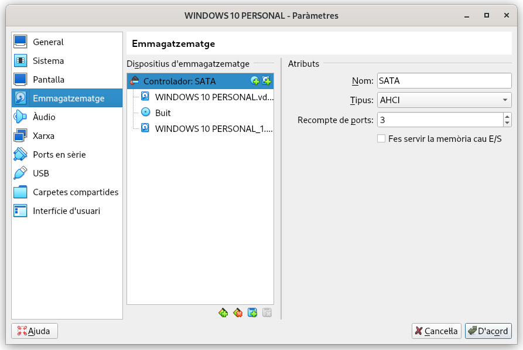
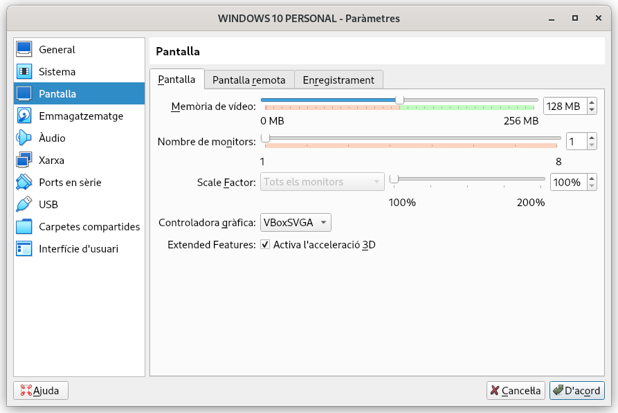
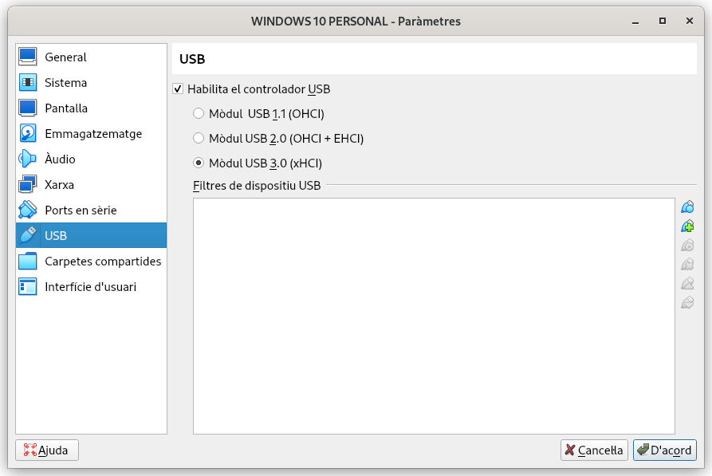
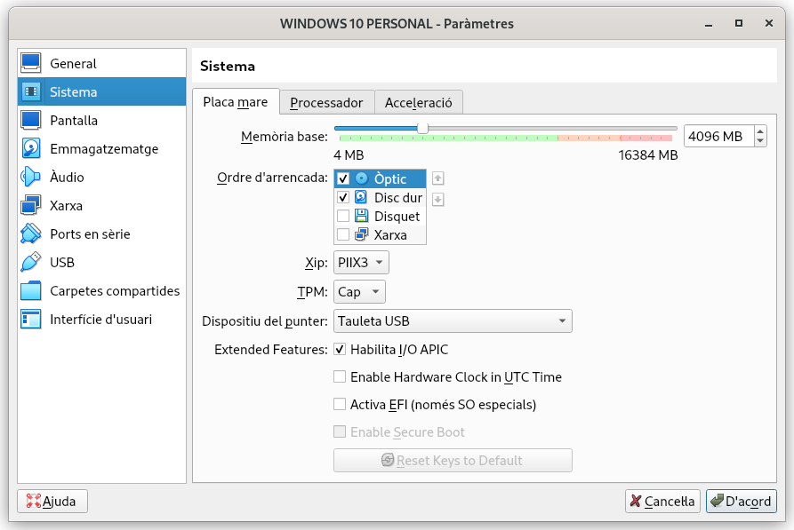
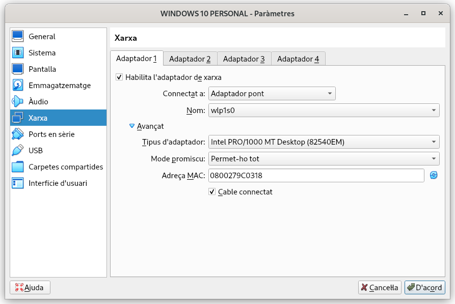
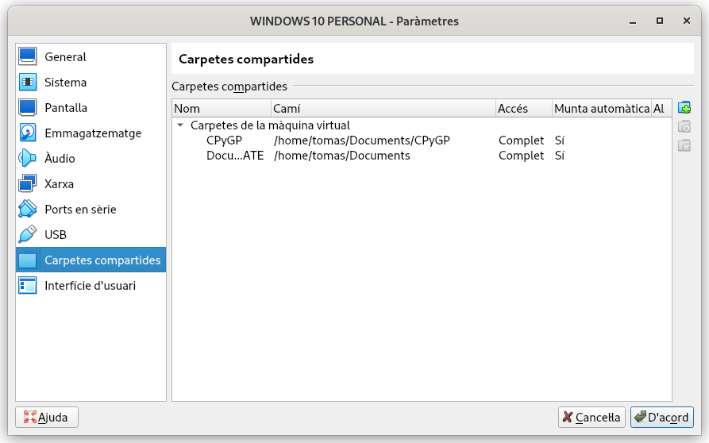

\newpage
\renewcommand\tablename{Tabla}
---

# 1. Introducció

La virtualització és una tecnologia informàtica que permet crear entorns virtuals dins de sistemes físics. En el nostre módul creraem Màquines Virtuals.

En aquesta unitat farem una aproximació mitjançant l'eina gratuïta (i sense suport!) d'Oracle **VM VirtualBox** amb la Llicència d'ús gratuït (Personal Use License) que esn permet l'ús gratuït personal mai comercial.

## 1.1 Avantatges

-   **Reducció de costos**: Menys maquinari físic.
-   **Flexibilitat i escalabilitat**: Facilita la creació de nous entorns de proves o producció.
-   **Recuperació ràpida**: Facilita la recuperació davant de fallades.
-   **Espais de proves (aïllament)**: Ideal amb finalitat educativa o experimental. 
-   **Eficiència en la utilització dels recursos:** Permet a diversos sistemes operatius funcionar simultàniament sobre el mateix maquinari.

# 2. Màquines virtuals

## 2.1 Definició

Una màquina virtual (MV) és una emulació d'ordinador independent dins d'un ordinador físic mitjançant un  software de sistema.

## 2.2 Caracterísitiques:

* Pot instal·lar-se un SO distint al de la màquina amfitriona.
* Usa part dels recursos HW ( CPU, RAM, Discos...).
* Podem tindre'n més d'una en marxa en el mateix PC.
* Podem comunicar-se per una xarxa virtual (interna) o no.
* Poden accedir a carpetes del PC amfitrió.
* Poden tenir accès a internet o no.
* Poden exportar-se o executar-se en un disc extraïble en diferents PC ambfitrions.
* Podem afegir HW vitrual facilment.
* Podem instal·lar aplicacions.

# 3 Tipus de virtualització

Centrant-nos en l'objectiu de mòdul de SOM, parlarem de la **virtualizació de MV en local**. Així tindrem dos tipus basat en dos tipus de **hipervisors**

## 3.1 Hipervisors

És el software que permet l'execució de Máquinas Virtuales (VM).

* El SO principal sobre el que hem instal·lat l'hipervisor és el sistema operatiu amfitrió.

* Els SOs de les MV són els SO invitats (guest)

Els hipervisors poden ser de 2 tipus:

* **Tipus 1** Funcionan directamente sobre el hardware.
    Exemples:
    Promox VE, VMware: ESX / vSphere Hypervisor, Microsoft Hyper-V Server, Citrix XenServer, citrix Hypervisor
    Xen

* **Tipus 2** Funcionen sobre el SO amfitrió. 
    Exemples: VirtualBox, VMWare Workstations/Player, Microsoft Virtual PC, QEMU Virt-Manager
    

    
## 3.2 Altres

Hi ha més tipus de virutalització que podeu investigar però no és objecte del mòdul de SOM.

# 4. Oracle VM VirtualBox

## 4.1 Instal·lació de VirtualBox *Ho heu de fer a casa*

- **Requisits del sistema:** Verificar les especificacions mínimes del sistema per a la instal·lació.
- **Procés d'instal·lació:** Descarregar l'instal·lador des del lloc web oficial de VirtualBox. Seguir les instruccions per instal·lar-lo en els diferents sistemes operatius com Windows , Linux i macOS.

[Video Tutorial Windows 1x]()

[Video Tutorial Linux ]()

## 4.2 Entorn i barres dels VirtualBox 

*Apartat poc important: 4.2*

**Entorn:**

- **Interfície d'usuari:** La interfície inclou la llista de màquines virtuals, opcions de configuració, i els logs de sistema.
- **Seccions principals:** L'espai de treball principal on es poden veure i gestionar les màquines virtuals existents.

**Barra de ferramentes:**

- **Funcions principals:** La barra de ferramentes proporciona accés ràpid a funcions com iniciar, aturar, i suspendre màquines virtuals.
- **Accions ràpides:** Permet realitzar accions com clonar, crear instantànies i accedir a la configuració ràpida de les màquines virtuals.

**Barra de menús:**

  - **Gestió de discos virtuals:** Crear, eliminar i modificar discos virtuals associats a les màquines virtuals.
  - **Imatges ISO:** Afegir i gestionar imatges ISO utilitzades per instal·lar sistemes operatius o aplicacions.

## 4.3 Importació i exportació

- **Importació:** Procediment per importar màquines virtuals des de formats com OVF o **OVA**
- **Exportació:** Procediment per exportar màquines virtuals per a compartir o crear còpies de seguretat.

> Nota:
>
> Són procediments lents. Una opció més viable és crear la MV en un disc extraible si el teu PC té un bon port USB 3. 

## 4.4  Administració de medis virtuals

### 4.4.1 La Unitat de magatzenament 

Podem indicar on estan les ISO. 
      - del SO a instal·lar
      - del GuestAdditions ( ho vorem)
      - altre software (MS Office, per exemple)

En l'apartat de Sistema indiquem el que emularia al **Boot oder** de la BIOS/UEFI. I ens assegurem que la MV inicie a partir del DVD. 

### 4.4.2 Discos

En **VirtualBox**, quan crees un disc dur virtual, tens tres possibles formats de fitxers.

1. **VDI (VirtualBox Disk Image)**:
   - Aquest és el format **natiu de VirtualBox**.
   - Ofereix compatibilitat completa amb totes les funcionalitats de VirtualBox, com la **mida dinàmica o fixa**.
   - És ideal si només utilitzaràs el disc amb VirtualBox com serà el nostre cas.

2. **VHD (Virtual Hard Disk)**:
   - Aquest és un format utilitzat principalment per Microsoft i aplicacions com Hyper-V (el virtualitzador integrat en Windows)
   - És útil si necessites compartir el disc dur virtual amb sistemes Microsoft o altres aplicacions de virtualització que suporten aquest format.

3. **VMDK (Virtual Machine Disk)**:
   - Aquest format és utilitzat per VMware, un altre software de virtualització.
   - És adequat si necessites moure màquines virtuals entre VirtualBox i VMware.
   

**VDI** és el més eficient si només utilitzes **VirtualBox** i serà el que usarem.

### 4.4.3 Boot Order

El **"boot order"** (ordre d'arrencada) es la seqüència en què el sistema (la UEFI o BIO) busca dispositius per arrencar un sistema operatiu quan l'ordinador es reinicia per  carregar un sistema operatiu.

- **Disquetera** (OBSOLET.Desactivar).
- **Unitats USB** (memòries USB, dispositius externs. NO operativa en VirtualBox).
- **Unitats CD/DVD** (lectors de CD o DVD. La que usarem en VirtualBox).
- **Disc dur o SSD** (on normalment està instal·lat el sistema operatiu).
- **Xarxa** (per arrencar des d'un servidor en una xarxa, utilitzant tècniques com PXE).

La configuració del boot order es fa a través de la configuració del BIOS o UEFI del sistema. Accedeixes a aquesta configuració generalment prem el teclat `F2`, `Delete`, `Esc`

### Usos

- **Instal·lació de Sistemes Operatius:** Per instal·lar el SO des de xarxa, USB o CD/DVD.
- **Resolució de Problemes:** Si el sistema no arrenca correctament, pot ser útil modificar el boot order per intentar arrencar des d'un dispositiu de recuperació o un live CD.

## 4.5 Configuració d'una màquina virtual

### Pantalla

Pot ser la configuració ens done problemes, la canviem ací:

### USB

L'accés a USB no sol anar massa bé en VirtualBox i pot donar algun problema segons el SO que instal·lem.

### 4.5.1 Sistema

1. **Xip (Processador Virtual)**:
   - **Funció**: Configura el tipus i la quantitat de processadors virtuals que utilitza la màquina virtual.

2. **TPM (Trusted Platform Module)**:
   - **Funció**: Proporciona seguretat criptogràfica a nivell de maquinari per emmagatzemar claus i dades sensibles.

3. **Habilita I/O APIC**:
   - **Funció**: Millora la gestió d’interrupcions, especialment en sistemes amb múltiples processadors o nuclis.

4. **Activa EFI (Extensible Firmware Interface)**:
   - **Funció**: Substitueix el BIOS tradicional amb una interfície de firmware moderna que suporta arrencada des de discs GPT i altres funcions avançades.

*Taula 1: Resum de les opcions de configuració de la màquina virtual per SO.*

| **Opció**              | **Ubuntu**                                  | **Windows 10**                             | **Windows 11**                                    |
|------------------------|---------------------------------------------|--------------------------------------------|---------------------------------------------------|
| **Xip (Processador Virtual)** | Configuració per defecte és suficient       | Configuració per defecte és suficient      | Configuració per defecte, amb almenys 2 nuclis  |
| **TPM (Trusted Platform Module)** | No necessari                              | No necessari                               | Necessari; utilitza solucions alternatives per simular TPM |
| **Habilita I/O APIC**         | Recomanat per a millor rendiment            | Recomanat per a millor rendiment            | Recomanat per a millor rendiment                 |
| **Activa EFI**                | Opcional, segons el disc (GPT o MBR)        | Recomanat si utilitzes un disc GPT         | Necessari; el disc ha de ser GPT                 |

### 4.5.2 Xarxa

En aquest punt convé detindre'ns en l'apartat de la configuració de xarxa per dos raons:

* Podem fer comporvacions de les IPs que tindrà la màquina segons la configuració que fem ara al "HW virtual". Qüestió relacionada amb el mòdul de XAL.

* Per al curs de 2n ho usarem més en els mòduls de SOX i SEX.

De totes les opcions que ens apareixen anem a centrar-nos en les que més ens interessen.

* **Adaptador pont** fa que la MV aparega com un PC més de la xarxa local real de l'aula o de ta casa. Tindrà una IP del mateix rang que la de l'amfitrió si ha sigut porporcionada pel servei del router.

* **NAT** Assigan una IP de rang (inclús de classe) ditinta a la del teu PC amfitrió.

* **XARXA INTERNA** A l'igual que l'anterior però ens permet assignar un **nom a la xarxa**.

*Taula 2: Resum característiques xarxa VirtualBox*

|Té accés a internet|Pot comunicar-se amb altres MV|Es pot comunicar amb la màquina real|Hem de configurar alguna cosa a Linux/Windows|
|:--|:--|:--|:--|:--|
|NAT|Sí|No|No|No|
|XARXA INTERNA|No|Sí|No|Sí|
|PONT (BRIDGE)|Sí|Sí|Sí|No|

## 4.6 Ús de carpetes compartides

- **Configuració:** Configurar carpetes compartides entre el sistema host (amfritrió) i les màquines virtuals per facilitar l'intercanvi de fitxers.
- **Gestió de permisos:** Assegurar que les carpetes compartides tenen els permisos adequats per accedir i modificar els fitxers des de les màquines virtuals.

Exemples pràctics habituals d'ús de les carpetes compartides:

1.  Usar programes de Linux i Windows sobre els mateixos fitxers. 
    Exmeple: El meu portatil té un Ubuntu i, a vegades vull usar el MS Office. Tinc una màquina virutal amb Windows 11 amb el MS Office des d'on accedisc a la carpeta */home/tomas/Documents*
    
2.  Estem treballant a classe o casa en la MV Lubuntu i fem captures de pantalla, documents etc... des de la MV per no anar alternant d'entorn (tampoc té massa compliació), podem guardar directament a la carpeta compartida des de la MV.

# 5. Alternatives de virtualització

## 5.1 VMware

- **VMware Workstation:** Aplicació de virtualització de maquinari per a usuaris de PC i servidors, amb funcionalitats avançades per a entorns de desenvolupament i proves.
- **VMware Player:** Versió gratuïta per executar màquines virtuals, adequada per a usuaris individuals.

## 5.2 Altres

- **Parallels Desktop:** Solució de virtualització específica per a macOS, permet executar sistemes operatius Windows i altres sobre Macs.
- **Hyper-V:** Tecnologia de virtualització de Microsoft integrada en Windows 10 i Windows Server, ofereix funcions avançades per a la creació i gestió de màquines virtuals.

(*No cal estudiar a partir d'ací*)

- **KVM (Kernel-based Virtual Machine):** Solució de virtualització per a Linux basada en el nucli, ofereix un entorn robust per a la creació i gestió de màquines virtuals.
- **Xen:** Hypervisor de codi obert que permet la virtualització de maquinari per a diversos sistemes operatius i entorns de servidor.

