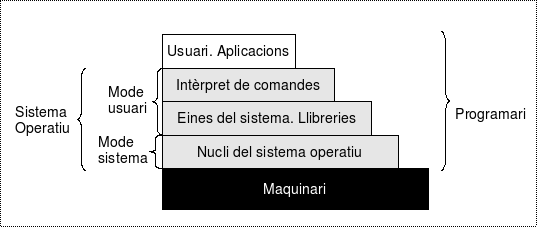
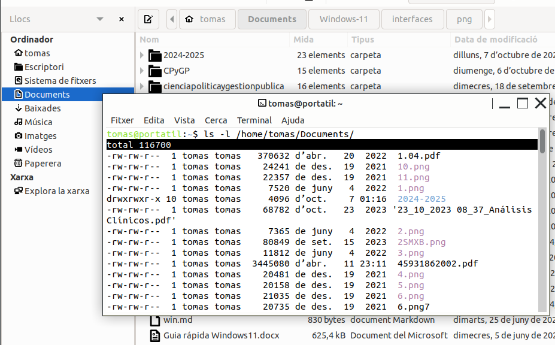
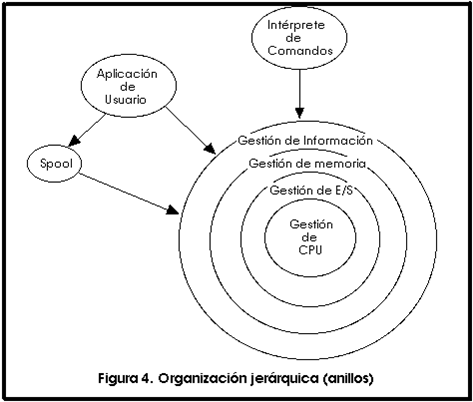
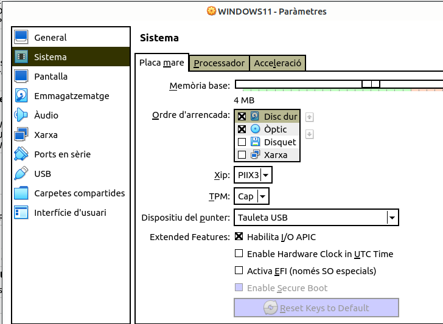
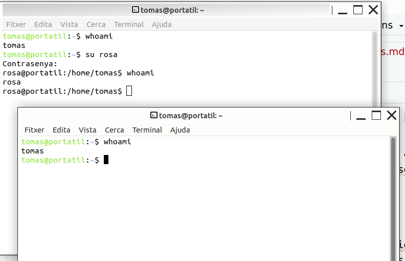

\newpage
\renewcommand\tablename{Tabla}

# 1. Introducció

El sistema operatiu (SO) és el conjunt de programes essencials que actuen com a intermediari entre els usuaris, les aplicacions i el maquinari de l'ordinador. El seu objectiu principal és gestionar els recursos del sistema i proporcionar una plataforma estable perquè els programes es puguen executar de manera eficient.


# 2. Components

Anem a veure els principals components del sistema operatiu monolloc típic.



## 2.1 Nucli (Kernel)

És el component central del SO. Gestiona operacions fonamentals com la gestió de memòria, la planificació de processos, la gestió de dispositius i la seguretat. Hi ha diferents tipus de nuclis:

  - **Nucli monolític**: Totes les funcions del sistema s'executen en un únic espai de memòria (ex.: Linux).

  - **Microkernel**: Només gestiona funcions bàsiques, com processos i memòria, mentre que altres serveis s'executen com processos independents (ex.: MINIX).

  - **Nucli híbrid**: Combina característiques dels nuclis monolítics i dels microkernel, permetent més modularitat (ex.: Windows NT i macOS).

## 2.2 Interfície amb l'usuari

La interfície d'usuari és el mitjà pel qual els usuaris interaccionen amb el sistema operatiu. Els dos tipus principals són:

- **CLI (Command Line Interface)**: L'usuari interactua mitjançant ordres de text ex.: Terminal en Linux, CMD en Windows).

- **GUI (Graphical User Interface)**: Permet la interacció gràfica mitjançant icones, finestres i menús (ex.: Windows, macOS).

És important entendre els avantatges de cadascun. Tindre un domini mínim per diverses raons:

* En Linux, els entorn gràfics canvien molt segons distribucions i els diferents **entorn d'escriptori**
* Molt sovint, tant en Linux com en Windows podem oblidar on està una ferramenta, consola...
* Algunes accions són més fàcils en un interface que en l'altres.
* Per a l'administració d'instal·lacions sense GUI (Windows Server Core i Linux Server).*No entra en aquest curs*



 
### ***...proveu!!***

A la vista de la imatge superior, intenta deduir quin podria ser un avanatge del CLI sobre el GUI.
Pista: usa l'ordre *pwd*

## 2.3 Entorns d'escriptori

Un **entorn d'escriptori** és la interfície gràfica que permet als usuaris interactuar amb el sistema operatiu d'una manera visual i intuïtiva. Inclou elements com el gestor de finestres, els menús, les icones, les barres d'eines i les aplicacions bàsiques (com el gestor d'arxius o el navegador). 

En Linux tenim els **GNOME**, **KDE** i **LXQt**. Podem instal·lar i desinstal·lar-ne

En Windows sols el **Windows Explorer** (també conegut com a **File Explorer**). Inclou la interfície gràfica principal, com el *menú d'inici*, la *barra de tasques*, les *finestres*, els *icones*, i altres elements visuals que permeten interactuar amb el sistema operatiu de manera fàcil i intuïtiva. Tots aquests components formen part de l'**experiència d'usuari a Windows**.

# 3 Funcions del SO

Les tractarem de forma més pràctica en els temes següents en la MV de Lubuntu i una de Windows 1x. Aquest és un tema introductori i generalista.




## 3.1 Gestor de fitxers

Gestiona l’emmagatzematge i l'accés als fitxers, i inclou la gestió de permisos d'accés per usuaris o processos.

Les accions que es poden fer són:

1- Creació de Fitxers.

2- Lectura de Fitxers.

3- Facilita la recuperació de dades d'un fitxer.

4- Escriptura de Fitxers. Modificar o afegir contingut a un fitxer existent.

5- Supressió de Fitxers.

6- Mou i Renombra Fitxers.Permet canviar la ubicació (moure) d'un fitxer o canviar el seu nom.

7- Gestió de Permisos. Controla qui té permís per llegir, escriure, executar un fitxer o canviar aquests permisos o propietari.

8- Organització en Directoris.

9- Cerca de Fitxers.

10- Control de Versions. Permet gestionar diferents versions d'un fitxer, especialment útil en entorns de desenvolupament.

11- Gestió de Sistemes de Fitxers. 

## 3.2 Processos

Un procés és un **programa en execució** que inclou el codi executable i el seu context d'execució (memòria, variables, fitxers oberts). El sistema operatiu gestiona múltiples processos i descideix en cada moment quin(s) estan fent ús de la CPU. 

Aquest decisió la pren atenent a un **algorisme de planificació**. Cada SO operatiu pot usar un o més d'un algorisme combinats (segon si són procesos d'un usuari o del SO).

Vorem alguns d'ells per entendre_ho millor com son: *FIFO (First In First Out)*, *SJF (Sort Job First)*, *Round Robin*. I els diferents estats que pot estar un procés en Linux i Windows.


## 3.3 Gestió de memòria

La memòria és un recurs crític i el SO l'assigna de manera que cada procés tinga suficient espai per executar-se. Les tècniques inclouen:

- **Paginació**: Divideix la memòria en pàgines per gestionar millor els recursos disponibles.

- **Memòria virtual**: Utilitza espai en el disc dur com si fos memòria RAM per permetre que els processos utilitzen més memòria de la disponible físicament. La **partició SWAP** de Linux o el **arxiu de paginació de Windows** ( en els entorns amb poc RAM tenia més ús).

### ***...proveu!!***

Proveu a la MV Lubuntu executar:
```bash
free
```
Si afegiu el paràmetre "human" com teniu ací...
```bash
free
```
Què observeu?

## 3.4 Gestió de dispositius d'entrada/sortida (E/S)

La gestió dels dispositius d'E/S permet que el sistema operatiu interactuï amb dispositius externs com teclats, ratolins o discos durs. 

- **Controladors (drivers)**: Són programes que tradueixen les ordres del SO per a cada dispositiu.

- **Buffering**: Es fa servir memòria intermèdia per gestionar les dades entre la CPU i els dispositius d'E/S.


## 3.5 Gestió de sistemes d’arxius

Els sistemes d'arxius gestionen l'emmagatzematge i l'accés a les dades.

- **Tipus de sistemes d'arxius**: 
      **FAT32, File Allocation Table** En dispositius antics i els pendrives (compte amb el tamany dels fitxers ISO!).
      **NTFS, New Technology File System**  Actualment en Windows.
      **ReFS, Resilient File System** Dissenyat per a Windows Server, però també està disponible en certes edicions          de Windows 11.
      **ext4**  Per Linux.
      
## 3.6 Gestió de la xarxa

El SO proporciona la connectivitat amb altres dispositius a través de protocols de xarxa com **TCP/IP**, permetent compartir recursos com fitxers o impressores.

## 3.7 Protecció

Els sistemes operatius implementen mecanismes de seguretat per controlar l'accés als recursos:

- **Polítiques de permisos**: Controlen l'accés a fitxers i recursos.

- **Sistemes d'autenticació**: Verifiquen la identitat dels usuaris mitjançant contrasenyes o biometria.


# 4. Tipus de Sistemes Operatius

## 4.1 SO per la seua estructura *No cal estudiar aquest punt*

- **Monolítics**: Totes les funcions del SO es troben en un mateix nucli, facilitant la velocitat però reduint la modularitat.
  - **Exemples**: **Linux**, **MS-DOS**.

- **Microkernel**: Només inclou funcions bàsiques com la gestió de processos i memòria, mentre que altres serveis funcionen fora del nucli.
  - **Exemples**: **MINIX**, **QNX**, **GNU Hurd**.

- **Nuclis híbrids**: Combinen aspectes de nuclis monolítics i microkernel, oferint un equilibri entre rendiment i modularitat.
  - **Exemples**: **Windows NT** (Windows 10/11), **macOS** (nucli XNU).

## 4.2 SO pels seus serveis *No cal estudiar aquest punt* 

- **Sistemes de temps compartit**: Permeten que múltiples usuaris utilitzin el sistema simultàniament compartint els recursos.
  - **Exemples**: **UNIX**, **Linux** (Ubuntu, Debian), **VMS**.

- **Sistemes de temps real**: Sistemes que responen a esdeveniments externs dins d'un temps determinat, utilitzats en entorns crítics com l'aeronàutica i la indústria.
  - **Exemples**: **VxWorks**, **RTLinux**, **FreeRTOS**.

- **Sistemes distribuïts**: Permeten la col·laboració entre ordinadors per compartir recursos i processos.
  - **Exemples**: **Apache Hadoop**, **Google Fuchsia**, **Amoeba**.

## 4.3 SO pels serveis de xarxa *No cal estudiar aquest punt*

- **SO amb serveis de xarxa**: Dissenyats per gestionar serveis de xarxa com la compartició de fitxers o la configuració de servidors.
  - **Exemples**: **Windows Server**, **Red Hat Enterprise Linux (RHEL)**, **FreeNAS/TrueNAS**.

- **SO per a serveis de xarxa avançats**: Optimitzats per gestionar xarxes complexes o serveis específics com tallafocs o ruters.
  - **Exemples**: **Cisco IOS**, **pfSense**, **OpenWRT**.


# 5. SO Monolloc actuals

## 5.1 Família Microsoft
- **Windows 10/11**: Són els SO més utilitzats en ordinadors personals. Windows Server és la seva versió per a servidors.
  
## 5.2 GNU/Linux

Hi ha una gran varietat de distribucions (**distros**) de Linux, cadascuna amb un enfocament diferent. Aquí tens un breu resum de les més populars:

### Ubuntu
Una de les distros més conegudes i utilitzades. Està basada en **Debian** i és popular per la seua facilitat d'ús i gran comunitat de suport. Té diverses variants com **Lubuntu** (amb LXQt) i **Kubuntu** (amb KDE).

És la que usarem a tots el Cicle Mitjà ( Lliurex està basa en ella).

*La següent informació sobre les distros no cal saber-la*

### Debian
Una distribució estable i segura, coneguda per la seua fiabilitat i base de moltes altres distros, com Ubuntu. Té versions estables i experimentals.

### Fedora
Patrocinada per **Red Hat**, és una distro orientada a l'última tecnologia, amb un cicle de llançament ràpid. Sol utilitzar-se GNOME com a escriptori.

### Arch Linux
Orientada a usuaris avançats, Arch proporciona una experiència personalitzada i minimalista. L'usuari construeix el sistema des de zero i es manté amb el model **rolling release** (actualitzacions constants).

### CentOS
Basada en **Red Hat Enterprise Linux (RHEL)**, ofereix una opció gratuïta per a servidors amb un enfocament en la seguretat i l'estabilitat a llarg termini.

### Linux Mint
Basada en Ubuntu, està dissenyada per ser una alternativa fàcil d'utilitzar per als usuaris que vénen de Windows, amb escriptoris com **Cinnamon** i **MATE**.

### OpenSUSE
Una distro coneguda per la seua eina de configuració central, **YaST**, que facilita la gestió del sistema. Té versions per a usuaris finals i empreses.

### Manjaro
Basada en Arch Linux, però amb una experiència d'instal·lació i ús més senzilla. Està dirigida a usuaris que volen la potència d'Arch sense la complexitat.

### Red Hat Enterprise Linux (RHEL)
Una distribució comercial orientada a empreses i servidors, coneguda per la seua estabilitat i suport tècnic professional.

### Kali Linux
Una distribució basada en Debian dissenyada per a **seguretat informàtica** i **test de penetració**, molt utilitzada en entorns de seguretat i hacking ètic.


## 5.3 Apple
- **macOS**: El sistema operatiu d'Apple per a ordinadors, conegut per la seva interfície gràfica i integració amb altres dispositius Apple.

## 5.4 Altres

- **Android**: Un sistema operatiu basat en Linux per a dispositius mòbils.
- **Chrome OS**: Utilitzat en Chromebooks, basat en el navegador Chrome.
  


# 6. Seqüència d’engegada de l’ordinador

La seqüència d’engegada (o **boot process**) és el conjunt de passos que segueix un ordinador des que es prem el botó d'engegada fins que el sistema operatiu està llest per ser utilitzat. És un procés crucial, ja que s’encarrega de comprovar que el maquinari funcioni correctament i de carregar el sistema operatiu. Aquest procés segueix una sèrie d'etapes ben definides:

## 6.1. Encès i activació del BIOS/UEFI

   Quan l'usuari prem el botó d'encendre l'ordinador, la font d’alimentació subministra energia i el primer programa que s'executa és el **BIOS** (Basic Input/Output System) o el més modern **UEFI** (Unified Extensible Firmware Interface), un programari integrat en la placa base que s'encarrega de realitzar les primeres comprovacions del sistema.

   - **Comprovació POST (Power-On Self Test)**: El BIOS/UEFI executa el **POST**, una sèrie de comprovacions per verificar que el maquinari essencial (memòria RAM, teclat, processador, etc.).
   
   - **Configuració inicial**: Es detecten els dispositius de maquinari instal·lats i es configura el sistema per funcionar amb ells, com ara la memòria, el disc dur, i altres dispositius perifèrics.

## 6.2. Càrrega del carregador d'arrencada (Bootloader)

   Després del POST, la BIOS/UEFI busca un dispositiu d’emmagatzematge com el disc dur, SSD o dispositiu USB (o per xarxa) segon l'**ordre de boot** (boot order) que tinga un sistema operatiu i busca el **carregador d'arrencada** (bootloader). Aquest és un petit programa que carrega el sistema operatiu en la memòria.

   - **Ordre de boot**: El BIOS/UEFI segueix una seqüència definida per comprovar on buscar el sistema operatiu. Aquesta seqüència es pot configurar en la BIOS/UEFI i pot incloure, per exemple, el disc dur principal, una unitat USB o una unitat òptica.
   A VirtuaBox ho emulem.
   
   
   
## 6.3. Execució del Bootloader

Quan el BIOS/UEFI troba el dispositiu amb el sistema operatiu, el **bootloader** es carrega en la memòria RAM. 
   
Els **bootloaders** més comuns són:
   
- **GRUB** en sistemes LinuX
- **Windows Boot Manager** en Windows
    
El bootloader té dues funcions principals:
   
- **Seleccionar el sistema operatiu** si hi ha més d'un instal·lat en l'ordinador, com en configuracions dual boot.
- **Carregar el nucli (kernel)** del sistema operatiu seleccionat a la memòria RAM.

## 6.4. Càrrega del nucli (Kernel)
   
   El **nucli del sistema operatiu** és el component central que s’encarrega de gestionar els recursos del maquinari i coordinar la comunicació entre el programari i el maquinari. En aquesta etapa, el nucli s'inicia i comença a detectar i inicialitzar els dispositius de maquinari (com la targeta gràfica, la targeta de xarxa, etc.).
   
   - **Inici dels controladors**: Es carreguen els controladors dels dispositius per permetre que el sistema operatiu interactuï amb ells.
   
   - **Inici de la gestió de memòria i processos**: El nucli també s’encarrega de gestionar la memòria i els processos que s'executen en l’ordinador.

## 6.5. Inicialització dels serveis i processos del sistema

   Després de carregar el nucli, s'inicien els **serveis** i **daemons** (processos que s'executen en segon pla) necessaris per al funcionament del sistema operatiu. Això inclou serveis de xarxa, seguretat, gestió d’arxius, etc.

   - En **Linux**, s'inicia el sistema d’inicialització com **systemd** o **init**, que llança tots els serveis essencials.
   
   - En **Windows**, s'inicien serveis com el gestor d’usuaris, serveis de seguretat, i altres processos del sistema.

>Nota:
>
>Un servei és un programa que s'exeuta en segon pla (no el veiem). Sense interactuar directament amb l'usuari. Proporciona servicis a altres programes.
> És, per tant, software de sistema.

## 6.6. Inici de la interfície gràfica d'usuari (GUI)
  
   Si el sistema operatiu utilitza una interfície gràfica, aquesta etapa es dedica a carregar la **interfície gràfica d'usuari (GUI)**. Això permet a l'usuari interactuar amb l’ordinador de manera visual i gràfica.

   - En **Windows**, s’inicia l’**explorer.exe**, que carrega l’escriptori i el menú d'inici.
   
   - En **Linux**, es pot carregar un entorn d’escriptori com **GNOME**, **KDE**, **LDE**. Poden instal·lar-se'n més d'un, com ja s'ha explicat adés, i escollir en inciar la sessió d'usuari en quin volem treballar.
   

## 6.7. Sessió d'usuari

   Finalment, l’ordinador està a punt per l’inici de sessió de l’usuari. Una vegada l'usuari introdueix les seues credencials, el sistema carrega el perfil de l'usuari (les carpetes on treballa: Documents, Baixades...) i està preparat per utilitzar el sistema operatiu i les aplicacions.

Una vegada iniciada la sessió, en Linux vorem que podem inciar la sessió dins del terminal d'uns altre usuari.

