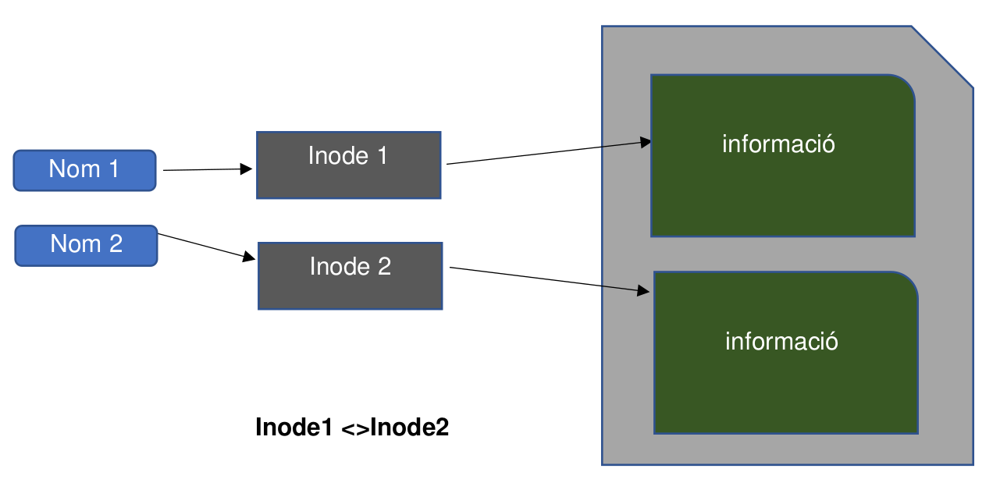
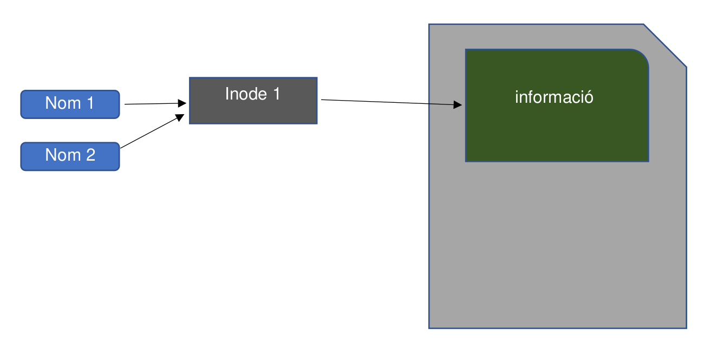
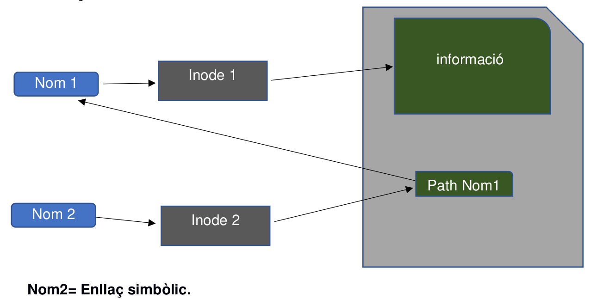

\newpage
\renewcommand\tablename{Tabla}
---

# 1. Introducció
Un sistema d'arxius és una estructura que un sistema operatiu utilitza per a organitzar i emmagatzemar dades de manera eficient en un dispositiu d'emmagatzematge (disc dur, SSD, etc.). El sistema de fitxers és essencial per a garantir que els arxius es puguen crear, modificar i eliminar de manera segura i controlada.

Els sistemes operatius basats en Linux, com Lubuntu, ofereixen diversos tipus de sistemes de fitxers, cadascun amb les seues característiques. A més, mitjançant la línia de comandes (terminal), es poden realitzar operacions avançades sobre els arxius i directoris de manera eficient.

# 2. Els arxius
Els arxius són els elements bàsics del sistema d'emmagatzematge. En Linux, qualsevol cosa és un fitxer, incloent dispositius, processos i sockets.

## 2.1 Els comodins
Els comodins són caràcters especials que permeten operar sobre múltiples arxius de manera més eficient.

| Comodí | Descripció | Exemple |
|--------|------------|---------|
| `*`    | Substitueix qualsevol nombre de caràcters | `ls *.txt` (mostra tots els fitxers `.txt`) |
| `?`    | Substitueix un sol caràcter | `ls arxiu?.txt` (mostra `arxiu1.txt`, però no `arxiu11.txt`) |
| `[ ]`  | Substitueix un conjunt de caràcters | `ls arxiu[12].txt` (mostra `arxiu1.txt` i `arxiu2.txt`) |

### Exemple 1
```bash
ls *.jpg
```
Aquest exemple llistarà tots els fitxers amb extensió `.jpg` del directori actual.

### Exemple 2
```bash
ls document[12].txt
```
Aquest exemple mostrarà els arxius `document1.txt` i `document2.txt`.

## 2.2 Tipus d’arxius
Els arxius en Linux es poden classificar en diversos tipus:
- Arxius normals: arxius de text o binaris.
- Directoris: contenidors que emmagatzemen altres arxius.
- Arxius de dispositiu: representen el maquinari (discs, impressores).
- Enllaços: referències a altres arxius.
- Arxius de sockets: usats per a la comunicació entre processos.

Per a identificar el tipus d'un arxiu:

```bash
file nom_arxiu
```

### Exemple
```bash
file /bin/bash
```
Aquesta ordre indicarà que `/bin/bash` és un executable binari.

# 3. Els permisos d’arxius
Cada arxiu o directori en Linux té associats permisos que controlen qui pot llegir, escriure o executar l'arxiu.

| Permís | Descripció | ordre |
|--------|------------|-------------|
| `r`    | Lectura    | Permet llegir el contingut de l'arxiu |
| `w`    | Escriptura | Permet modificar l'arxiu |
| `x`    | Execució   | Permet executar l'arxiu com un programa |

Els permisos s’assignen per a tres categories:
- Propietari (u)
- Grup (g)
- Altres (o)

Per a veure els permisos:
```bash
ls -l
```

### Exemple
```bash
ls -l document.txt
```
Això mostrarà els permisos del fitxer `document.txt`, per exemple:
```
-rw-r--r-- 1 usuari grup 1234 oct 13 08:42 document.txt
```

# 4. Operacions comunes d’arxius
| Operació               | Descripció                                   | ordre                       |
|------------------------|----------------------------------------------|-----------------------------------|
| Llistar arxius          | Mostra els arxius del directori actual       | `ls`                             |
| Copiar arxius           | Copia un arxiu a una altra ubicació          | `cp fitxer_origen fitxer_desti`   |
| Moure o canviar nom     | Mou o canvia el nom d'un arxiu               | `mv fitxer_origen fitxer_desti`   |
| Eliminar arxius         | Esborra un arxiu                             | `rm fitxer`                       |
| Crear un arxiu buit     | Crea un arxiu buit                           | `touch nom_fitxer`                |
| Consultar el contingut  | Mostra el contingut d'un arxiu de text       | `cat fitxer`, `less fitxer`       |

### Exemple 1: Copiar un fitxer
```bash
cp document.txt /home/usuari/Documentos/
```

### Exemple 2: Eliminar un fitxer
```bash
rm document.txt
```

### Exemple 3: Crear un fitxer buit
```bash
touch nou_fitxer.txt
```

# 5. Els directoris
Els directoris són arxius especials que contenen altres arxius i directoris. Permeten estructurar i organitzar el sistema de fitxers de manera jeràrquica.

## 5.1 Els permisos dels directoris
Els permisos per a directoris funcionen de manera similar als arxius, però amb algunes diferències:
- `r` (lectura): permet llistar els continguts del directori.
- `w` (escriptura): permet crear o eliminar fitxers dins del directori.
- `x` (execució): permet accedir a un directori (canviar-hi).

Per a canviar permisos a un directori:
```bash
chmod u+rwx nom_directori
```

## 5.2 Operacions comunes amb els directoris
| Operació                   | Descripció                                      | ordre                         |
|----------------------------|-------------------------------------------------|-------------------------------------|
| Crear un directori          | Crea un nou directori                           | `mkdir nom_directori`               |
| Eliminar un directori buit  | Esborra un directori                            | `rmdir nom_directori`               |
| Eliminar un directori amb contingut | Esborra un directori i tots els seus arxius | `rm -r nom_directori`               |
| Canviar de directori        | Navegar entre directoris                        | `cd nom_directori`                  |
| Llistar el contingut        | Llistar el contingut d'un directori             | `ls nom_directori`                  |

### Exemple 1: Crear un directori
```bash
mkdir Projecte
```

### Exemple 2: Eliminar un directori buit
```bash
rmdir Projecte
```

# 6. Rutes relatives i absolutes

En Linux, una **ruta** és la forma d'accedir a un fitxer o directori dins del sistema de fitxers. Hi ha dos tipus principals de rutes: **relatives** i **absolutes**.

## 6.1 Ruta absoluta
Una ruta absoluta és aquella que comença des de l'arrel del sistema de fitxers (`/`) i proporciona la ubicació completa d'un fitxer o directori. No depèn del directori actual en què et trobes.

### Exemple de ruta absoluta:
```bash
/home/usuari/Documentos/document.txt
```
En aquest cas, la ruta comença des de l'arrel (`/`) i especifica tot el camí fins al fitxer `document.txt`.

### Exemple d'ús:
```bash
cd /home/usuari/Documentos
```
Aquesta ordre et porta directament al directori `Documentos`, independentment del directori on et trobes actualment.

## 6.2 Ruta relativa
Una ruta relativa es defineix respecte al directori actual. No comença des de l'arrel, sinó des del directori en què estàs treballant. Si estàs en un directori concret, pots utilitzar rutes relatives per accedir a fitxers o subdirectoris dins del directori actual.

### Exemple de ruta relativa:
Si estàs en `/home/usuari` i vols accedir a `Documentos/document.txt`, pots utilitzar una ruta relativa:
```bash
cd Documentos
```

### Ús dels símbols `.` i `..`
- `.` fa referència al directori actual.
- `..` fa referència al directori pare (el directori immediatament superior).

### Exemple d'ús:
Per a pujar un nivell en la jerarquia de directoris:
```bash
cd ..
```

Per a moure's a un altre directori dins del directori pare:
```bash
cd ../Documents
```

# 7. Tipus de sistemes d’arxius

Linux suporta diferents tipus de sistemes de fitxers, cadascun amb les seues característiques.

| Sistema d’arxius | Característiques                                   |
|------------------|----------------------------------------------------|
| ext4             | Sistema d'arxius per defecte en moltes distribucions Linux. |
| NTFS             | Utilitzat per Windows, compatible amb Linux.       |
| FAT32            | Compatible amb diversos sistemes operatius, limitacions de grandària d'arxiu. |
| Btrfs            | Suporta snapshots, més adequat per a sistemes avançats. |

Per a identificar el sistema de fitxers d'una partició:
```bash
df -T
```

## 7.1 El sistema de fitxers basat en inodes

En Linux, el sistema de fitxers està basat en **inodes**. Un inode és una estructura de dades que conté informació important sobre un fitxer o directori. Cada fitxer en un sistema de fitxers de Linux té un inode associat que actua com la seua **clau única**. L'inode no emmagatzema el nom del fitxer ni el seu contingut, sinó que guarda informació sobre el fitxer, com ara:
- El propietari
- Els permisos
- La grandària del fitxer
- La data de creació i modificació
- Les adreces als blocs de dades on es troba emmagatzemat el contingut del fitxer

### Característiques dels inodes
1. **Clau única**: Cada fitxer o directori té un número d'inode únic dins del sistema de fitxers.
2. **Informació associada**: Conté metadades del fitxer, com propietari, permisos, dates...
3. **Punter als blocs de dades**: L'inode apunta als blocs del disc on es guarda el contingut del fitxer.
4. **Separació de noms i dades**: Els noms del fitxer i l'inode estan separats; és per això que és possible tenir múltiples noms (enllaços durs) apuntant al mateix inode. Diferència clau de Unix/Linux.

### Exemple: Visualitzar el número d'inode d'un fitxer
Pots visualitzar el número d'inode associat a un fitxer (o directori) amb l'ordre següent:

```bash
ls -i nom_fitxer
```
```bash
stat nom_fitxer
```

### Inode en acció

Quan crees un fitxer en un sistema de fitxers de Linux, s'assigna un inode per a aquest fitxer. Aquest inode manté informació sobre el fitxer, però el nom del fitxer està associat a aquest inode dins del directori. Quan elimines un fitxer, el sistema de fitxers només elimina l'enllaç (link) entre el nom del fitxer i l'inode, i no allibera l'inode fins que tots els enllaços (si hi ha més d'un) han estat eliminats.


**Resum**
1. Cada fitxer (nom) està enllaçat a un inode únic.Pot haver més d'un (diferència amb la resta de SO)
2. L'inode conté informació del fitxer (metadades) i apunta als blocs de dades del disc.
3. Els blocs de dades són els que emmagatzemen el contingut real del fitxer.

## 7.2 Representació gràfica

Veiem gràficament les **etiquetes o noms de fitxers**, els **inodes** i **l’àrea de dades** com quedarien en una
còpia de fitxer, un enllaç dur i un enllaç simbòlic.

### Còpia de fitxer



### Enllaç dur



### Enllaç simbòlic




# 8. Implementació del sistema d’arxius
Un sistema de fitxers és implementat mitjançant estructures que emmagatzemen la informació sobre els arxius i directoris, com ara taules d'índexs (inodes) i blocs de dades.

## 8.1 Comprovar el sistema d'arxius
Linux ofereix eines per a comprovar i reparar sistemes de fitxers.

```bash
fsck /dev/sdX
```

Aquesta ordre comprova i repara el sistema de fitxers del dispositiu `/dev/sdX`.

# 9. Els sistemes transaccionals
Els sistemes d’arxius transaccionals permeten que les operacions d’escriptura siguen atòmiques, garantint que qualsevol canvi es complete amb èxit o es revertisca totalment en cas d'error. Un exemple d'això és Btrfs, que permet utilitzar snapshots i còpies segures.

## 9.1 Com utilitzar snapshots amb Btrfs
Un snapshot és una còpia instantània del sistema de fitxers en un moment concret.

```bash
btrfs subvolume snapshot /mnt/source /mnt/snapshot
```

Aquesta ordre crea un snapshot del volum `/mnt/source`.

# 10. Enllaços simbòlics i enllaços durs
Un enllaç simbòlic (soft link) és com un "accés directe" a un altre fitxer. Un enllaç dur (hard link) fa que dos noms d'arxiu apunten al mateix contingut.

| Tipus d'enllaç    | Descripció |
|-------------------|------------|
| Enllaç simbòlic    | Apunta a la ubicació d'un altre arxiu |
| Enllaç dur         | Apunta al mateix contingut de dades dins del disc |

## 10.1 Crear un enllaç simbòlic
```bash
ln -s fitxer_original enllac_simbòlic
```

## 10.2 Crear un enllaç dur
```bash
ln fitxer_original enllac_dur
```

### Exemple
```bash
ln -s /home/usuari/document.txt document_enllac.txt
```

# 11. L'ordre stat
L'ordre `stat` proporciona informació detallada sobre un arxiu o directori, incloent la mida, permisos, inode i dates.

### Exemple d'ús
```bash
stat document.txt
```

Aquesta ordre mostra informació completa sobre el fitxer `document.txt`.

# 12. L'atribut l/d/-
Quan es fa un `ls -l`, el primer caràcter de cada línia indica el tipus d'arxiu:
- `-` indica un arxiu normal.
- `d` indica un directori.
- `l` indica un enllaç simbòlic.

### Exemple
```bash
ls -l
```
Eixida:
```
-rw-r--r-- 1 usuari grup 1234 oct 13 08:42 document.txt
drwxr-xr-x 2 usuari grup 4096 oct 13 08:42 carpeta
lrwxrwxrwx 1 usuari grup   12 oct 13 08:42 enllac -> document.txt
```
En aquest exemple, `document.txt` és un arxiu normal, `carpeta` és un directori i `enllac` és un enllaç simbòlic.

# 13. Empaquetament i compressió de fitxers

Empaquetar i comprimir són dues operacions relacionades però diferents. **Empaquetar** consisteix a ajuntar diversos fitxers en un sol arxiu, mentre que **comprimir** implica reduir la grandària d'un o més arxius mitjançant un algoritme de compressió.

## 13.1 Empaquetament amb tar
L'ordre `tar` s'utilitza per a empaquetar diversos fitxers en un sol arxiu. El format `tar` no realitza compressió per si mateix, simplement empaqueta fitxers i directoris en un únic arxiu.

### Paràmetres més comuns de l'ordre tar
| Paràmetre | Descripció |
|-----------|------------|
| `-c`      | Crea un arxiu empaquetat |
| `-x`      | Extreu fitxers d'un arxiu empaquetat |
| `-v`      | Mostra informació detallada durant l'empaquetament o descompressió (mode detallat) |
| `-f`      | Especifica el nom de l'arxiu empaquetat |
| `-z`      | Comprimeix l'arxiu amb `gzip` |
| `-j`      | Comprimeix l'arxiu amb `bzip2` |

### Exemple d'empaquetament d'una carpeta sencera amb tar
```bash
tar -cvf arxiu_empaquetat.tar directori_a_empaquetar/
```
Aquest exemple empaqueta el directori complet sense comprimir-lo. El paràmetre `-c` indica que estem creant un arxiu, `-v` mostra els detalls i `-f` especifica el nom de l'arxiu de destinació.

### Exemple d'empaquetament i compressió amb tar i gzip
```bash
tar -czvf arxiu_comprimit.tar.gz directori_a_empaquetar/
```
Ací s'empaqueta el directori i es comprimeix utilitzant `gzip`. El paràmetre `-z` afegeix compressió `gzip` a l'arxiu empaquetat.

### Exemple de descompressió d'un arxiu tar.gz
```bash
tar -xzvf arxiu_comprimit.tar.gz
```
Aquest exemple extreu els fitxers d'un arxiu comprimit `tar.gz`. El paràmetre `-x` indica que s'ha d'extreure, mentre que `-z` especifica que es tracta d'un arxiu comprimit amb `gzip`.

### Exemple d'empaquetament i compressió amb tar i bzip2
```bash
tar -cjvf arxiu_comprimit.tar.bz2 directori_a_empaquetar/
```
Aquest exemple utilitza `bzip2` per a comprimir l'arxiu, gràcies al paràmetre `-j`. 

### Exemple de descompressió d'un arxiu tar.bz2
```bash
tar -xjvf arxiu_comprimit.tar.bz2
```
Aquesta ordre extreu un arxiu empaquetat i comprimit amb `bzip2`.

## 13.2 Compressió i descompressió amb zip

El format `zip` és àmpliament utilitzat, especialment en sistemes Windows, però és compatible també amb Linux. A diferència de `tar`, `zip` empaqueta i comprimeix fitxers en un únic pas.

### Exemple de compressió d'una carpeta sencera amb zip
```bash
zip -r arxiu_comprimit.zip directori_a_comprimir/
```
En aquest exemple, el paràmetre `-r` permet comprimir tot el directori i els seus subdirectoris de manera recursiva en un únic arxiu `zip`.

### Exemple de descompressió d'un arxiu zip
```bash
unzip arxiu_comprimit.zip
```
Aquesta ordre descomprimeix el contingut de l'arxiu `zip` al directori actual.

## 13.3 Compressió i descompressió amb rar

El format `rar` és molt utilitzat en Windows i pot comprimir de manera molt eficient. A Linux, cal instal·lar l'eina `rar` per a poder treballar amb aquest format.

### Paràmetres comuns de l'ordre rar
| Paràmetre | Descripció |
|-----------|------------|
| `a`       | Afegir fitxers a un arxiu rar (comprimeix fitxers) |
| `x`       | Extreu fitxers d'un arxiu rar |
| `r`       | Comprimir recursivament (inclosos subdirectoris) |

### Exemple de compressió d'una carpeta sencera amb rar
```bash
rar a -r arxiu_comprimit.rar directori_a_comprimir/
```
El paràmetre `a` crea un arxiu comprimit. El paràmetre `-r` assegura que es comprimeix tot el directori de manera recursiva, incloent subdirectoris.

### Exemple de descompressió

D'un arxiu rar
```bash
unrar x arxiu_comprimit.rar
```
Aquesta ordre extreu tot el contingut de l'arxiu `rar`.

### Diferència entre empaquetar i comprimir
- **Empaquetar**: consisteix a ajuntar diversos fitxers en un únic arxiu. L'arxiu resultant no es comprimeix. Exemples: arxius `.tar`.
- **Comprimir**: es redueix la grandària de l'arxiu mitjançant algoritmes de compressió. Exemples: arxius `.zip`, `.rar`, `.tar.gz`.

### Relació del format tar amb paquets d'instal·lació
El format `tar` es fa servir habitualment per a empaquetar programari i biblioteques per a la seua distribució en sistemes Linux. Els paquets `.tar.gz` o `.tar.bz2` encapsulen fitxers de codi font o binaris, la qual cosa permet distribuir programari o fonts per a la compilació i instal·lació en diverses màquines.

### Compatibilitat amb Windows

Els formats `zip` i `rar` són àmpliament utilitzats en Windows, i són compatibles tant amb aquest sistema com amb Linux. El format `tar` és nadiu en Linux, però pot ser utilitzat en Windows mitjançant programari de tercers com **7-Zip** o **WinRAR**, que poden descomprimir arxius `.tar.gz` o `.tar.bz2`. Això fa que els arxius empaquetats en Linux puguen ser utilitzats també en Windows.

# 13 Glossari

Clàr! A continuació et presento un glossari basat en el text que hem tractat fins ara, amb les definicions claus per ajudar a entendre millor els conceptes discutits.

### Glossari

**Arxiu o fitxer**: Element bàsic de magatzematge en un sistema operatiu, que pot ser de text, binari, dispositiu, enllaç, o socket.

**Blocs de dades**: Unitats on es guarda físicament el contingut dels arxius en un disc dins del sistema de fitxers.

**Btrfs**: Sistema d'arxius per a Linux que suporta característiques com snapshots i còpies de seguretat.

**Carpetes**: Contenidors d'arxius que permeten organitzar el sistema de fitxers de manera jeràrquica.

**Comodins**: Caràcters utilitzats per substituir altres caràcters en operacions que involucren noms d'arxius.

**Directoris**: Vegeu Carpetes

**Enllaços**: Referències a arxius que poden ser simbòlics (soft links) o durs (hard links).

**Ext4**: Sistema d'arxius estàndard per a moltes distribucions de Linux, conegut per la seva robustesa i eficiència.

**FAT32**: Sistema d'arxius que ofereix compatibilitat amb diversos sistemes operatius però amb limitacions en la grandària i característiques.

**Fitxers**: Vegeu Arxiu.

**Inode**: Estructura de dades que conté informació essencial sobre arxius i directoris, com permisos, propietari, i ubicació dels blocs de dades.

**Linux**: Sistema operatiu de tipus Unix que és de codi obert i utilitzat àmpliament en servidors i sistemes embebuts.

**NTFS**: Sistema d'arxius utilitzat per Windows, compatible amb Linux a través de eines específiques.

**Permisos**: Atributs assignats a arxius i directoris que determinen qui pot llegir, escriure, o executar-los.

**Ruta absoluta**: Camí complet des de l'arrel (/) del sistema de fitxers fins a un arxiu o directori específic.

**Ruta relativa**: Camí que comença des del directori actual fins a un altre arxiu o directori, no comença des de l'arrel.

**Sistema de fitxers**: Estructura organitzativa usada per un sistema operatiu per controlar com es guarda i recupera la informació del disc.

**Snapshots**: Funció suportada per alguns sistemes de fitxers (com Btrfs) que permet crear una còpia instantània del sistema de fitxers en un moment concret.

**Tar**: Utilitat que permet empaquetar múltiples arxius en un sol arxiu, sovint usat juntament amb eines de compressió com gzip o bzip2.

**Zip/Rar**: Formats de compressió de fitxers que permeten reduir la grandària dels fitxers emmagatzemats i suporten la compressió d'una carpeta sencera.


