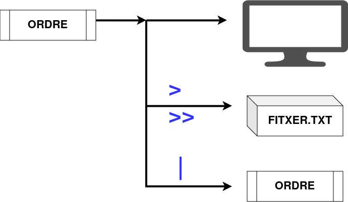
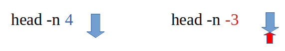
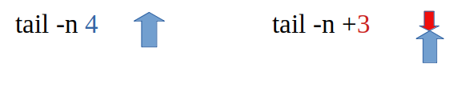

```{=tex}
\newpage
\renewcommand\tablename{Tabla}
```
# Resum

Tot seguit coneixerem dos ordres de Linux que ens serveixen per veure un nombre determinta de línies del principi (head) o del final (tail) de fitxers de text pla. 
Són útils en fitxer grans tipus log, on volem vore els registres més antics o més nous.

# 1 Eixides possibles d'una ordre.

Una ordre executada al terminal treu obviament el resultat (eixida) al terminal. Però, com hem practicat a classe, també podem enviar el resultat a un fitxer de text (creant-lo si no existeix) o també enviar este resultat com un operand més d'una altra ordre:

Exemple de cada cas
Eixida a pantalla
```bash
ls -l
```
Eixida a un fitxer de text (crea el fitxer de nou)
```bash
ls-l >f1.txt
```
L'eixida és l'entrada de l'ordre wc ( wc s'aplica sobre el resultat de ls -l)
```bash
ls -l|wc
```




# 2 ORDRE head

L'ordre *head* obté les 10 primeres línies d'un fitxer de text pla ( o eixida d'ordres )


## 2.1 Exemples sobre un fitxer

Aplicarem el *head* al següent fitxer de text...
```bash
tomas@portatil:~/Documents/textos$ ls>fitxer.txt
tomas@portatil:~/Documents/textos$ cat fitxer.txt 
f01
f02
f03
f04
f05
f06
f07
f08
f09
f10
f11
f12
f13
fitxer.txt
```
10 primeres línies
```bash
tomas@portatil:~/Documents/textos$ head fitxer.txt 
f01
f02
f03
f04
f05
f06
f07
f08
f09
f10
```
3 primeres línies
```bash
tomas@portatil:~/Documents/textos$ head -n 3 fitxer.txt 
f01
f02
f03
```
La capçalera ( primeres línies ) fins la N-última. *head -n N*
```bash
tomas@portatil:~/Documents/textos$ head -n -3 fitxer.txt 
f01
f02
f03
f04
f05
f06
f07
f08
f09
f10
f11
```

## 2.2 Exemples amb |

A partir d'un *ls* del directori ens treu el següent contingut.
```bash
tomas@portatil:~/Documents/textos$ ls
f01  f03  f05  f07  f09  f11  f13
f02  f04  f06  f08  f10  f12
```
Comencem a usar el *head*
```bash
tomas@portatil:~/Documents/textos$ ls|head
f01
f02
f03
f04
f05
f06
f07
f08
f09
f10
```
Podem canviar el valor per defecte de 10 per altre.
```bash
tomas@portatil:~/Documents/textos$ ls|head -n 2
f01
f02
```
La capçalera (primeres línies) fins la N-última. *head -n N*

```bash
tomas@portatil:~/Documents/textos$ ls|head -n -9
f01
f02
f03
f04
```


# 3 ORDRE tail

L'ordre *tail* obté les 10 darreres línies d'un fitxer de text pla ( o eixida d'ordres )

## 3.1 Exemples sobre un fitxer

A partir d'un fitxer de text.
```bash
tomas@portatil:~/Documents/textos$ ls>fitxer.txt
tomas@portatil:~/Documents/textos$ cat fitxer.txt 
f01
f02
f03
f04
f05
f06
f07
f08
f09
f10
f11
f12
f13
fitxer.txt
```
Les 10 darreres línies ( per defecte )
```bash
tomas@portatil:~/Documents/textos$ tail fitxer.txt 
f05
f06
f07
f08
f09
f10
f11
f12
f13
fitxer.txt
```
Canviem el valro per defecte. Les 5 darreres línies
```bash
tomas@portatil:~/Documents/textos$ tail -n 5 fitxer.txt 
f10
f11
f12
f13
fitxer.txt
```
La cua fins la 8ª línia
```bash
tomas@portatil:~/Documents/textos$ tail -n +8 fitxer.txt 
f08
f09
f10
f11
f12
f13
fitxer.txt
tomas@portatil:~/Documents/textos$
```

## 3.2 Exemples amb |
A partir d'un *ls* del directori ens treu el següent contingut.
```bash
tomas@portatil:~/Documents/textos$ ls
f01  f03  f05  f07  f09  f11  f13
f02  f04  f06  f08  f10  f12
```
Comencem a usar el *tail*. Les 10 darreres línies.
```bash
tomas@portatil:~/Documents/textos$ ls |tail
f05
f06
f07
f08
f09
f10
f11
f12
f13
fitxer.txt
```
Les 3 darreres línies de la cua
```bash
tomas@portatil:~/Documents/textos$ ls |tail -n 3
f12
f13
fitxer.txt
```
La cua sencera excepte les 3 primeres línies. *tail -n -N*
```bash
tomas@portatil:~/Documents/textos$ ls |tail -n +3
f03
f04
f05
f06
f07
f08
f09
f10
f11
f12
f13
fitxer.txt
```



