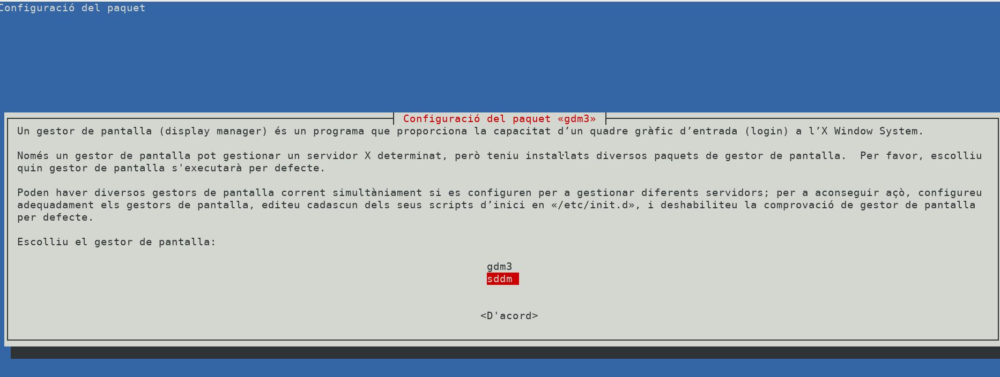
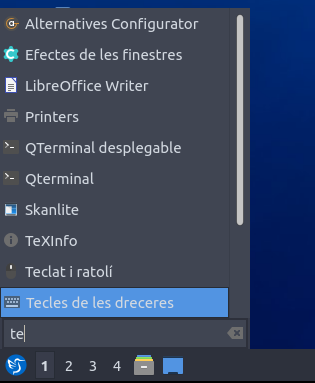
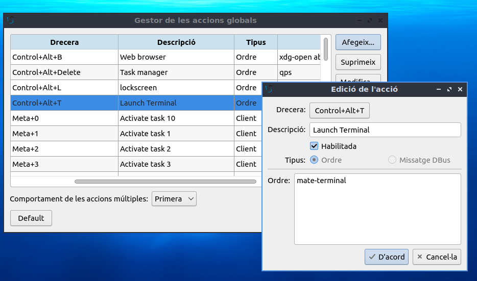
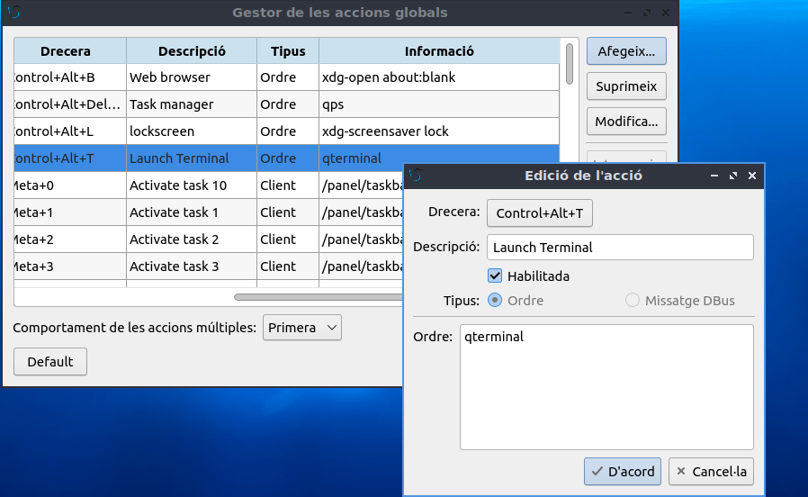
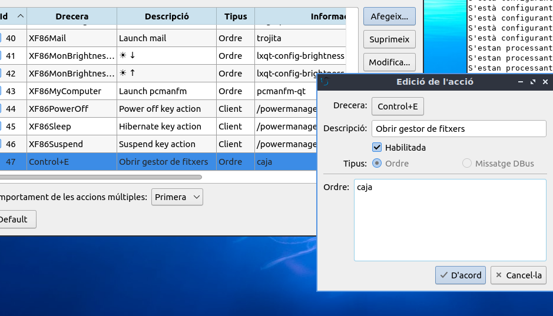
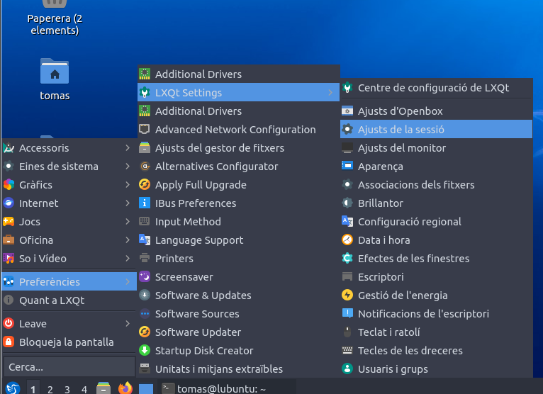
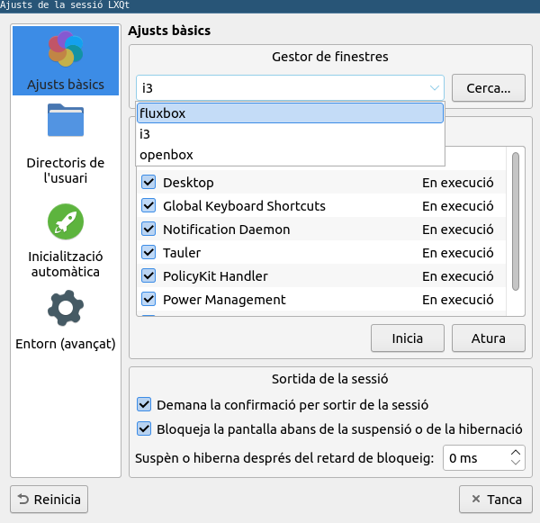
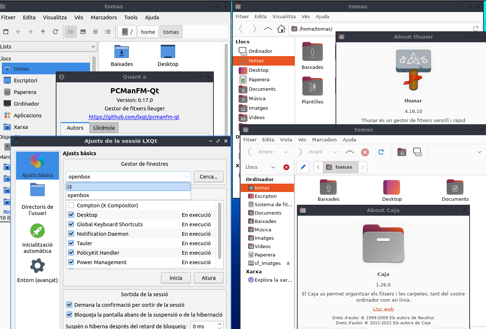

\newpage
\renewcommand\tablename{Tabla}


# 1. El sistema operatiu GNU/Linux. 

## 1.1 Característiques

- **GNU/Linux** és un sistema operatiu lliure i de codi obert.
- Basat en el nucli **Linux** i eines del projecte **GNU**.
- Escalable: pot ser utilitzat en dispositius menuts o grans servidors.


## 1.2 Distribucions


Una **distribució** Linux (distro) és un sistema operatiu basat en el nucli Linux que inclou programari específic, eines d'administració, gestors de paquets i una configuració personalitzada. 
Cada distribució s'adapta a necessitats concretes:ús general, educació, servidors, sistemes lleugers...

Exemples de distribucions:

  | **Distribució** | **Orientació**                      |
  |------------------|------------------------------------|
  | Ubuntu           | Usuaris nous, suport comunitari.  |
  | Debian           | Estable, per servidors.           |
  | Arch Linux       | Personalitzable, usuaris experts. |
  |Fedora||
  |Manjaro||

Als cicles de FP ens centrarem en **Ubuntu**


# 2 UBUNTU

## 2.1 Característiques

- **Lliure i obert**: Es pot modificar i distribuir.
- **Multiusuari**: Diversos usuaris alhora.
- **Multitasca**: Execució de múltiples processos.
- **Segur**: Model de permisos.
- **Portabilitat**: Funciona en diferents plataformes.


## 2.2 La Instal·lació de Ubuntu

**Resum dels pasos a seguir**

1. Descarrega la imatge ISO des d'[ubuntu.com](https://ubuntu.com/). 
2. Comprova que l'has descarregada bé ( codi HASH: `sha256sum`, habitualment )
3. Grava-la en un PenDrive amb eines com **Ventoy** (o Rufus, Etcher).
4. Modifica el BootOrder de la UEFI per arrancar des del PenDrive.
5. Segueix el procés d'instal·lació: Partició SWAP (si en necessites), regióm idioma, fus horari, altres particions.
6. Canvia el BootOrder i incia sessió.


## 2.3 Versió d'Ubuntu

Amb l'ordre: 
```bash
lsb_release -a
```
o llegint el fitxer de configuració
```bash
cat /etc/os-release
```

Una vegada més veiem com en un fitxer de text pla es guarda informació del sistema. En este cas:

* Nom del SO
* Distribució
* Versió

I el fitxer el manté una ordre: `lsb_release`

# 3 Estructura

## 3.1 Nucli (Kernel)

   - Gestió de recursos: memòria, CPU, dispositius.
   - Per veure la versió:
     ```bash
     uname -r
     ```
   - Exemple de resultat: `6.8.0-49-generic`.

## 3.2 Shell

### Definicio i tipus

   - Interfície que permet interactuar amb el sistema amb les seues ordres.
   - Exemples: **bash**, **sh**, **dash**.
  
  Els shells diponible sels tenim al fitxer /etc/shells
  
  ```bash
  cat /etc/shells
  ```
  
Cada usuari té un assigant (ho podem vore a /etc/passwd) però es pot canviar amb: chsh ( change shell)
```bash
sudo chsh -s /bin/bash tomas
```
El canvi es vorà immediatament en /etc/passwd però no s'aplicarà fins que no reiniciem sessió amb l'usuari.

  
### Ordres

   - Comandes bàsiques: `ls`, `cp`, `mv`.

### Utilitats

   `apt`, ǹet-tools`,`mdadm', 

### Curiositat

Podem instal·lar un emulador del shell més avançat de MS-Windows a Ubuntu: el PowerShell.

## 3.3 Entorn gràfic

### 3.3.1 Entorn d'escriptori

* Cada Distro en porta un Entorn per defecte que podem canviar i tindre un altre o més d'un i triar en l'inici de sessió d'usuari.

* Un **Entorn d'escriptori** és el conjunt d'elements gràfics que defineixen la interfície visual del sistema operatiu. 
Inclou:

  * Gestor de finestres. (a)
  * Gestor de fitxers.
  * Menús, barres d'eines, icones i aplicacions predeterminades.
  * Emulador de terminal.

    (a) Usat per tots els altres components ( està un nivell per baix)

* Tot que **cada eçentorn d'escriptori té el seu gestor de finestres i gestor de fitxers per defecte però podeu canviar-los** i es manté l'estructura.

* No tots els canvis funcionen perfectament.

### 3.3.2 Gestor d'arxius

Un **gestor d'arxius** és una aplicació que permet navegar, organitzar, copiar, moure i gestionar fitxers i carpetes del sistema. És una peça essencial en qualsevol entorn d'escriptori.

Per defecte cada Entorn d'Escriptori en duu un però podem instal·lar i desinstal·lar-ne, tindre'n més d'un...

**Exemples:** Nautilus (Gnome), Dolphin (KDE Plasma), Thunar (Xfce), PCManFM-Qt (LXQt).


### 3.3.3 Emulador de terminal

Un **emulador de terminal** és una aplicació que proporciona accés a la línia de comandes. Permet interactuar directament amb el sistema operatiu, executar ordres, i gestionar processos i fitxers de manera avançada.

Per defecte cada Entorn d'Escriptori en duu un però (igual que amb el Gestor de Fitxers) podem instal·lar i desinstal·lar-ne, tindre'n més d'un...

**Exemples:** Gnome Terminal, Konsole (KDE), Xfce Terminal, QTerminal (LXQt).

### 3.3.4 Gestor de Finestres (+ informació al Punt 6)
El gestor de finestres és un component més bàsic per al funcionament de l'entorn gràfic en general. Controla les finestres de totes les aplicacions, no només del gestor de fitxers.
Per tant, està en un nivell inferior al Gestor de Finestres, navegadors web, editors de text, terminals, etc.

*(+ informació al Punt 6: Fora de temari en SOM)*

---

# 4 L'*ecosistema* gràfic de Linux

## 4.1 Quadre resum


| **Distribució**       | **Entorn d'escriptori** | **Usos habituals**                                   | **Paquet**                    | **Gestor d'arxius per defecte** (paquet) | **Emulador de terminal per defecte** (paquet) |
|------------------------|-------------------------|-----------------------------------------------------|--------------------------------|------------------------------------------|-----------------------------------|
| **Lubuntu**           | **LXQt**               | Perfecte per a equips molt antics o amb pocs recursos. | `lubuntu-desktop`             | **PCManFM-Qt (`pcmanfm-qt`)**           | **QTerminal (`qterminal`)**       |
| **Ubuntu**            | **Gnome**              | Ideal per a usuaris que busquen simplicitat i modernitat. | `ubuntu-gnome-desktop`        | **Nautilus (Files) (`nautilus`)**        | **Gnome Terminal (`gnome-terminal`)** |
| **Linux Mint**        | **Cinnamon**           | Per a usuaris que busquen un entorn similar a Windows. | `cinnamon-desktop-environment` | **Nemo (`nemo`)**                       | **Gnome Terminal (`gnome-terminal`)** |
| **Kubuntu**           | **KDE Plasma**         | Per a usuaris que volen personalització extrema i eines avançades. | `kde-plasma-desktop`          | **Dolphin (`dolphin`)**                 | **Konsole (`konsole`)**           |
| **Xubuntu**           | **Xfce**               | Ideal per a equips antics o usuaris que prefereixen un entorn lleuger i funcional. | `---xubuntu-desktop`             | **Thunar (`thunar`)**                   | **Xfce Terminal (`xfce4-terminal`)** |
| **Ubuntu Mate**       | **Mate**               | Per usuaris que prefereixen una experiència clàssica i retro. | `ubuntu-mate-desktop`         | **Caja (`caja`)**                       | **Mate Terminal (`mate-terminal`)** |
| **Ubuntu Budgie**     | **Budgie**             | Perfecte per a usuaris que volen una experiència moderna i neta. | `ubuntu-budgie-desktop`       | **Nautilus (Files) (`nautilus`)**        | **Tilix (`tilix`)**               |
| **Ubuntu Unity**      | **Unity**              | Per a usuaris nostàlgics d'Ubuntu (pre-Gnome 2017). | `ubuntu-unity-desktop`        | **Nautilus (Files) (`nautilus`)**        | **Gnome Terminal (`gnome-terminal`)** |

## 4.2 Instal·lació i desinstal·lació d'un entorn d'escriptori

- **Instal·lació**:
  ```bash
  sudo apt install ubuntu-gnome-desktop
  ```
- **Desinstal·lació**:
  ```bash
  sudo apt remove --purge ubuntu-gnome-desktop
  sudo apt autoremove --purge
  ```

**El gestor de pantalles**

Quan instal·les un nou escriptori (com ara GNOME en Lubuntu, que utilitza per defecte LXQt), potser et demane que tries quin **gestor de pantalles (display manager)** prefreixes usar.

El gestor de pantalles és el programa que s'encarrega de la interfície d'inici de sessió gràfica. És el que veus quan encens l'ordinador i et demana que introduesques el teu usuari, contrasenya i l'escriptori gràfic o sessió vols iniciar (per exemple, GNOME, KDE, LXQt, etc.).

* gdm3 (GNOME Display Manager): Dissenyat per a GNOME, però pot gestionar altres entorns gràfics.
* sddm (Simple Desktop Display Manager): Sovint utilitzat per entorns lleugers com LXQt o KDE Plasma.




Si vols prioritzar l'ús de GNOME (el que acabes d'instal·lar), selecciona gdm3.
Si prefereixes mantenir l'entorn lleuger de Lubuntu (LXQt), pots optar per sddm.

Si en algun moment necessites canviar de gestor de pantalles, pots fer-ho amb l'a comand'ordre
```bash
sudo dpkg-reconfigure gdm3
```


## 4.3 Instal·lar i desinstal·lar un gestor de fitxers

- **Instal·lació**:
  ```bash
  sudo apt install dolphin
  ```
- **Desinstal·lació**:
  ```bash
  sudo apt remove --purge dolphin
  ```

## 4.4 Instal·lar i desinstal·lar un emulador de terminal

- **Instal·lació**:
  ```bash
  sudo apt install tilix
  ```
- **Desinstal·lació**:
  ```bash
  sudo apt remove --purge tilix
  ```


>**Nota:**
>
>Després de desinstal·lar qualsevol paquet, és recomanable executar:
 ```bash
  sudo apt autoremove --purge
  ```
  Això elimina dependències innecessàries per alliberar espai al sistema.
  
## 4.5 Dreceres (combinació de tecles)

Lligat a l'anterior punt, pot ser interessant accedir a l'emulador de terminal o al gestor de fitxers gràfic amb una sola combinació de tecles.



### Modificar una drecera existent: 

Amb *Control + T* obrim el QTerminal



Canviem el nom del terminal...

Ara obrirem el Mate-terminal que hem instal·lat.



### Crear una drecera nova

Amb *Control + E* obrirem el gestor de fitxers Caja (que devem instal·lar)



## 4.6 Aplicacions

- Navegador web: **Firefox**.
- Suite ofimàtica: **LibreOffice**.
- Reproductor multimèdia: **VLC**.

Habitualment entenem per aplicacions les que són gràfiques però no hem d'oblidar que hi ha moltes eines que són aplicacions que s'executen en mode CLI, encara que són software de sistemes per regla genearal. Les hem anomenat al punt 1.2: apt, net-tools, nano, mdadm...

La instal·lació ja hem vist que podem fer-la amb l'eina *apt*. Més avant ho repassarem i vorem altres formes.

# 5 Conclusions

Què podem dir ja de Linux o d'Ubuntu amb el que hem vist i el poc que sabem de Windows o Android?

**Delimitació o capes:**

La primera cosa a destacar al món d'Ubuntu és la clara separació entre nuclis, shell i GUI. 
Dins del GUI, veiem que també queda ben delimitat el gestor de finestres, el gestors d'arxius dins del Escriptori.

**Diversitat i compatibilitat:**

La segona qüestió a destacar és la quantitat de Escriptoris, Gestors de finestres, Gestors de fitxers i, fins i tot d'emuladors de terminals! i la intercanviabilitat.

*Compte que només estem veient una part del món Ubuntu. La galaxia Linux és més gran i friqui encara!*

Tot açò junt a característiques com ser multiusuari (poder tindre sessions de terminal de distints usuaris al mateix temps) fa que siga ideal per a una introducció al món del Sistema Operatius.

Podem fer proves al nostre entorn de proves (màquines virtuals de VirtualBox) instal·lant Escriptoris,  Gestors o Terminals, però una vegada tinguem clar quin volem, interessa alleugerir la instal·lació amb només el que anem a usar.


# 6 (Fora de temari) Gestor de finestres

El gestor de finestres és un component més bàsic per al funcionament de l'entorn gràfic en general. Controla les finestres de totes les aplicacions, no només del gestor de fitxers.
Per tant, està en un nivell inferior al Gestor de Finestres, navegadors web, editors de text, terminals, etc.

| **Entorn d'Escriptori** | **Gestor de Finestres Predeterminat** | **Gestor de Fitxers Predeterminat** | **Alternatives de Gestor de Finestres** | **Alternatives de Gestor de Fitxers**     |
|--------------------------|---------------------------------------|--------------------------------------|-----------------------------------------|-------------------------------------------|
| **GNOME**               | Mutter                                | Nautilus (Files)                    | Openbox, i3, bspwm                     | Thunar, PCManFM, Dolphin                  |
| **LXQt**                | Openbox (o altres lleugers)           | PCManFM-Qt                           | i3, Fluxbox, bspwm                     | Thunar, Dolphin, Nautilus                 |             |
| **MATE**                | Marco                                 | Caja                                 | Openbox, i3, bspwm                     | Nautilus, Dolphin, Thunar   
| **KDE Plasma**          | KWin                                  | Dolphin                              | Openbox, i3, bspwm                     | Thunar, Nautilus, PCManFM                 |
| **Xfce**                | Xfwm                                  | Thunar                               | Openbox, i3, bspwm                     | Nautilus, Dolphin, PCManFM                |
              |
| **Unity (antic)**        | Compiz                                | Nautilus                             | Openbox, Mutter                        | Thunar, Dolphin, PCManFM                  |
              |

**Recomanacions**

- **Compatibilitat**: Quan canvies un gestor de finestres o un gestor de fitxers, assegura't que és compatible amb l'entorn que utilitzes. Això és especialment important en entorns com GNOME o KDE, que tenen una integració molt ajustada.
- **Flexibilitat**: En entorns més lleugers com **LXQt**, **LXDE** o **Xfce**, és més fàcil combinar components diferents sense trencar l'experiència de l'escriptori.
- **Minimalisme**: Si utilitzes un gestor de finestres minimalista com **i3** o **bspwm**, sovint hauràs de configurar manualment el gestor de fitxers i altres components.

>**Nota**
>
> La MV de VirutalBox et permet fer les proves abans.

##  Canviar en la sessió de Gestor de Finestres

Instal·la un nou Gestor de finestres

```bash
sudo apt install openbox
```

Substitueix Marco pel nou gestor:
```bash
openbox --replace
```

## Canvi permanent

Al nostre Lubuntu, com exemple, tenim el Gestor de finestres OpenBox. Ara, instal·lem el i3 i el posem com predeterminat. 
El provarem







Vegem 3 Gestors de Fitxers amb el mateix Gestor de Finetres. Podem fer canvis i comprovar que totes les combinacions no funcionen massa bé.




