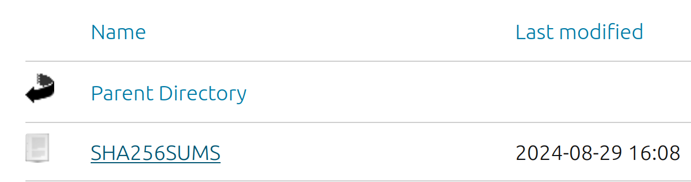
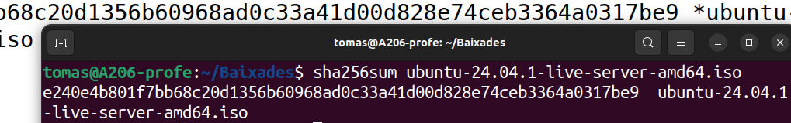
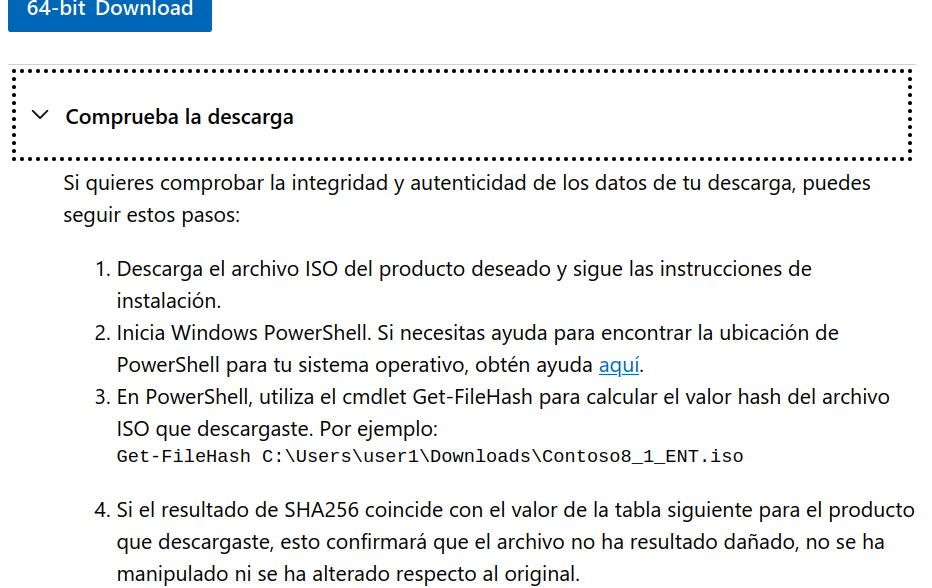
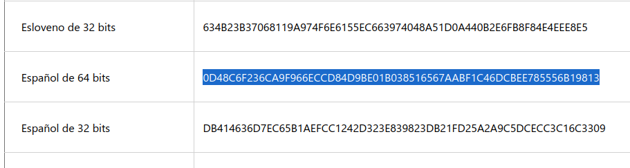

# 1 CODI HASH

Un codi hash és un valor únic generat a partir de dades mitjançant un algorisme matemàtic. Serveix per identificar i verificar informació sense revelar-ne el contingut.

## 1.1 Característiques:

* De mida fixa (ex: 256 bits per SHA-256).

* Un petit canvi a les dades genera un hash completament diferent.

* No es pot revertir (no es pot obtenir l’original des del hash).

## 1.2 Usos:

* **Verificació de fitxers (integritat)**

* Emmagatzematge segur de contrasenyes.

* Signatures digitals i seguretat informàtica.

### Exemples de diferents algorismes:

En negreta resalte el que anem a usar.

| Algorisme  | Longitud del hash | Seguretat | Ús principal |
|------------|-----------------|-----------|-------------|
| MD5        | 128 bits (32 caràcters)  | Feble (col·lisions) | Comprovació de fitxers (no segur per criptografia) |
| SHA-1      | 160 bits (40 caràcters)  | Feble (col·lisions trobades) | Signatures digitals antigues |
| **SHA-256**    | 256 bits (64 caràcters)  | Alta | Certificats digitals, blockchain, **integritat de dades** |
| SHA-512    | 512 bits (128 caràcters) | Molt alta | Seguretat avançada |
| BLAKE2     | 256-512 bits  | Més ràpid que SHA-256 | Criptografia moderna |
| Argon2     | Variable | Molt segura | Emmagatzematge de contrasenyes |
| bcrypt     | 192 bits | Resistència a atacs de força bruta | Protecció de contrasenyes |


# 2.- SHA256 en LINUX: *sha256sum*

* Llegeix les dades d'un fitxer o entrada.
* Processa les dades mitjançant l'algorisme SHA-256.
* Retorna una cadena hexadecimal de 64 caràcters que representa el hash.

Exemple:

```bash
sha256sum exemple.txt
5e884898da28047151d0e56f8dc6292773603d0d6aabbdd89c6b247dd60a8a6e  exemple.txt
```

## 2.1 Verificació de una ISO






# 3. SHA256 en WINDOWS

## 3.1 Informació 



## 3.2 Get-FileHash

```powershell
Get-FileHash -Path "C:\Windows.iso" -Algorithm SHA256

```
Ens donarà, per exemple:
```
Algorithm       Hash                                                                   Path
---------       ----                                                                   ----
SHA256         0D48C6F236CA9F966ECCD84D9BE01B038516567AABF1C46DCBEE785556B19813       C:\Ruta\Windows.iso
```


En Windows tenim un codi Hash (sha256) distint per cada idioma:



Comprovem que els codis coincideixen.

# 4 ALTRES USOS

Encara que el cas de les ISO de Sistemes Operatius serà l'ús més habitual en quant a la verificació de la **integritat d'un fitxer** pode donar altres usos.

Exemple: Ens demanen que compartim en un portal web un fitxer gran que altri podrà descarregar mitjaçant https o ftp. Podem generar el codi *sha256* i compartir-lo per a que, després de la descàrrega es puguen comprovar si ha anat bé.

```bash
tomas@portatil:~$ sha256sum smartgit-linux-23_1_2.tar.gz>>sha256sum.txt
tomas@portatil:~$ ls -l sha256sum.txt
-rw-rw-r-- 1 tomas tomas 95 de gen.  29 12:01 sha256sum.txt
```

És indistint que usem Linux (sha256sum) que usem cmdLets (Get-FileHash). La funció *sha256* és la mateixa.