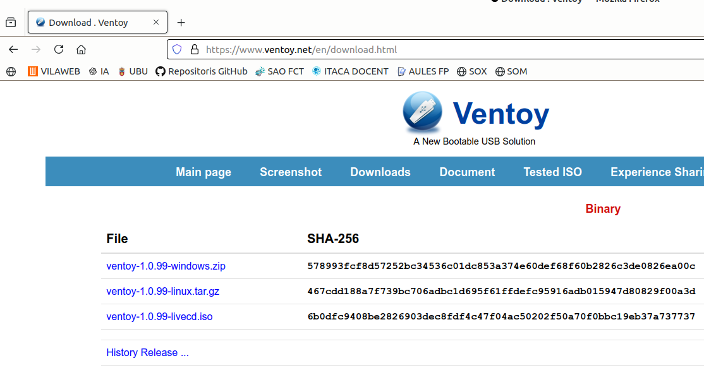
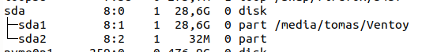
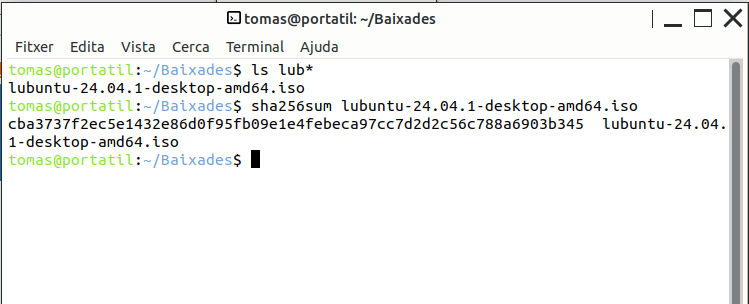
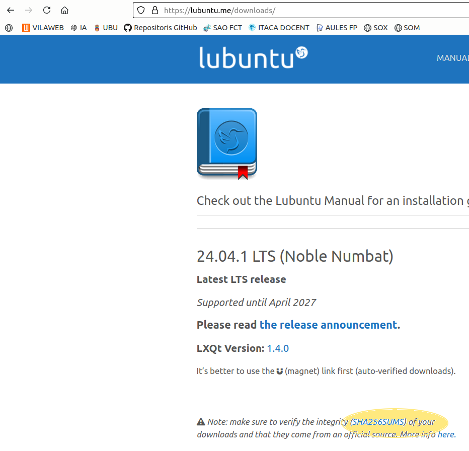
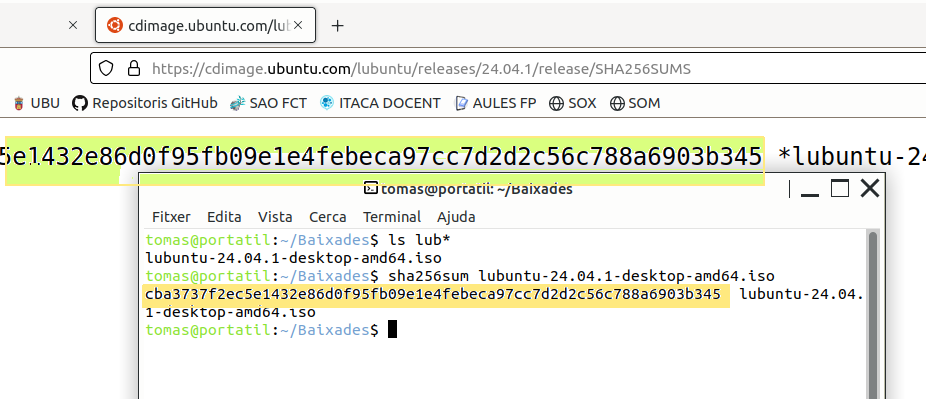

El Ventoy és una utilitat per a preparar un Pendrive. Una vegada instal·lada al Pen, podrem usar-lo per instal·lar el SO que vullguem.
Només caldrà copiar la ISO del SO al Pen (tantes com càpiguen !)

\newpage
\renewcommand\tablename{Tabla}

# 1. Preparar un Ventoy amb una ISO.

## 1.1. Descarregar Ventoy

1. Accedeix a la pàgina oficial de Ventoy: [https://www.ventoy.net](https://www.ventoy.net).
2. Descarrega el fitxer per a Linux (`ventoy-x.x.x-linux.tar.gz`).



## 1.2 Descomprimir i instal·lar

1. **Obre el terminal**:
   Prem `Ctrl` + `Alt` + `T`.

2. **Canvia al directori de descàrregues**:
   ```bash
   cd ~/Baixades
   ```

3. **Extreu el fitxer descarregat**:
   ```bash
   tar -xzf ventoy-x.x.x-linux.tar.gz
   ```
   Això crearà una carpeta amb el nom `ventoy-x.x.x`.

4. **Entra al directori extret**:
   ```bash
   cd ventoy-x.x.x
   ```


# 2 Instal·lar 

## 2.1 Connecta el pendrive

1. Connecta el pendrive que vols preparar.
2. Identifica el dispositiu del pendrive al sistema:
   
   ```bash
   lsblk
   ```
Localitza el dispositiu que correspon al pendrive (exemple: `/dev/sda`). Assegura't d'identificar-lo correctament.

**ATENCIÓ**: Assegura't de seleccionar el dispositiu correcte perquè aquest procés esborrarà totes les dades del pendrive.

### Exemple:



---

#  2.2 Instal·lar Ventoy al pendrive

Per instal·lar Ventoy al pendrive, executa:

```bash
sudo ./Ventoy2Disk.sh -i /dev/sdX
```

Substitueix `/dev/sdX` pel nom correcte del dispositiu del pendrive (per exemple, `/dev/sdb`).

Durant la instal·lació, el terminal et demanarà confirmació. Escriu `y` per continuar.

---


**Ja tenim el Ventoy instal·lat !**

# 3. Copia d’arxius ISO

> Nota:
> Abans de copiar la ISO podem comprovar si està correctament descarregada.

## 3.1 Comprovar la ISO del SO 

(Hi ha una unitat posterior que també ho explica per a Linux i per a Windows)

**Si la ISO està correcta, no cal fer este pas però s'ha de saber fer.**

### Mirem quin codi sha256 dona el fitxer descarregat

A les webs de descàrregues de fitxers grans sempre torbarem un codi com el sha256 per a fer la comporvació.



### Busquem a la web quin codi sha256 és el correcte

En clicar sobre l'enllaç s'obrirà un fitxer amb et codi.



### Els comparem



Si el codi coindideix podem continuar...

## 3.1 Copiem les IOS que vulguem

Una vegada instal·lat el Ventoy, el pendrive apareixerà "buit". 

Ara pots copiar qualsevol **arxiu ISO** al pendrive i tindrem tots els SO disponibles per instal·lar.

# 4 Instal·lació del SO.

Ara hem de reinciar el PC i arrancar des del Pendrive.

1. Entrar a la UEFI i canviar el BootoOrder: el primer disc a buscar ha de ser el Pen
2. Insertar el pendrive i arrancar.
3. Ens treu un menú on triarem quin SO volem instal·lar.


