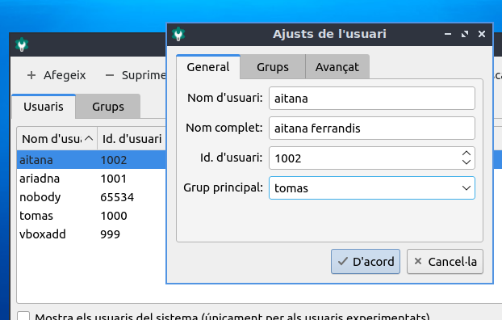
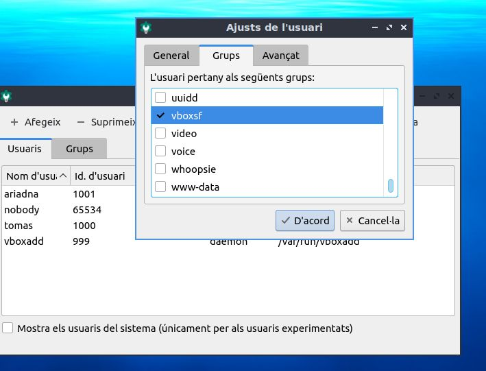
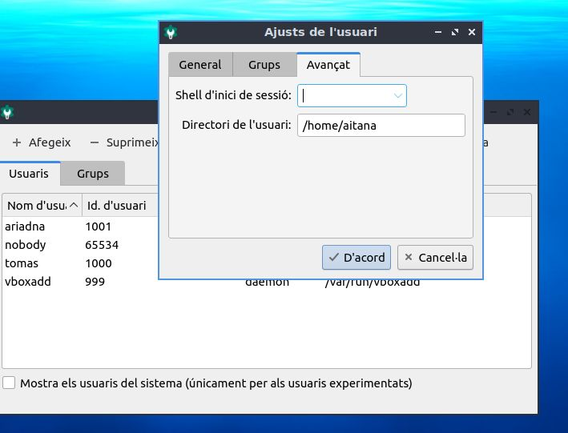

\newpage
\renewcommand\tablename{Tabla}

# 1 Resum 

En esta unitat aprendrem com crear, modificar i eliminar comptes locals (usuaris i grups) de Linux des de l'entorn gràfic i des de terminal. Haurem de ser capaços de dominar:

* La gestió des de l'entorn GUI
* La gestió amb ordres Linux
* Conéixer alguns fitxers de configuració
* Conéixer el perfil dels usuaris


# 2 Consideracions prèvies

* Comptes = usuaris +  grups.
* El permís es dona a comptes sobre carpetes o fitxers.
* Un usuari pot pertanyer a més d'un grup.
* Si un usuari pertany a més d'un grup té els permisos i drets que tenen tots els grups.
* Un usuari pot fer canvis sobre la seua configuració, però no pot canviar-se de grup si no es administrador (sudoer)

|PC|Grup|Usuari|Permisos|Carpeta|
|:--|:--|:---|:---|:--|
|PC_Mostrador|tornDia|Pere, Joana|/home/DirectoriAlbarans2024|lectura|
||tornVesprada|Aitana, Vicent, Joana||lectura i escriure|

Sobre la carpeta */home/DirectoriAlbarans2024* els usuaris podran...
Pere i Joana podran llegir el contigut de la carpeta (ls .) i el contingut del fitxers que hi haja (cat, tail...).
Els usuaris Aitana, Vicent i (també) Joana podran, llegir, crear i eliminar (touch, cp, rm...) fitxers a la carpeta i també modificar el contingut dels fitxers.

(Assumim que els permisos dels fitxers son els mateixos que els de la carpeta i que podem navegar (permís d'execució) per ella)

# 3 Gestió des del GUI

Observem que els UID son els identificador únics d'usuari (com un NIA, DNI, NUSS o adreça MAC): 

* Els usuaris que inicien sessió (persones) comença per 1000 per defecte.
* Els usuari que corresponen a software de sistema (servicis), tenen valors distints.
* L'usuari vboxadd i el grup són de VirtualBox, no els trobareu en instal·lacions normals.

Si no indiquem grup, en crea un amb el mateix nom que l'usuari assigna un GID (major que 1000 també).



Podem incloure en més d'un grup. 

Un grup interessant per compartir informació entre màquines (virtuals o reals) és el *sambashare*. La compartició de carpetes i fitxers entre ordinadors (xarxa local) es veu en el mòdul de SOX. No obstant, podrem fer alguna prova més avant.


>Nota:

>No hem de confondre la compartició en xarxa de la compartició local en VirtualBox

En l'àmbit de màquines virtuals, tenim el *vboxadd* que ens fa falta per poder usar "carpetes compartides" entre la MV i el PC amfitrió.

| Aspecte                      | Compartició general                   | Compartició en VirtualBox              |
|-------------------------------|----------------------------------------|----------------------------------------|
| **Connexió**                  | Utilitza xarxa (Samba, NFS, etc.).     | No utilitza xarxa, connexió directa.   |
| **Requisits**                 | Configuració de xarxa i permisos.      | Instal·lació de Guest Additions.       |
| **Disponibilitat**            | Accessible des de qualsevol dispositiu autoritzat. | Només entre amfitrió i convidat.      |
| **Configuració**              | Pot requerir coneixements avançats.    | Bastant senzilla amb l'eina GUI de VirtualBox. |
| **Seguretat**                 | Pot requerir encriptació o VPN.        | Accés limitat al sistema amfitrió.     |






# 4 Gestió des del terminal i fitxers de configuració

Les ordres del terminal tenen avantatges respecte al GUI:

* Molt sovint les opcions gràfiques poden donar problemes.
* Poden automatitzar-se (per exemple, un script que llig un fitxer csv on estan els usuaris i els crea tots de colp).
* Podem consultar i modificar (fent còpia de seguretat abans) els fitxers de configuració.
* No sempre disposarem de GUI.


## 4.1 Alta d'usuari: *useradd*

Creem un usuari "vicenta" assignant-li com a grup principal "tomas" ( paràmetre "-g" ).

* -g grup principal
* -G l'afegim a un segon grup
* -s li assignem un shell per defecte
* -c Un descriptor
* -h Directori de treball (home)...
* -m ...el crea  (make) si no existeix


La contrassenya s'assigna amb "passwd"

```bash
tomas@tomas-VirtualBox:~$ sudo useradd vicenta -g grContabilidad -m -d /home/vta -s /bin/bash -c "Vicenta Ferrer"
tomas@tomas-VirtualBox:~$ sudo useradd vicenta -aG grFacturacion
tomas@tomas-VirtualBox:~$ sudo passwd vicenta
Nova contrasenya de : 
Torneu a escriure la nova contrasenya de : 
passwd: s'ha actualitzat la contrasenya satisfactòriament
tomas@tomas-VirtualBox:~$ 
```
Comprovem els grups...

```bash
tomas@tomas-VirtualBox:~$ cat /etc/group|grep Contab
grContabiliad:x:1002:vicenta
tomas@tomas-VirtualBox:~$ groups vicenta
vicenta : grContabilidad grFacturacion
```

## 4.2 Modificació d'usuari: *usermod*

Com exemple, afegim l'usuari al grup "rosa". Compte!, hem d'incloure els grups secundaris existents si no afegim "-a"

```bash
tomas@tomas-VirtualBox:~$ sudo usermod vicenta -G rosa,pere
```
Compte! Amb -G hem d'indicar la llista sencera de grups

Observem al fitxer de grups en quants està vicente
```bash
tomas@tomas-VirtualBox:~$ cat /etc/group|grep vicenta
grContabilitat:x:1001:vicenta
grFacturacion:x:1002:vicenta
```
També amb l'ordre *groups*

```bash
tomas@tomas-VirtualBox:~$ groups vicenta
vicenta : tomas grContabilidad grFacturacion
```

Amb els paràmetres "-G" i "-aG" (add)

```bash
tomas@tomas-VirtualBox:~$ sudo usermod vicenta -aG grVendedores
```

## 4.3 PERFIL d'USUARI

Comprovem que existeix el directori *home* però no conté els directoris del perfil "Documents", "Baixades"... Cal iniciar la sessió des de l'entorn gràfic.

```bash
tomas@tomas-VirtualBox:~$ ls /home/vta
tomas@tomas-VirtualBox:~$ ls /home
enric  pere  rosa  tomas  vta
tomas@tomas-VirtualBox:~$ 
```
Amb el primer inici de sessió en el PC de l'usuari nou, es crea el perfil sencer ( carpetes DOcuments, Baixades...)

>PROPIETARI 
>És molt important que es fixeu en el propietari del directori, fent *ls -l* o també amb *stat*


## 4.4 Eliminació: *userdel*

Sobre el *userdel* convé conéixer el paràmtre "-r" per borrar els directoris de treball i saber que si el grup principal conté altres usuaris es manté.

```bash
tomas@tomas-VirtualBox:~$ sudo userdel -r pere
userdel: no s'eliminarà el grup pere donat que hi ha usuaris assignats.
userdel: pere no s'ha trobat la cua de correu (/var/mail/pere)
```
## 4.5 Alta de grups: *groupadd*

Ja hem vist com assignar usuaris a grups amb "usermod" veiem ara ordres de grups.
```bash
tomas@tomas-VirtualBox:~$ sudo groupadd gr1
[sudo] contrasenya per a tomas: 
tomas@tomas-VirtualBox:~$ sudo groupadd -r gr2
```
## 4.6 Eliminació de grups: *groupdel*

```bash
tomas@tomas-VirtualBox:~$ sudo useradd  -g gr1 joana
tomas@tomas-VirtualBox:~$ sudo groupdel gr1
groupdel: no es pot eliminar el grup primari de l'usuari «joana»
```

## 4.7 Administració dels grups

Afegir un usuari a un grup. Veiem les dos alternatives:

* amb el gpasswd -a

* amb el usermod -a -G

Per a eliminar un usuari del grup. Veiem les dos alternatives:

* amb el gpasswd -d

* amb el usermod -G  ( indicant els grups excepte el que volem llevar )

(l'opció -G té el perill d'oblidar-nos-en d'algun grup!)

Al següent exemple afegim enric a gr2, l'eliminem i el tornem a afegir.

```bash
tomas@tomas-VirtualBox:~$ sudo gpasswd -a enric gr2
S'està afegint l'usuari enric al grup gr2
tomas@tomas-VirtualBox:~$ sudo gpasswd -d enric gr2
S'està eliminant l'usuari enric del grup gr2
tomas@tomas-VirtualBox:~$ sudo usermod enric -a -G gr2
```
*(NO solen usar-se contrassenyes de grup. No estudiar)*
Afegir i eliminar contrasenya al grup 
```bash
sudo gpasswd gr1
```
```bash
sudo gpasswd -r gr1
```
El fitxer de contrassenyes encriptades de grup...
```bahs
sudo cat/etc/gshadow
...
...
gr1:::
gr2:!::enric
```

# 5 Resum: Fitxers de configuració dels comptes locals.


En el present curs (SOM) ens centrarem en els dos primers.


| **Fitxer**                 | **Funció**                                                                 | **Exemple de Contingut**                                 |
|----------------------|---------------------------------------------------------------------|---------------------------------------------------|
| **/etc/passwd**      | Informació bàsica dels usuaris (UID, directori inicial, shell).   | `user:x:1001:1001:/home/user:/bin/bash`            |
| **/etc/group**      | Informació dels grups (GID, membres).                             | `group:x:1001:user1,user2`                          |
| **/etc/shadow**      | Contrasenyes encriptades i configuració de caducitat.             | `user:$6$...:19000:0:99999:7:::`                    |
| **/etc/gshadow**           | Configuració avançada de grups (inclou contrasenyes de grup).             | `group:!:1001:user1,user2`            |
| **/etc/login.defs**        | Paràmetres globals per usuaris (expiració de contrasenyes, UID/GID).      | `PASS_MAX_DAYS 90`                    |
| **/etc/default/useradd**   | Configuració predeterminada per nous usuaris.                             | `SHELL=/bin/bash`                    |
| **/etc/skel/**             | Plantilla per als nous usuaris (fitxers inicials).                        | `.bashrc`, `.profile`                   |
| **/etc/security/limits.conf** | Límits de recursos per als usuaris.                                       | `user hard nofile 1024`              |
|**/etc/security/pwquality.conf**| Complexitat de la contrassenya||
|**/etc/pam.d/common-password**|Fitxer associat a la configuració de contrassenyes||

# 6 Els UID i GID

En sistemes Ubuntu, els **UID** (User ID) i **GID** (Group ID) es divideixen en intervals segons els tipus de comptes.

| **Tipus de Compte**      | **Interval UID/GID**  | **Descripció**                                                                 |
|---------------------------|-----------------------|-------------------------------------------------------------------------------|
| **Usuaris del sistema**   | 0–999                | Comptes reservats per al sistema i serveis. Inclou l'usuari `root` (UID 0).    |
| **Usuaris normals**       | 1000–59999           | Comptes creats per usuaris humans (per defecte, comença a 1000).               |
| **UID dinàmics**          | 60000–65533          | Reservat per a comptes temporals o dinàmics (normalment creats per processos). |

Podríem modificar-los manualment amb nano */etc/login.defs*, sempre fent una còpia prèvia!

