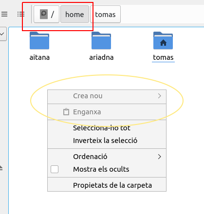
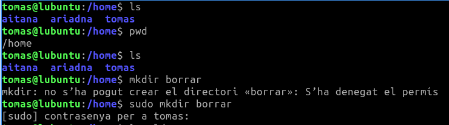
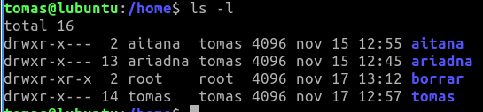
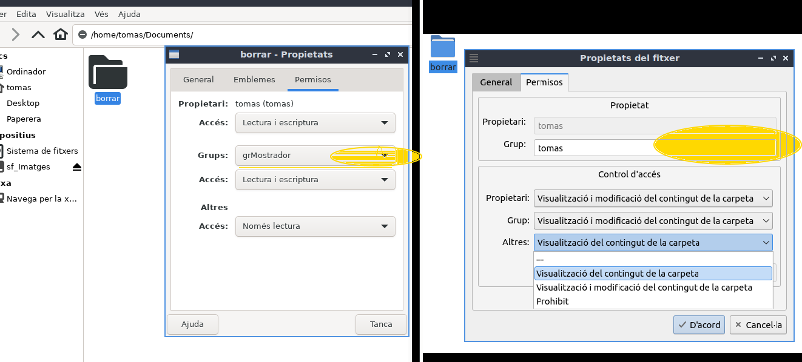

\newpage
\renewcommand\tablename{Tabla}


# 1. Introducció 
Els permisos de fitxers i directoris són una part fonamental de la seguretat i la gestió del sistema en GNU/Linux. A través d'ells, es defineix qui pot **llegir, escriure o executar** determinats arxius o directoris.

Les ordres més importants són:

- **`chmod`**: Modificar els permisos de fitxers i dels directoris.
- **`chown`**: Canviar el propietari i grup d’un fitxer o directori.

# 2. Visualització de permisos

Per veure els permisos d’un fitxer o directori, utilitzem el comandament `ls -l` o el `stat`:

```bash
ls -l fitxer.txt
```

```bash
-rw-rw-r--  2  tomas administradors   4096       16 d’oct.   29 12:51
```


## Detall de l'eixida
1. **Tipus de fitxer**: El primer caràcter indica si és un fitxer o un directori:
   - **`-`**: És un fitxer normal (enllaç dur)
   - **`d`**: És un directori.
   - **`l`**: És un enllaç simbòlic.
   - **`c`**: Fitxer de dispositiu de caràcters (teclat)
   - **`b`**: Fitxer de dispositiu de blocs (disc dur)

Ens centrarem, ara, en els 3 primers.

2. **Permisos**: Els següents 9 caràcters mostren els permisos en tres grups:
   - **rwx**: Permisos per al propietari (usuari1).
   - **r-x**: Permisos per al grup (grup1).
   - **r--**: Permisos per a altres.

   Els permisos poden ser per a 3 accions:
   - **r** (lectura): Permet llegir el contingut del fitxer.
   - **w** (escriptura): Permet modificar el fitxer.
   - **x** (execució): Permet executar el fitxer o accedir al directori.
   
En Linux un fitxer per ser executable no depén de l'extensió com en Windows (.exe, .bat, .msc, .cpl, .ps1), sinó d'un del permisos 'x'. 

3. **Nombre de enllaços**: Quantitat d’enllaços (durs) associats al fitxer.

4. **Propietari**: Inicialment és l'usuari que va crear el fitxer o que se li ha atorgat la propietat posteriorment (amb **`chown`**) i, per tant, actualment té els permisos per modificar-lo.

5. **Grup**: El grup és un conjunt d'usuaris que poden compartir permisos sobre els fitxers. Els membres del grup **grup1** tindran els permisos indicats per a este grup.

6. **Mida**: La mida del fitxer (en bytes).

7. **Data i hora de modificació**: Mostra la data i hora de la darrera modificació del fitxer.

8. **Nom del fitxer**: Finalment, es mostra el nom del fitxer (enllaça dur) pot tenir-ne molts, en aquest cas **fitxer.txt**.

Una opció molt interessant és **`ls -li`** per veure l'inode.


## Exemples d'eixides i significat:

- **`-rwxr-xr--`**:
  - El propietari pot llegir, escriure i executar el fitxer.
  - El grup pot llegir i executar el fitxer.
  - Altres usuaris només poden llegir el fitxer.

- **`drwxr-xr-x`** (per un directori):
  - El propietari pot llegir el contingut del directori, escriure-hi (afegir, eliminar fitxers) i executar-lo.
  - El grup pot llegir i executar el directori.
  - Altres usuaris poden llegir i executar el directori.

# 3. Comandes bàsiques per assignar permisos

## 3.1 `chmod` — Canviar permisos
El comandament **`chmod`** permet modificar els permisos d’un fitxer o directori. Els permisos es poden assignar de manera **simbòlica** o **numèrica**.

## 3.2 `chmod` simbòlic

Els permisos també poden ser assignats utilitzant les lletres per representar els drets de lectura, escriptura i execució. Els permisos simbòlics es poden afegir o eliminar utilitzant les lletres `r`, `w`, `x` (lectura, escriptura i execució), seguides d'un **signe més** (`+`) per afegir permisos o un **signe menys** (`-`) per eliminar-los.

### Sintaxi:
```bash
chmod [opcions] [usuari][+/-][permisos] fitxer
```

### Exemples:
1. **Afegir permís d'execució per al propietari**:
   ```bash
   chmod u+x fitxer.txt
   ```
   - **u**: propietari (user).
   - **+x**: afegeix el permís d'execució.

2. **Eliminar el permís d'escriptura per al grup**:
   ```bash
   chmod g-w fitxer.txt
   ```
   - **g**: grup.
   - **-w**: elimina el permís d'escriptura.
   
3. **Afegir permís d'escriptura per all altres usuari que no són el propietari o grup propietari**:
   ```bash
   chmod g+w itxer.txt
   ```
   - **o**: other.
   - **+w**: afig el permís d'escriptura.

4. **Establir permisos de lectura i execució per a tothom**:
   ```bash
   chmod a+rx fitxer.txt
   ```
    - **a**: tots (all: user, group i others).
    -**+rx**: afegeix els permisos de lectura i execució.

5. Podem combinar totes les opcions,
```bash
tomas@lubuntu:~/Documents$ chmod u+rwx,g+rw-,o-rwx directoris
tomas@lubuntu:~/Documents$ ls -l directoris 
-rwxrw---- 1 tomas tomas 255 nov 17 14:55 directoris
```

## 3.3 `chmod` numèric

Els permisos numèrics utilitzen valors enteros per representar els drets d'accés:
- **Lectura (r)**: 4
- **Escriptura (w)**: 2
- **Execució (x)**: 1

Per assignar permisos, sumem els valors dels permisos per a cada categoria (usuari, grup, altres).

### Sintaxi:
```bash
chmod [permisos] fitxer
```

### Exemples:
1. **Atorgar permisos de lectura i escriptura per al propietari, i només lectura per al grup i altres**:
   ```bash
   chmod 644 fitxer.txt
   ```
   Explicació del codi:
   - **6**: Lectura i escriptura per al propietari (4 + 2).
   - **4**: Lectura per al grup.
   - **4**: Lectura per a altres.

2. **Atorgar permisos de lectura, escriptura i execució al propietari, i només lectura i execució per al grup i altres**:
   ```bash
   chmod 755 fitxer.txt
   ```
   Explicació del codi:
   - **7**: Lectura, escriptura i execució per al propietari (4 + 2 + 1).
   - **5**: Lectura i execució per al grup (4 + 1).
   - **5**: Lectura i execució per a altres (4 + 1).

# 4. Canviar propietari i grup amb `chown` i `chgrp`

## 4.1 `chown` — Canviar el propietari i grup
El comandament **`chown`** permet modificar el propietari i el grup d’un fitxer o directori.

### Sintaxi:
```bash
chown [nou_proprietari][:[nou_grup]] fitxer
```

### Exemples:
1. **Canviar el propietari a "usuari1" i el grup a "grup1"**:
   ```bash
   chown usuari1:grup1 fitxer.txt
   ```

2. **Canviar només el propietari del fitxer**:
   ```bash
   chown usuari1 fitxer.txt
   ```

3. **Canviar només el grup del fitxer**:
   ```bash
   chown :grup1 fitxer.txt
   ```

## 4.2 `chgrp` — Canviar el grup
El comandament **`chgrp`** serveix per canviar el grup d’un fitxer o directori sense modificar el propietari.

### Sintaxi:
```bash
chgrp nou_grup fitxer
```

### Exemple:
1. **Canviar el grup de "fitxer.txt" a "grup1"**:
   ```bash
   chgrp grup1 fitxer.txt
   ```

# 5. Administració gràfica de permisos a Lubuntu

Lubuntu utilitza **PCManFM** com a explorador de fitxers. Podeu gestionar els permisos de fitxers i directoris de manera gràfica:

* Feu clic dret sobre el fitxer o directori que vols modificar i selecciona **Propietats**.

* A la pestanya **Permisos**, marqueu les caselles corresponents per concedir o revocar (llevar) permisos.


## 5.2 Limitacions de l'entorn gràfic

### Permisos "d'administrador"

Crear una carpeta o fitxer si no tens permisos a la carpeta és impossible.  En el CLI, pots fer un "sudo mkdir..." o "sudo touch..."

**Exemple:** Crear una carpeta borrar en *`/home`*



Observem que des del CLI, **amb sudo**



Mirem el resultat des dels dos entorns.  Fixem-no amb el propietari i grup assignat.





### Diferències entre gestors de fitxer:

Depenent del gestor de fitxer que estiguem usant, tindrem més o menys facilitats. Mireu a la imatge esta comparació entre:

* **PCManFM-Qt** que ve per defecte en el Lubuntu (part esquerra de la imatge)
* **Thunar** que instal·lem a la Unitat 5 d'este curs (part dreta de la imatge)




També hi ha diverses aplicacions per executar terminals, però una obertes, les opcions no canvien: un `ls -l`, per exemple sempre mostra la mateixa informació


# 6. sudo i propietari

Sovint necessitarem crear algun directori o fitxer com a sudoer (administrador) perquè estem a una carpeta que no tenim permís d'escriptura.
El directori o fitxer que creem tindrà per propietari i grup a **root:root**

Depenent del és molt probable que tinguem que fer els canvis de amb **chown**.

Dos exemples d'esta casuística que tractarem a les activitats:

1. Un directori del perfil d'un usuari que s'ha eliminat accidentalment ( /home/joana/Baixades ) i hem de tornar a crear.

2. Un directori compartit per als usuaris de la mateixa màquina a /home/dadescompartides.