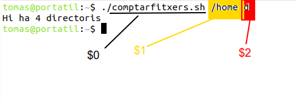
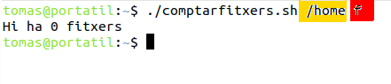
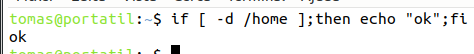

---
output:
  pdf_document: default
  html_document: default
---
# Activitat de repàs d'scripts

1.- **Explicació de l'script inicial**

Tenim un scripts que necessita 2 necessita 2 paràmetres (arguments o operands) per a funcionar bé. 
* El primer paràmetre serà un directori.
* El segon serà o el caràcter "d" o el caràcter "f".

L'script comptarà quants subdirectoris o fitxers hi ha dins del directori que li diguem segons indiquem, d/f






* El primer paràmetre es llig des de dins l'script com **$1**.

* El segon com a **$2**.

* **$0** és el nom del mateix script.

* **$#** el número de paràmetres passats en cridar l'script (deu ser 2 en l'exemple nostre)

\newpage

Ací teniu el codi de l'script. Llegiu-lo detingudament.
Copieu-lo per fer un script nou que heu de provar i modificar com se vos indicarà.

```bash
#!/bin/bash
# Amb el if (si) controlarem si no han passat 2 arguments. En eixe cas fem "exit" (avortem)
if [ $# -ne 2 ];then
echo "NO has passat 2 paràmetres"
exit 20
fi 
# Si no ha fet 'exit 20' és perquè SÍ hi ha 2 paràmetres, continuem...

# Ara miramem quin valor té el $2 (segon paràmetre).
if  [ "$2" == "d" ];then # Si han passat el valor "d", buscarem directoris
numDir=0    # Opcional 
numDir=$(ls -l $1 |grep ^d |wc -l)
echo "Hi ha $numDir directoris"
exit
fi

# Si $2 val "f", comptem els fitxers
if  [ "$2" == "-" ];then
numFitxers=$(ls -l $1|grep ^-|wc -l)
numFitxers=0
echo "Hi ha $numFitxers fitxers"
exit
fi

# Si el segon paràmetre no és 'd' ni '-'
echo "Error: no heu indicat fitxers (-) ni directoris (d)"
exit 30
```
\newpage

---

2.- Modifiqueu el codi per a que es **controle que el primer paràmetre ($1) siga un directori que existesca**.

Vos done una pista: 



Amb 'if -d' es comprova si és directori...

---

3.- Lectura de **l'error $?**

La variable $? guarda el valor "d'error" de l'últim programa/ordre/script que s'ha executat.

* Si val 0, s'ha executat bé.
* Sino ha doant un error.

Esta utilitat del Sistema la utilitzem per a que el nostre script ens informe quan no ha pogut comptar bé.
Fixeu-vos que quan s'executa bé el programa, l'última instrucció és: `exit` 
Per tant, si consultem $?
```bash
echo $?
```
Ens retorna un 0 ( proveu-ho!)

En canvi, quan alguna cosa no va bé fem que el programa avorte i done un número `exit 20` o `exit 30`(qualsevol número distint de 0).
Si consultem $? com adés ens donarà 20 o 30. (proveu-ho!)


Feu la modificació per a que si $1 no és directori done un error 40.


