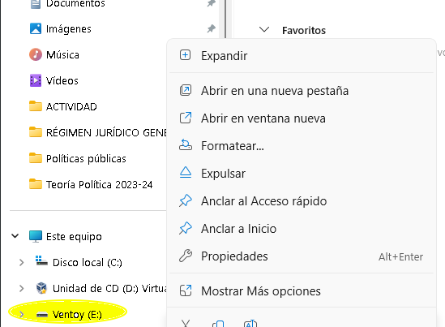
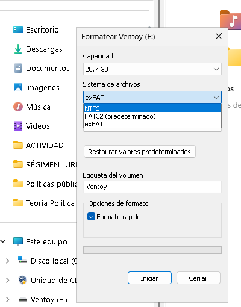
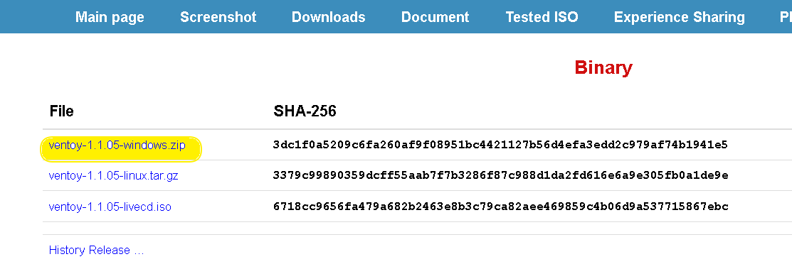
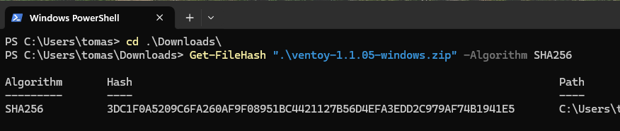
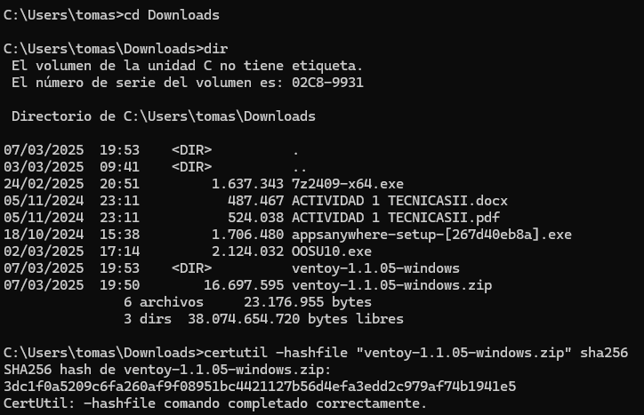
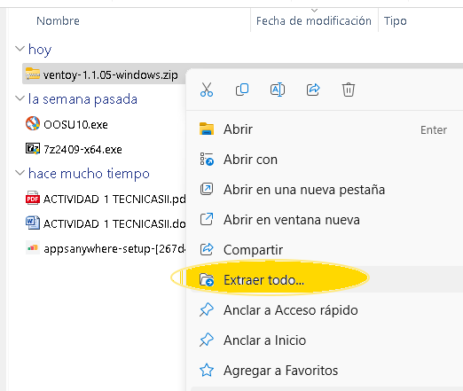
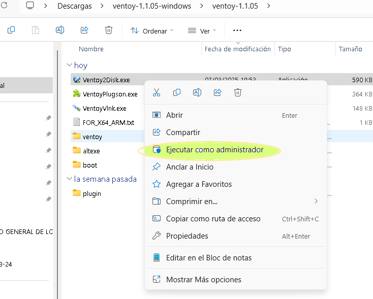
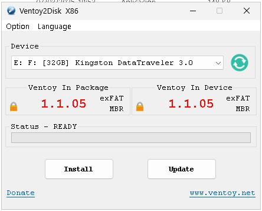
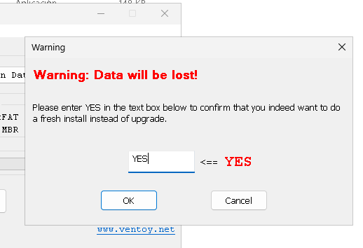

\newpage

\renewcommand\tablename{Tabla}

# 1. Introducció

## 1.1 Què és Ventoy

**Ventoy** és una ferramenta lliure i de codi obert que permet crear un **USB bootejable** d'una manera molt més senzilla i eficient que els mètodes tradicionals. A diferència d'altres programes com Rufus o UNetbootin, Ventoy no requereix que crees un nou USB bootejable per a cada imatge ISO; en lloc d'això, simplement copies els fitxers ISO al pendrive i Ventoy els detecta automàticament en el moment d'arrancar.

En la **classificació del software** que vam estudiar a principi de curs, es tractaria d'un **software de sistema** que actua molt a prop del firmware (BIOS/UEFI). Concretament és un gestor d'arrancada.

## 1.2 Característiques principals de Ventoy

* No cal tornar a formatar el pendrive cada vegada que vols afegir una nova ISO.
* Compatible amb BIOS i UEFI sense necessitat de canviar configuracions.
* Suporta múltiples ISOs al mateix USB (pots tenir Linux, Windows i eines de recuperació o per clonar al mateix pendrive).
* Admet arxius ISO de més de 4GB (ideal per a Windows 11 o Server).
* 100% de codi obert i gratuït, amb suport per a Windows i Linux.

---

\newpage

# 2. Preparar Ventoy en un pendrive des d'Ubuntu

## 2.1 Formatejar el pendrive en NTFS

Usem NTFS que admet fitxer amb tamańy superior a 4Gb i compatibilitat en Windows i Linux


## 2.2 Descarregar Ventoy

Baixa l'última versió de Ventoy per a Linux des del seu web oficial:
```
https://www.ventoy.net/en/download.html
```
Descarrega el fitxer .tar.gz per a Linux. Observeru el codi *sha256* !


Ens obri una segona pàgina des d'on descarregar ja.


### 2.2.1 Comprovació sha256sum

Opcionalment podem comprovar si s'ha descarregat bé el fitxer. A la web de descàrrega esn faciliten el codi sha256 per a comprovar.
Executem la utilitat de Linux i mirem si el valor és igual.


## 2.3 Extraure l'arxiu

Obre un terminal i executa:

```bash
cd ~/Baixades
tar -xvf ventoy-*.tar.gz
cd ventoy-*
```

## 2.4 Identificar el dispositiu USB

Connecta el teu USB i comprova la seva identificació amb:
```bash
lsblk
```
O també amb:
```bash
sudo fdisk -l
```
Busca el nom del teu USB, per exemple /dev/sdX (substitueix "X" per la lletra correcta).

## 2.5 Instal·lar Ventoy al pendrive

Executa la instal·lació (substitueix X per la lletra del teu USB):

```bash
sudo ./Ventoy2Disk.sh -i /dev/sdX
```

Això esborrarà tot el contingut del pendrive!

Si vols actualitzar Ventoy sense esborrar dades, usa:
```bash
sudo ./Ventoy2Disk.sh -u /dev/sdX
```

Per instal·lar amb confirmació prèvia:

```bash
sudo ./Ventoy2Disk.sh -I /dev/sdX
```

## 2.6 Copiar les ISOs al pendrive

Una vegada instal·lat, només cal que copieu les imatges ISO (Windows, Linux, etc.) directament al pendrive, sense necessitat de crear particions ni fer res més.

## 2.7 Provar el pendrive

1. Reinicia el teu ordinador.  
2. Entra a la BIOS/UEFI prement una de les tecles següents (depèn del fabricant):  
   - F2, F12, ESC, DEL  
3. Canvia l'ordre (BOOT ORDER, BOOT SEQUENCE...) i reodrena pera que el pendrive USB siga el 1r dispositiu d'arrencada. 
4. Reininicia el PC. Si tot ha anat bé, apareixerà el menú de Ventoy amb les ISOs que has copiat.  

---

\newpage


# 3. Guia per instal·lar Ventoy en un USB des de Windows 11  

## 3.0 Formatar el pendrive

Seleccionem el PenDrive



Indiquem el tipus de Sistema de Fitxers (File System, SF): NTFS



## 3.1 Descarregar Ventoy per a Windows  

- Ves a la web oficial:  
[https://www.ventoy.net/en/download.html](https://www.ventoy.net/en/download.html)  

- Descarrega l’arxiu "Ventoy-xxxxx-windows.zip".  



## 3.2 Comprovar el SHA256 del fitxer descarregat  (OPCIONAL)

Abans d'instal·lar Ventoy, és recomanable comprovar la seva integritat verificant el **SHA256** del fitxer descarregat.  

### Opció 1: amb PowerShell:  **

1. Obri PowerShell (Win + X → Terminal (PowerShell)).  
2. Executa el següent cmdLet:  

```powershell
Get-FileHash "C:\ruta\al\fitxer.zip" -Algorithm SHA256
```
3. Es mostrarà un codi hash. Compara'l amb el proporcionat a la web oficial de Ventoy.  



### Opció 2:  amb CMD (CertUtil):  

1. Obri el símbol del sistema (Win + R, escriu `cmd` i prem Enter).  
2. Escriu la següent ordre:

```cmd
   certutil -hashfile "C:\ruta\al\fitxer.zip" SHA256
```
3. Compara el resultat amb el hash oficial.  



## 3.3 Extraure l'arxiu  

1. Ves a la carpeta de Descàrregues.  
2. Fes clic dret al fitxer ZIP i selecciona "Extreure tot...".  
3. Obri la carpeta generada després de l’extracció.  



### 3.5 Obrir Ventoy  

A la carpeta extreta, **executa com a Administrador** l'executable **Ventoy2Disk.exe**.  



### 3.6 Seleccionar el pendrive i instal·lar Ventoy 

1. A la part superior, assegura’t que el dispositiu seleccionat és el teu pendrive.  
2. Opcional: Pots clicar a "Opcions" → "Estil de partició" i escollir entre:  
   - **MBR** (recomanat per compatibilitat universal, BIOS + UEFI).  
   - **GPT** (per a UEFI moderns).  
3. Finalment, fes clic a "Instal·lar".  
4. Apareixeran dos missatges d’advertència, fes clic a "Sí" dues vegades per confirmar.  





## 3.7 Copiar les imatges ISO  
Una vegada instal·lat el Ventoy al Pendrive només cal copiar els fitxers ISO (per exemple, Windows, Linux, etc.) directament al pendrive.  
  

### 3.8 Provar l'arrencada  

1. Reinicia el teu ordinador.  
2. Entra a la BIOS/UEFI prement una de les tecles següents (depèn del fabricant):  
   - F2, F12, ESC, DEL  
3. Canvia l'ordre (BOOT ORDER, BOOT SEQUENCE...) i reodrena pera que el pendrive USB siga el 1r dispositiu d'arrencada. 
4. Reininicia el PC. Si tot ha anat bé, apareixerà el menú de Ventoy amb les ISOs que has copiat.  

