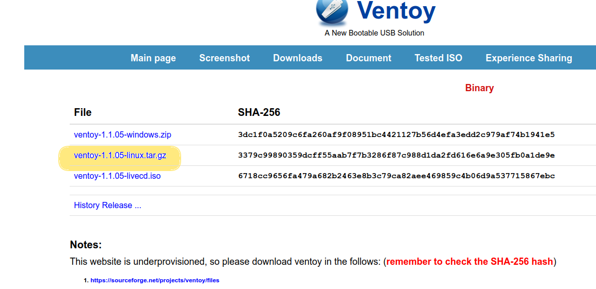
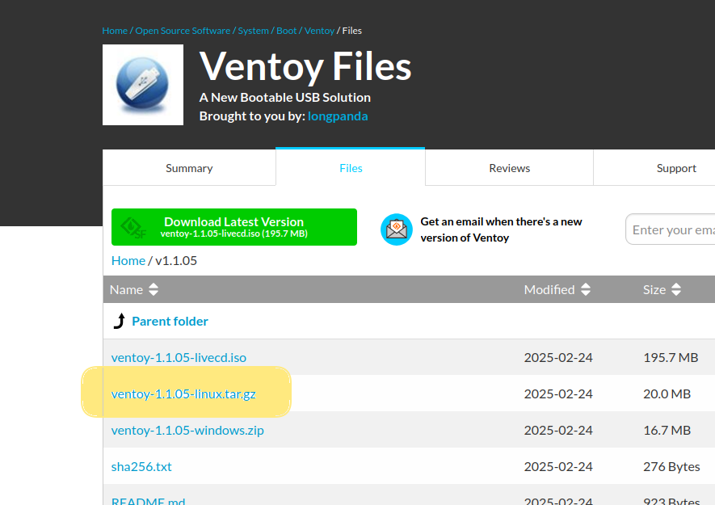

\newpage

\renewcommand\tablename{Tabla}


# 1. Formatejar el pendrive en NTFS

Usem NTFS que admet fitxer amb tamańy superior a 4Gb i compatibilitat en Windows i Linux


# 2. Preparar Ventoy en un pendrive des d'Ubuntu

## 2.1. Descarregar Ventoy

Baixa l'última versió de Ventoy per a Linux des del seu web oficial:
```
https://www.ventoy.net/en/download.html
```
Descarrega el fitxer .tar.gz per a Linux. Observeru el codi *sha256* !




Ens obri una segona pàgina des d'on descarregar ja.



### 2.1.1 Comprovació sha256sum

Opcionalment podem comprovar si s'ha descarregat bé el fitxer. A la web de descàrrega esn faciliten el codi sha256 per a comprovar.
Executem la utilitat de Linux i mirem si el valor és igual.


## 2.2 Extraure l'arxiu

Obre un terminal i executa:

```bash
cd ~/Baixades
tar -xvf ventoy-*.tar.gz
cd ventoy-*
```

## 2.3. Identificar el dispositiu USB

Connecta el teu USB i comprova la seva identificació amb:
```bash
lsblk
```
O també amb:
```bash
sudo fdisk -l
```
Busca el nom del teu USB, per exemple /dev/sdX (substitueix "X" per la lletra correcta).

## 2.4. Instal·lar Ventoy al pendrive

Executa la instal·lació (substitueix X per la lletra del teu USB):

```bash
sudo ./Ventoy2Disk.sh -i /dev/sdX
```

Això esborrarà tot el contingut del pendrive!

Si vols actualitzar Ventoy sense esborrar dades, usa:
```bash
sudo ./Ventoy2Disk.sh -u /dev/sdX
```

Per instal·lar amb confirmació prèvia:

```bash
sudo ./Ventoy2Disk.sh -I /dev/sdX
```

## 2.5. Copiar les ISOs al pendrive

Una vegada instal·lat, només cal que copieu les imatges ISO (Windows, Linux, etc.) directament al pendrive, sense necessitat de crear particions ni fer res més.

## 2.6. Provar el pendrive

Reinicia l'ordinador, entra a la BIOS/UEFI i selecciona el pendrive com a dispositiu d'arrencada. Hauries de veure el menú de Ventoy amb les ISOs que hi has copiat.
