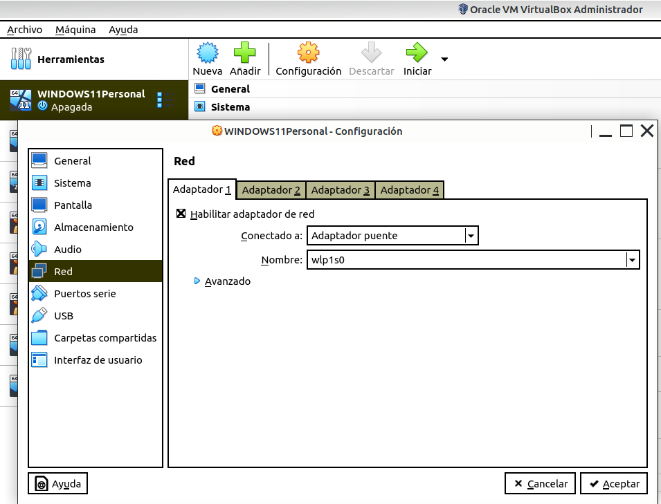
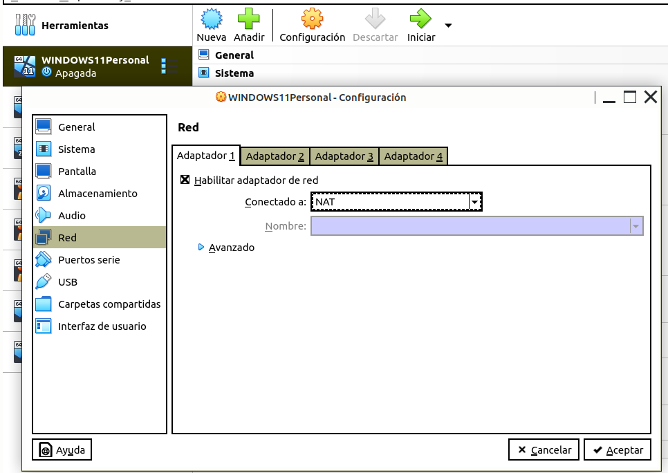
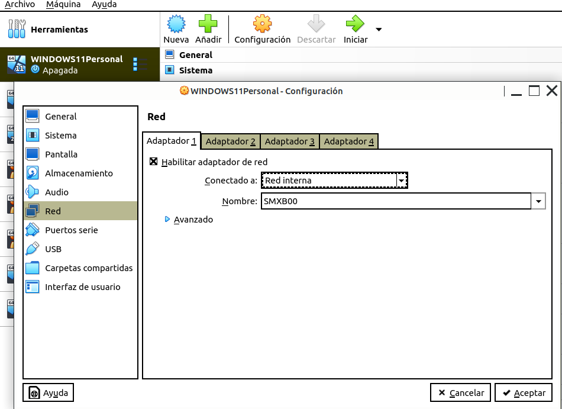
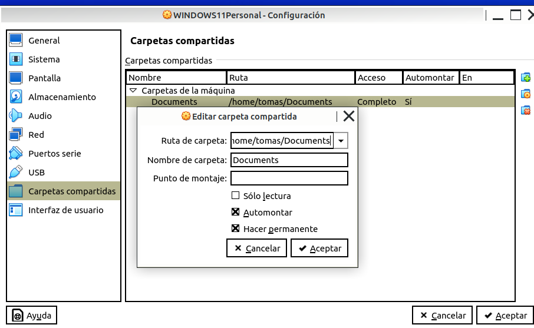
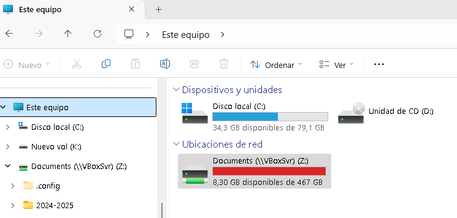

\newpage
\renewcommand\tablename{Tabla}
---

A la Unitat 2 teniu més informació sobre VirtuaBox. 
Ara anem a provar algunes configuracions que afecten a la **comunicació entre la nostra màquina virtual Windows 11 i l'amfitrió**.

# La tarja de xarxa (NIC)

Al mòdul de Xarxes Locals veieu el que és la tarja i que té una IP. També estudiareu les IPs, els rangs, famílies...

Ací vorem les formes de configurar la targeta d'una màquina virtual.

## Adaptador pont

* Tindrà un IP de la mateixa família que el PC amfitrió.
* Si el PC té internet (WIFI, cable o mòbil), la màquina virtual també.

* Heu de comprovar que les ip son de la mateixa família fent **ipconfig**. En la màquina física i en la virtual.
* Feu un ping entre les dos ip.

WIN + R, CMD, ipconfig

## NAT

La ip de la màquina virtual serà d'una altra família a la de la màquina real però hi haurà una "traducció". Esta traducció és similar a la que fa el vostre router a casa entre ip pública i ip privada. 
Per tant, si el PC o portàtil té internet, esta màquina virtual, també.

* Heu de comprovar que les ip NO son de la mateixa família fent **ipconfig** 
En la màquina física i en la virtual.
* Feu un ping entre les dos ip

WIN + R, CMD, ipconfig

## Xarxa interna

La ip de la màquina virtual serà d'una altra família a la de la màquina real i no hi ha cap "traducció".

* Heu de comprovar que les ip NO son de la mateixa família fent **ipconfig** 
En la màquina física i en la virtual.
* Feu un ping entre les dos ip. No es comunicaran

En esta configuració les màquines virtuals estan aïllades de la real.

# Carpetes compartides

En **Dispositius**

No s'ha de confondre amb la compartició de fitxers i carpetes en xarxes locals que es veu més avant. Ací només es tracta de que, des de la MV es puga accedir una carpeta de l'amfitrió.

Podem triar si volem:

* Sols de lectura.

* Fer permanent. Per a que, en reiniciar, estiga disponible. 

Ara ja vorem en el nostre explorardor de la Màquina virtual la carpeta de la màquina amfitriona.

**Ús habitual**

Si treballem en un Lubuntu a casa pero el nostre portàtil és un Windows Home, molt probablement voldrem que els documents o imatges ( captures de pantalla de les pràctiques, per exemple) es guarden a Documentos del Windows. Compartiríem esta carpeta de Windows en el Lubuntu.

# Copiar entre màquines. 

En **Dispositius**

### Portapapers

Si volem fer CONTROL + C i CONTROL + V entre les 2 màquines (Portapapeles) 

o si volem 

### "arrastrar y soltar"

Les opcions per habilitar-ho són:

* Inhabilitat.
* Només per a copiar des de l'amfitrió a la virtual.
* Només per a copiar des de la virtual a l'amfitrió.
* Bidireccional

