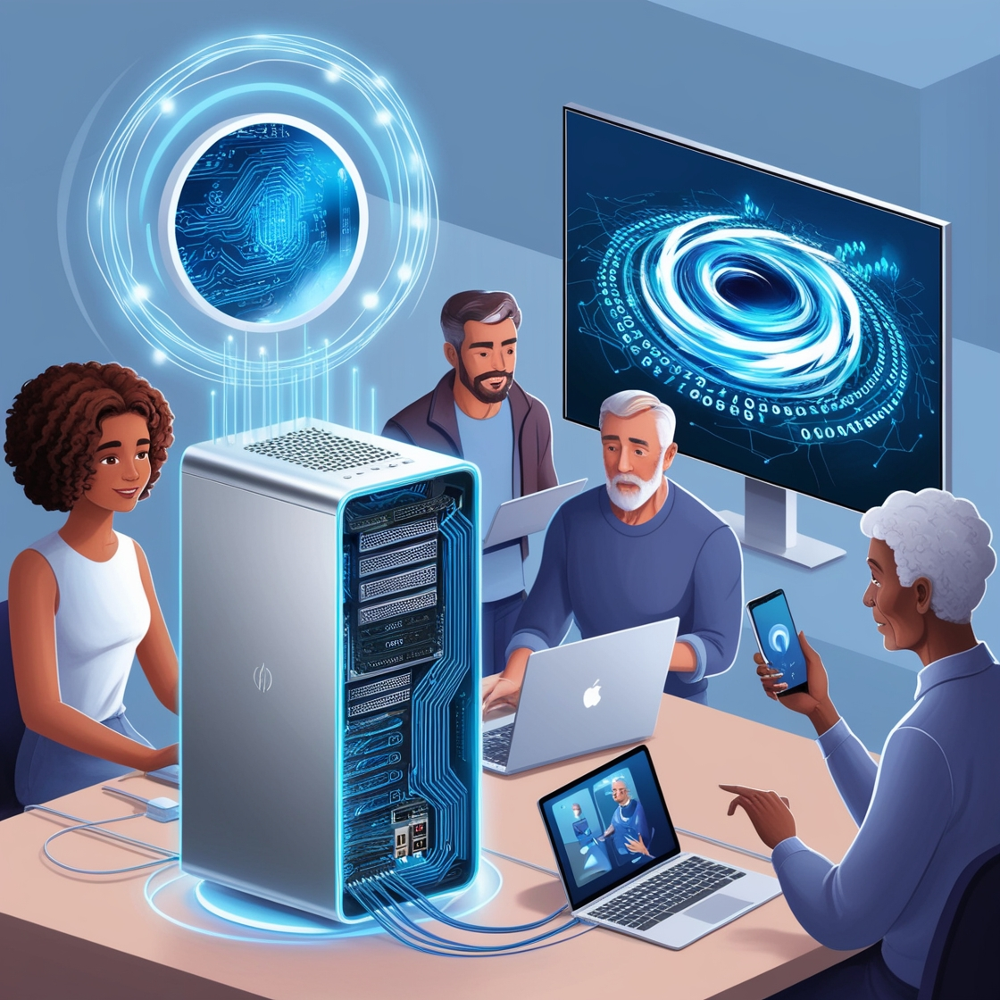
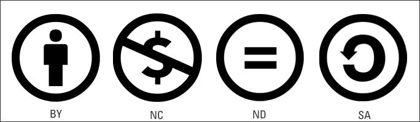

\newpage
\renewcommand\tablename{Tabla}

# 1. El sistema informàtic
Un sistema informàtic és un conjunt integrat de components, tant físics com digitals, dissenyats per a la captura, emmagatzematge, processament i comunicació d'informació. 

Aquest sistema està compost per 3 tipus d'elements:

* Hardware (maquinari)

* Software (programari)

* Usuaris

{width=50%}

## 1.1 Tipus de sistemes informàtics

- **Sistemes personals**: Inclouen PC (ordinadors de sobretaula o Personal Computer), portàtils, tauletes i smartphones.
- **Sistemes empresarials**: Com ara servidors, mainframes i sistemes de computació en núvol, que suporten les operacions d'una organització.
- **Sistemes empotrats**: Sistemes informàtics especialitzats que es troben dins d'altres dispositius com electrodomèstics, cotxes i dispositius mèdics.

## 2.2 Evolució Tecnològica: les generacions dels computadors

### 1. Primera Generació (1940-1956):
- **Tecnologia**: Vàlvules de buit.
- **Característiques**: Grans dimensions, molt calorosos, poca memòria.
- **Exemple**: ENIAC.
- **Limitacions**: Programació complicada mitjançant targetes perforades.

### 2. Segona Generació (1956-1963):
- **Tecnologia**: Transistors.
- **Característiques**: Menor mida, més ràpids i fiables.
- **Exemple**: IBM 1401.
- **Millores**: Introducció de llenguatges de programació com Fortran i COBOL.

### 3. Tercera Generació (1964-1971):
- **Tecnologia**: Circuits integrats.
- **Característiques**: Mida encara més petita, augment de la capacitat de processament.
- **Exemple**: IBM 360.
- **Innovació**: Multiprogramació, ús d'ordinadors en diverses àrees.

### 4. Quarta Generació (1971-actualitat):
- **Tecnologia**: Microprocessadors.
- **Característiques**: Ordinadors personals (PCs), molt més potents i accessibles.
- **Exemple**: Intel 4004.
- **Impacte**: Aparició d'Internet, democratització de la informàtica.

## 2.3 Enllaços al Museu d'Informàtica de la UPV

[Història dels ordinadors personals. Museu UPV](https://museo.inf.upv.es/va/historia-del-ordenador-personal/)

[ENIAC Museu UPV](https://museo.inf.upv.es/eniac-2/)

[Ordenador de circuits integrats](https://museo.inf.upv.es/va/apollo-guidance-computer/)

### 5. Cinquena Generació (Futur):
- **Tecnologia**: Intel·ligència Artificial, computació quàntica.
- **Característiques**: Computadors capaços d'aprendre i resoldre problemes complexos.
- **Objectiu**: Creació de màquines més intel·ligents i eficients.

**Conclusions**: Les generacions dels computadors mostren l'evolució tecnològica, des de màquines massives i limitades fins a dispositius petits però molt potents, que han transformat la nostra vida diària.

La tecnologia ha fet un salt enorme des de les vàlvules de buit fins als microprocessadors. Cada bot ha permès fer computadors **més menuts, potents i accessibles**. Una evolució que ha canviat la nostra vida diària.

## 1.3 Comparativa interessant

Comparar la capacitat de processament d'un smartphone actual amb la d'un mainframe dels anys 50 pot sorprene'ns:

### 1. Mainframes dels anys 50
- **Velocitat de Processament**: Uns pocs milers d'operacions per segon.
- **Memòria**: Generalment uns quants kilobytes.
- **Mida**: Ocupaven habitacions senceres.
- **Cost**: Milions de dòlars.
- **Exemple**: ENIAC, UNIVAC.

### 2. Smartphone Actual
- **Velocitat de Processament**: Milions de milions d'operacions per segon (Gigaflops).
- **Memòria**: Diversos gigabytes de RAM i terabytes d'emmagatzematge.
- **Mida**: Cap a la butxaca.
- **Cost**: Centenars d'euros.
- **Exemple**: iPhone, Samsung Galaxy.

### Conclusió
La tecnologia ha avançat tant que un dispositiu personal assequible avui dia és incomparablement més poderós que les màquines més avançades de mitjans del segle XX. Això ha transformat la manera com vivim i treballem.

# 2. Components hardware
Els components hardware constitueixen la part física dels sistemes informàtics, incloent dispositius que són visibles, tangibles així com la lògica de la electrònica digital.

## 2.1 Elements funcionals principals
- **Processador (CPU)**: L'element principal que executa les instruccions dels programes.
- **Memòria**: Inclou la RAM (memòria d'accés aleatori) per a l'emmagatzematge temporal.

## 2.2 Perifèrics (Unitat E/S)

Els perifèrics són dispositius connectats a l'ordinador que faciliten la interacció amb el sistema o amplien les seves funcionalitats. Es poden classificar en diverses categories:

### 2.2.1 Dispositius d'entrada/eixida pròpiament dits[^1]

1- Hi ha un canvi de medi. De paper, ones sonores, llum... (informació del món humà, percibida pels sentits) passa a informació en una memòria digital. 

2- Per a això hi ha una digitalització o transformació prèvia a binari.

   - **Entrada**: Dispositius que permeten introduir dades o comandaments a l'ordinador.
     - *Exemples*: Teclats, ratolins, escàners, micròfons.
   - **Eixida**: Dispositius que mostren o emeten informació processada per l'ordinador.
     - *Exemples*: Monitors, impressores, altaveus, projectors.
- **Entrada i eixida**. Dispositius que poden fer les dues funcions adés esmentades alhora:
  - *Exemples*: Pantalla tàctil. 

### 2.2.2 Dispositius de magatzematge

   - Dispositius que magatzemen dades de forma **permanent i en binari**.
     - *Exemples*: Discs durs (HDD, SSD), unitats de disc òptic (CD/DVD), memòries USB, targetes de memòria.

### 2.2.3 Dispositius de comunicació

   - Dispositius que permeten la **transmissió de dades (bits)** entre ordinadors o altres dispositius.
     
     - *Exemples*: Mòdems, targetes de xarxa, routers, adaptadors Wi-Fi, switch.
     
     1- Hi ha un canvi de medi. De cel·les de memòria del PC passa a pulsos elèctrics del cable de coure, a faig de llum en FO, a ones WIFI electromagnètiques per l'aire... però **sempre són bits** el que enviem/rebem.
     
     2- Però la informació no pertany a món humà, ja són bit. Per sentir-la o veure-la necessitem el dispositius d'eixida i preocessar-la prèviament.
     
>Aclariment:
>
>Per no confondre un dispositiu d'entrada amb un de magatzematge hem de pensar que:
>
>El d'E/S **transforma** una informació del món real (imatge, so, text...) a 0,1 per poder manipular-la en el cas d'Entrada. I al revés, en el cas d'eixida.
>
>El dispositiu de magatzematge, com el pen-drive, **no transforma**. La informació ja ve en binari.
>
>El dispositu de comunicació canvia el mitjà dels bits sols, tampoc transforma.

## 2.3 Busos.

Un bus és una línia o conjunt que pot tenir dos estats (0/1).

- **D'adreces**. Serveixen per seleccionar quina posició de a memòria volem accedir
- **De dades**. Serveiexen per llegir les dades de les posicions on hem accedit o per enviar les dades a escriure.
- **De control**. Envien senyal com ara Read/Write

{width=80%}

## 2.4 Elements auxiliars

No afecten a la capacitat del sistema però són necessaris per a que este funcione.

- **Plaques base**: Suport físic per als components i connectivitats.
- **Alimentació elèctrica**: Subministra l'energia necessària per al funcionament del sistema.( Fonts, SAI...)
- **Torres, racks..**: Conté el PC o servidor.
- **Elements de refrigeració** Ventiladors, refirgeració liquida...

# 3. Programari d’un sistema informàtic

El programari és l'equipament lògic d'un sistema informàtic, que inclou els programes i aplicacions que permeten realitzar tasques específiques.

## 3.1 Tipus de programari
- **Programari de sistema**: Com els sistemes operatius (Windows, Linux), software base per a donar serveis al programari d'aplicació, ferramentes que  podem instal·lar per a feines de gestió o administració del sistema o proves
  
  - El software que usa un tècnic o un administrador d'una xarxa
  - Exemples: Tots els SO, PacketTracer, GParted, MySQL, net-tools...
  
- **Programari d'aplicació**: Inclou programes per a tasques específiques com processadors de textos, fulls de càlcul i navegadors web.
  - El software que usa un usuari final. 
  - Exemples: Paquets d'ofimàtica, ERP, jocs, navegadors...
  
- **Programari de desenvolupament**: Eines per crear altres programes, com entorns de desenvolupament integrats (IDE).
  
  - El software que usa un programador.
  
  - Exemples: Visual Studio, RStudio, Eclipse, NetBeans, Git, GitHub...
  

## 3.2 Llicències de programari

Sense entras a fons, veiem algunes de les llicències més habituals i alguns exemples de software que s'usa en els cicles formatius d'informàtica.

### Llicències de Programari Lliure i de Codi Obert
Aquestes llicències permeten als usuaris utilitzar, copiar, modificar i distribuir el programari lliurement. Alguns exemples inclouen:

- **GPL (GNU General Public License)**: Utilitzada per projectes com el SO Linux o el paquet LibreOffice
  - Existeixen varietats de la GPL com Odoo, un ERP de codi obert de llicència AGPLv3.

- **MIT License**: Una llicència molt permissiva que s'utilitza en programes com JavaScript**, **jQuery, Bootstrap o React.

- **Apache License**: Utilitzada per projectes com Apache HTTP Server.

### Llicències Comercials
Aquestes llicències requereixen la compra d'una llicència per a utilitzar el programari. Exemples comuns inclouen:

- *Exemples*: Microsoft Office, Adobe Photoshop, Oracle Database...amb llicències comercials.

### Llicències Shareware
Aquestes llicències permeten l'ús gratuït del programari durant un període de prova limitat o amb funcionalitats restringides. Alguns exemples són:

- *Exemples:* WinRAR (per a la compressió de fitxers), Sublime Text (Editor de text amb una versió de prova disponible).

### Llicències Freeware
Aquestes llicències permeten l'ús gratuït del programari sense límits de temps, però sovint no permeten la modificació del codi font. 

- *Exemples:* Skype (Aplicació per a trucades de veu i vídeo), AVG Antivirus Free (Versió gratuïta d'un programa antivirus).

### Llicències de Programari de Prova (Trial)

Similar a les llicències shareware, però generalment ofereixen totes les funcionalitats del programari durant un període de prova limitat. 

* *Exemples:* AutoCAD ( per a disseny assistit per ordinador), Adobe Premiere Pro (Programari de edició de vídeo). 

### Llicències de Programari Propietari
Aquestes llicències són les més restrictives. 

- *Exemples:* els SO macOS, MS Windows; SAP ERP, Microsoft Dynamic 365, Oracle ERP 

Aquestes categories reflecteixen diferents models de distribució i ús del programari, amb variacions en termes de cost, accés al codi font i drets de modificació i redistribució.

## 3.3 Creative Commons

Creative Commons (CC) és una organització sense ànim de lucre dedicada a reduir les barreres legals per a compartir treballs. 
No és un intermediari ni gestor de dets, sols proporciona la ferramenta per a que cada autor puga definir quins usos permet i quins no sobre cada obra seua.

Les llicències Creative Commons es basen en quatre condicions bàsiques que es poden combinar:

1. **Reconeixement (BY)**: Permet l'ús de l'obra sempre que s'atribueixi l'autoria.
2. **No Comercial (NC)**: Prohibeix l'ús comercial de l'obra.
3. **Sense Obres Derivades (ND)**: Prohibeix la creació d'obres derivades.
4. **Compartir Igual (SA)**: Les obres derivades han de ser licenciades sota els mateixos termes que l'original.

{width=80%}

Amb aquestes condicions es poden crear les següents sis llicències:

1. **CC BY**: Permet l'ús comercial i la creació de derivats, sempre que es reconegui l'autoria.
2. **CC BY-NC**: Permet la creació de derivats només per ús no comercial.
3. **CC BY-NC-SA**: Permet derivats només per ús no comercial, amb la mateixa llicència que l'original.
4. **CC BY-NC-ND**: No permet derivats ni ús comercial.
5. **CC BY-SA**: Permet l'ús comercial i la creació de derivats, amb la mateixa llicència que l'original.
6. **CC BY-ND**: Permet l'ús comercial, però no la creació de derivats.

## 3.4 Normativa legal
Inclou les lleis i regulacions que afecten l'ús i distribució de programari, com la propietat intel·lectual, els drets d'autor i les polítiques de privacitat.

# 4 L'element humà del sistema informàtic

Com ja hem dit adés, a banda del software i el hardware existeix un tercer element en tot sistema informàtic: l'element humà. Les persones podem qualificar-les, grosso modo, en 3 grups:

* Els responsables de la **crear software** (programadors, dissenyadors, analistes...). Més familiaritzats am el software ded desenvolupament.

* Els responsables de la **instal·lació, configuració i manteniment** del sistema (administradors de xarxa, tècnics de manteniment...) . Més familiaritzats amb el software de sistema i el hardware.

* Els **usuaris finals** del sistema. Realitzaran les tasques específiques que l'organització necessites amb el software d'aplicació (factures, informes, edició de vídeo, maquetació, càlculs estadístics, tractament de dades... )

  

[^1]: Molts autors usen el terme *Dispositius d'entrada/eixida* en un sentit genèric abarcant a tots els *Perifèrics* donat que la Unitat Funcional que abarca tots els perifèrics és la Unitat d'E/S. 

